# Pattern Editor SVG — Analisi funzionale e tecnica

| | |
|---|---|
| **Documento** | Analisi funzionale e tecnica del componente Pattern Editor |
| **Versione** | 3.5 |
| **Data** | 17 settembre 2026 |
| **Redatto da** | Analisi funzionale |
| **Destinatari** | Sviluppo, Test, Manutenzione |
| **Stato** | Approvato per lo sviluppo |
| **Revisione 1.1** | Rivisti i §7.4-7.6: disposizione dei comandi, elenco/dettaglio degli elementi, uso dello spazio verticale |
| **Revisione 1.2** | Aggiunte le sezioni sul colore scritto a mano e sullo schermo stretto; rivista quella sullo spazio verticale; nuova appendice D |
| **Revisione 1.3** | Il capitolo 2 diventa la descrizione completa dell'architettura: dieci nuovi diagrammi (figure 9-18), l'inventario delle unità, il registro delle decisioni. Nuovo §10.3 sulle funzioni della pagina iniziale |
| **Revisione 1.4** | §3.3: da dove viene l'unicità degli UUIDv7. nella strategia di verifica: i controlli parametrici sul contratto dei plugin e sul caso «plugin staccato» |
| **Revisione 1.5** | §7.4: il riquadro della cella singola segue il rapporto di forma della cella |
| **Revisione 1.6** | Nuovo §6.6: l'importazione di un documento SVG, con la figura 19 |
| **Revisione 1.7** | §6.6: i valori iniziali delle tinte li detta la specifica, non il plugin; vanno segnalate anche le perdite parziali |
| **Revisione 1.8** | §3.3: la posizione nel piano sulla classe base. §6.6: le rotazioni si importano invece di essere scartate. §7.5: filtro e scelta multipla nell'elenco. §10.3: ricerca e filtri nella pagina iniziale |
| **Revisione 1.9** | §3.3: l'opacità complessiva si dichiara con un'interfaccia, non con l'ereditarietà, e le due sezioni comuni hanno un ordine. Nuovo §7.6: annullare e rifare |
| **Revisione 2.0** | §3.3: che cosa occupa la riga intera in un gruppo, e la nota sotto il pulsante del centro |
| **Revisione 3.0** | Nuovo capitolo 11: utenti, credenziali e proprietà dei pattern. §7.2: il parametro di sola lettura. I capitoli successivi scalano di uno |
| **Revisione 3.1** | §11.10: l'autore entra nel documento e l'indice esterno sparisce; un pattern senza autore non si modifica più. Nuovo §11.4 sull'unicità del nome utente e sugli omografi. §10.3: scarico dalla miniatura |
| **Revisione 3.2** | §11.8: la revisione nell'indirizzo della foto. §11.11: sulle miniature l'avatar di chi guarda si disegna dall'account, non dal riepilogo |
| **Revisione 3.3** | §11.11: che cosa succede con un archivio incoerente — identificativi ripetuti, nome del file discorde, autore inesistente. §10.3: il filtro per autore perde la voce «senza autore» |
| **Revisione 3.4** | Nuovo §10.4: la pagina di prodotto, seconda lettura dello stesso strumento |
| **Revisione 3.5** | §10.4: la presentazione diventa la radice, la gestione si sposta su /gestione. §7.9: il documento ospite dichiara il riquadro di visualizzazione |
| **Revisione 3.6** | Nuovo capitolo 12: i filtri SVG applicati al pattern intero |
| **Revisione 3.7** | §12.5: l'avviso sui passaggi che seguono un generatore |
| **Revisione 3.8** | §12.6: la colonna di sinistra diventa due card; l'editor si apre a tutta pagina |
| **Revisione 3.9** | §12.6: cinque card collocate in griglia; i filtri passano nella colonna larga, il sorgente nella stretta |
| **Revisione 3.10** | §12.6: anche il sorgente comincia aperto |
| **Revisione 3.11** | §7.4: le due anteprime diventano un corpo solo, con una legenda |
| **Revisione 3.12** | §12.6: chiudendo una card, quella sopra si prende la sua altezza |
| **Revisione 3.13** | §12.6: chi cede quando lo spazio non basta. §12.1: gli effetti in quattro famiglie. §12.3: nel documento finiscono i dati, non ciò che se ne ricava |
| **Revisione 3.14** | §7.6: annulla e ripeti diventano due pulsanti rotondi con la freccia nel colore d'accento |
| **Revisione 3.15** | Nuovo §11.13: la visibilità di un pattern e l'approvazione delle pubblicazioni. Aggiornati §3.1, §10.1, §14 e l'appendice A |
| **Revisione 3.16** | Nuova appendice E: le procedure di manutenzione dalla riga di comando, fra cui la nomina di un amministratore |
| **Revisione 3.17** | §10.1: il riepilogo porta con sé il peso del documento SVG |
| **Revisione 3.18** | Nuovo §7.10: che cosa costa un giro di aggiornamento, e come si accorpa |
| **Revisione 3.19** | §10.4: i pannelli agganciati si fermano sotto la barra, e l'avanzamento parte da lì |
| **Revisione 3.20** | Nuovo §10.5: la serie di pattern in scena, il movimento a pagina ferma, il foglio che si scrive e il campionario dei tipi |
| **Revisione 3.21** | Nuovo §13.1: le lingue — i due cataloghi, il ripiego per chiave, il testo che nasce nel modello. Aggiornati §13 (T5) e §14. Nuova figura 20 |
| **Riferimento** | Richiesta interna «Componente Blazor per la definizione di pattern SVG» |

---

## Indice

1. [Scopo e contesto](#1-scopo-e-contesto)
2. [Visione d'insieme e architettura](#2-visione-dinsieme-e-architettura)
   · [2.4 Inventario delle unità](#24-le-unità-della-soluzione-una-per-una)
   · [2.5 Composizione a runtime](#25-composizione-a-runtime-chi-registra-che-cosa)
   · [2.6 Albero dei componenti](#26-lalbero-dei-componenti)
   · [2.7 Il giro di una modifica](#27-il-giro-di-una-modifica)
   · [2.8 Il ciclo di una sessione](#28-il-ciclo-di-una-sessione)
   · [2.9 La catena di generazione](#29-la-catena-di-generazione-dellsvg)
   · [2.10 Il confine con il formato](#210-il-confine-con-il-formato)
   · [2.11 I punti di contatto con JavaScript](#211-i-punti-di-contatto-con-javascript)
   · [2.12 Il percorso dei dati](#212-il-percorso-dei-dati-dal-campo-al-file)
   · [2.13 Registro delle decisioni](#213-registro-delle-decisioni)
3. [Modello di dominio](#3-modello-di-dominio)
4. [Sistema a plugin](#4-sistema-a-plugin)
5. [Catalogo degli elementi](#5-catalogo-degli-elementi)
6. [Generazione dell'SVG](#6-generazione-dellsvg)
7. [Il componente PatternEditor](#7-il-componente-patterneditor)
8. [Validazione](#8-validazione)
9. [Persistenza](#9-persistenza)
10. [Applicazione di riferimento](#10-applicazione-di-riferimento)
    · [10.5 La presentazione da ferma](#105-la-presentazione-da-ferma)
    · [10.6 Un'applicazione sola, una pubblicazione sola](#106-unapplicazione-sola-una-pubblicazione-sola)
11. [Utenti e proprietà dei pattern](#11-utenti-e-proprietà-dei-pattern)
    · [11.13 Visibilità e approvazione](#1113-visibilità-e-approvazione)
12. [Il filtro del pattern](#12-il-filtro-del-pattern)
13. [La conversione da immagine](#13-la-conversione-da-immagine)
    · [13.3 Il reticolo](#133-il-reticolo)
    · [13.4 Le bande di colore](#134-le-bande-di-colore)
    · [13.6 La misura che decide](#136-la-misura-che-decide)
    · [13.7 I tre modi di fedeltà](#137-i-tre-modi-di-fedeltà)
14. [Requisiti trasversali](#14-requisiti-trasversali)
    · [14.1 Le lingue](#141-le-lingue)
15. [Strategia di verifica](#15-strategia-di-verifica)
16. [Estensioni previste](#16-estensioni-previste)

Appendici: [A. Schema del documento JSON](#appendice-a--schema-del-documento-json) · [B. Procedura per un nuovo elemento](#appendice-b--procedura-per-un-nuovo-elemento) · [C. Glossario](#appendice-c--glossario) · [D. Provenienza dei dati di esempio](#appendice-d--provenienza-dei-dati-di-esempio) · [E. Procedure di manutenzione](#appendice-e--procedure-di-manutenzione)

---

## 1. Scopo e contesto

### 1.1 La richiesta

È pervenuta la richiesta di realizzare un componente Blazor riutilizzabile che consenta a un
utente di **comporre visivamente un pattern SVG** — una cella grafica che, ripetuta a
scacchiera, riempie una superficie — e di salvarlo per riutilizzarlo altrove.

La richiesta indica un requisito che vincola l'intera impostazione: il catalogo delle forme
disponibili **non è definitivo**. Oggi servono rettangoli e linee; domani cerchi, tracciati,
immagini; dopodomani forme che non sappiamo ancora immaginare. Il committente chiede
esplicitamente che aggiungere una forma non comporti la modifica del componente principale.

### 1.2 Obiettivi

| # | Obiettivo | Criterio di accettazione |
|---|---|---|
| O1 | Comporre un pattern SVG in modo visuale | L'utente vede il risultato aggiornarsi mentre modifica i valori |
| O2 | Catalogo di forme estensibile | Una nuova forma si aggiunge senza toccare il componente principale |
| O3 | Persistenza indipendente dalla tecnologia | Il documento salvato non dipende da nomi di classi o assembly .NET |
| O4 | Riutilizzabilità del componente | L'applicazione ospitante decide dove e se salvare; il componente non lo sa |
| O5 | Nessuna perdita di dati | Un documento non del tutto interpretabile non viene mai impoverito |

### 1.3 Ambito

**Compreso.** Definizione della cella e della sua trasformazione; composizione della cella
con elementi vettoriali sovrapposti; anteprima in tempo reale; validazione; esportazione
dell'SVG; formato di persistenza; un'applicazione di riferimento che dimostri l'integrazione.

**Escluso.** Manipolazione diretta sulla tela (trascinamento, maniglie di ridimensionamento):
l'interazione avviene tramite campi e cursori. Gestione di utenti e permessi. Versionamento
storico dei pattern. Editing collaborativo.

### 1.4 Perché queste scelte

Due decisioni orientano tutto il resto e vengono qui motivate una volta per tutte.

**Il catalogo delle forme è un punto di estensione, non un elenco.** La soluzione adottata è
un sistema a plugin: ogni tipo di elemento è un progetto autonomo che dichiara come si chiama,
come si disegna, come si valida e con quale interfaccia si modifica. Il componente principale
conosce solo il contratto. L'alternativa — un `switch` sui tipi noti — costringerebbe a
modificare, ricompilare e ricollaudare il componente a ogni nuova forma.

**Il documento salvato è un contratto, non un dettaglio.** Il JSON non rispecchia la struttura
delle classi .NET: usa un discriminatore testuale (`type`) e nomi di campo propri. Questo
permette di rinominare classi e riorganizzare assembly senza invalidare i documenti già
salvati, e consente a un altro sistema di leggerli.

---

## 2. Visione d'insieme e architettura

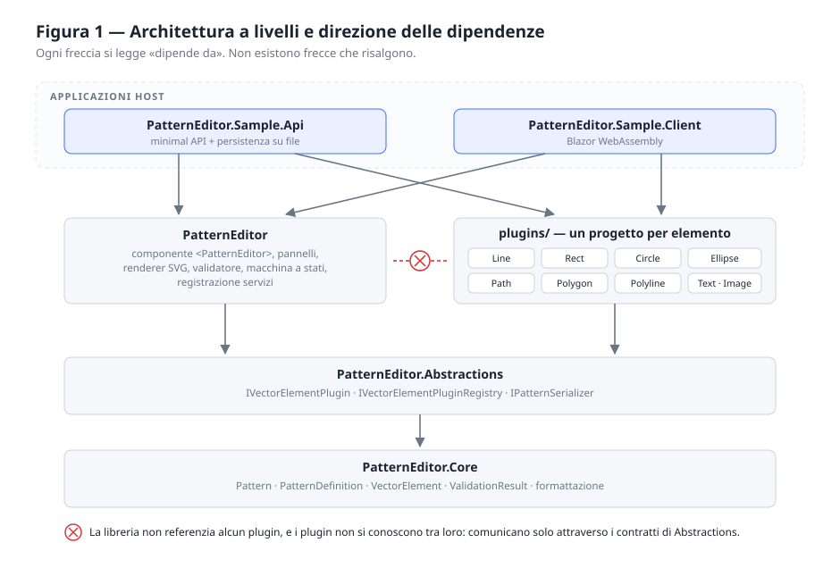

### 2.1 I livelli

| Livello | Progetto | Responsabilità |
|---|---|---|
| Dominio | `PatternEditor.Core` | Modello dei dati, esito di validazione, formattazione numerica e testuale |
| Contratti | `PatternEditor.Abstractions` | Contratto dei plugin, registro, serializzatore |
| Componente | `PatternEditor` | Componente Blazor, pannelli, renderer SVG, validatore, macchina a stati |
| Estensioni | `plugins/PatternEditor.Element.*` | Un progetto per tipo di elemento |
| Applicazioni | `PatternEditor.Sample.*` | API di persistenza e client dimostrativi |

### 2.2 Regole di dipendenza

Queste regole sono vincolanti e verificabili leggendo i riferimenti dei progetti.

1. **Il componente principale non referenzia alcun plugin.** Il progetto `PatternEditor`
   dipende esclusivamente da `Abstractions`.
2. **I plugin non si conoscono tra loro.** Ogni plugin dipende da `Abstractions` e da null'altro
   del sistema. Logica condivisa fra due plugin va collocata nel livello comune, mai in uno dei due.
3. **Solo l'applicazione host conosce i tipi concreti.** È il punto — e l'unico — in cui si
   decide quali elementi esistono.

```csharp
builder.Services.AddPatternEditor();
builder.Services.AddPatternEditorPlugin<LinePlugin>();
builder.Services.AddPatternEditorPlugin<RectPlugin>();
// … una riga per ogni elemento che questa applicazione rende disponibile
```

### 2.3 Struttura della soluzione

```
src/        Core, Abstractions, PatternEditor, Sample.Api, Sample.Client
plugins/    un progetto per tipo di elemento vettoriale
tests/      un progetto di test per ogni progetto di src/ e plugins/
docs/       questo documento e le sue figure
```

I plugin stanno in una cartella propria perché sono il punto di estensione del sistema, non
parte della libreria. La struttura sul disco rende visibile il vincolo architetturale.

### 2.4 Le unità della soluzione, una per una

L'inventario serve a una cosa sola: sapere dove si mette mano quando qualcosa va cambiato.
La colonna «dipende da» è la verifica della regola precedente — nessuna riga la contraddice.

**`PatternEditor.Core` — il dominio.** Non conosce Blazor, non conosce HTTP, non conosce i
plugin. È l'unico progetto che potrebbe essere compilato e usato da un programma a riga di
comando.

| Unità | Che cosa è | Punti da sapere |
|---|---|---|
| `Models/Pattern` | Il documento: identificativo, nome, definizione, versione, due date | `CurrentVersion` è la versione del formato, non del prodotto; `DefaultCreatedAtFor` ricava la data dall'UUIDv7 quando il documento non ce l'ha |
| `Models/PatternDefinition` | La cella (larghezza, altezza), la trasformazione (scala, rotazione, due traslazioni) e l'elenco degli elementi | È la parte che descrive *il disegno*; tutto il resto di `Pattern` descrive *il documento* |
| `Models/VectorElement` | La classe base di ogni elemento: identificativo, tipo, e la posizione nel piano (rotazione, specchiature, punto di rotazione) | Non ha riempimento né bordo: una linea non ha interno, e una base con proprietà che metà dei figli ignora è una base sbagliata. La rotazione invece vale per tutti (§3.3) |
| `Models/IOverallOpacity` | Il modello dichiara che la sua opacità complessiva la mostra l'editor, nella sezione comune | Un'interfaccia e non una proprietà ereditata: i modelli la dichiarano già, e l'ereditarietà ne creerebbe due omonime (§3.3) |
| `Models/UnknownVectorElement` | Un elemento di tipo non riconosciuto, con il suo JSON originale conservato | Attraversa il sistema senza essere compreso e senza essere perduto |
| `Models/Uuid7` | Generazione e lettura degli identificativi ordinabili nel tempo | I primi 48 bit sono l'istante in millisecondi: da qui la data di creazione di ripiego |
| `Formatting/InvariantNumber` | Numeri in forma invariante, e lettura tollerante | `0.5` e non `0,5`: in SVG la virgola è un separatore, non un decimale |
| `Formatting/SvgColor` | Riconoscimento e normalizzazione dei colori esadecimali | Accetta `#abc`, `abc`, `3b6ef5`; dice anche se un testo è *ancora* incompleto, che è ciò che serve per non applicarlo mentre lo si scrive |
| `Formatting/SvgPoints` | Conteggio e verifica degli elenchi di punti | Serve a poligono e spezzata, che non hanno altro modo di essere validati |
| `Formatting/SvgText` | Protezione del testo che entra nel markup | Due funzioni distinte: dentro un attributo e dentro il contenuto di un tag |
| `Validation/ValidationResult` | Errori e avvisi, separati | L'errore impedisce la conferma, l'avviso no |

**`PatternEditor.Abstractions` — i contratti.** Dipende da `Core` e da nient'altro. È il
progetto che un autore di plugin referenzia.

| Unità | Che cosa è | Punti da sapere |
|---|---|---|
| `IVectorElementPlugin` | Il contratto di un tipo di elemento: identificativo, nome visibile, icona, tipo CLR del modello, tipo del componente di modifica, creazione, validazione, rendering | `IconSvg` ha un'implementazione predefinita: un plugin già scritto non deve essere costretto a fornirla |
| `IVectorElementPluginRegistry` | La sola domanda che l'editor pone: «chi gestisce questo tipo?» | `TryGet` restituisce `false`, non solleva: un tipo sconosciuto non è un errore |
| `VectorElementPluginRegistry` | L'implementazione: un dizionario riempito all'avvio e poi solo letto | Confronto ordinale; identificativo duplicato = eccezione all'avvio |
| `PatternSerializer` | La traduzione fra documento JSON e modello, in entrambi i versi | È l'unico punto che conosce il formato; vedi §2.10 |

**`PatternEditor` — il componente.** Dipende da `Abstractions`. Non referenzia alcun plugin.

| Unità | Che cosa è | Punti da sapere |
|---|---|---|
| `Components/PatternEditor.razor` | Il contenitore: possiede la copia in modifica e decide quando è valida | Espone `Pattern`, `OnConfirm`, `OnCancel`, `Theme` |
| `Components/PatternEditorToolbar.razor` | Nome del pattern e le due decisioni sulla sessione | Sullo schermo stretto la stessa barra galleggia sopra l'anteprima |
| `Components/PatternPropertiesEditor.razor` | Cella e trasformazione | Cursore e casella numerica per lo stesso valore: esplorare e precisare sono due gesti diversi |
| `Components/PatternPreviewPanel.razor` | Le due anteprime, il sorgente, copia e scarica | L'unico pannello che parla con JavaScript |
| `Components/VectorElementsPanel.razor` | Elenco e dettaglio degli elementi, riordino, duplicazione, eliminazione | Ospita `DynamicComponent`: è la porta dei plugin |
| `Components/VectorElementIcon.razor` | L'icona dichiarata dal plugin, dentro un `<svg>` costruito qui | Il plugin fornisce il contenuto, non il contenitore |
| `Services/PatternFactory` | Il pattern nuovo: cella 50×50, trasformazione neutra, nessun elemento | Le misure di partenza stanno qui, in un punto solo, e non sparse fra i componenti |
| `Services/PatternSvgRenderer` | Il markup: cella singola, ripetizione, documento completo | Vedi §2.9 |
| `Services/PatternValidator` | Le regole che valgono per il pattern, non per il singolo elemento | Delega ai plugin la validazione dei loro modelli |
| `Services/SvgSourceFormatter` | Il sorgente indentato mostrato nel pannello | Solo presentazione: il markup generato non cambia |
| `Services/VectorElementCloner` | La copia di un elemento, qualunque sia il tipo | Passa dal serializzatore: funziona anche sui tipi sconosciuti |
| `Services/PatternCloner` | La copia di un pattern intero | Identificativo nuovo, date nuove, elementi clonati uno per uno |
| `Services/SvgPatternImporter` | Da documento SVG a pattern, con il resoconto di ciò che è rimasto fuori | Non nomina alcun tipo concreto: vedi §6.6 |
| `State/PatternEditorStateMachine` | Gli stati della sessione e le transizioni ammesse | Vive fuori da Blazor per poter essere verificata senza renderizzare nulla |
| `State/PatternHistory` | La cronologia di annullamento e ripetizione della sessione | Conserva istantanee e non comandi, così nessun plugin deve saper invertire le proprie modifiche (§7.6). Come la macchina a stati, non conosce Blazor |
| `Extensions/ServiceCollectionExtensions` | `AddPatternEditor()` e `AddPatternEditorPlugin<T>()` | Vedi §2.5 |
| `wwwroot/patternEditor.css` | L'intero aspetto, su variabili CSS e query di contenitore | Nessun riconoscimento del dispositivo: si guarda lo spazio disponibile |
| `wwwroot/patternEditorInterop.js` | Le tre funzioni che richiedono il browser | Vedi §2.11 |

**`plugins/PatternEditor.Element.*` — un progetto per tipo.** Ciascuno contiene esattamente
tre cose: il modello (`XxxElement`), il plugin (`XxxPlugin`) e il componente di modifica
(`Components/XxxEditor.razor`). Nessuno dipende dagli altri.

**`PatternEditor.Sample.Api` e `PatternEditor.Sample.Client` — l'applicazione di riferimento.**
Mostrano l'integrazione; non fanno parte della libreria. Vedi §10 e §2.12.

Sono due progetti e **una sola applicazione**: `Sample.Api` referenzia `Sample.Client`, ne
serve i file e risponde alle sue chiamate. Restano due progetti perché il codice che gira nel
browser si compila in WebAssembly e quello lo sa fare soltanto l'SDK `BlazorWebAssembly`;
quello che non esiste è la seconda pubblicazione. Vedi §10.6.

### 2.5 Composizione a runtime: chi registra che cosa

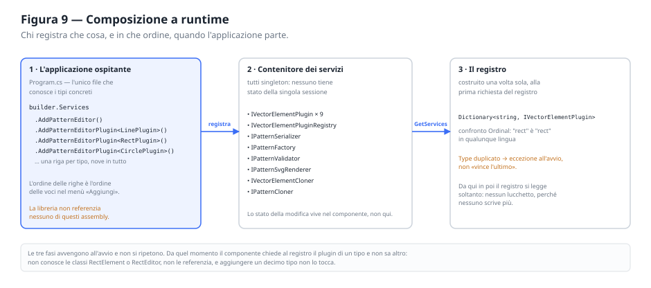

L'architettura descritta finora è una promessa che si mantiene in un punto solo: l'avvio. È lì
che i tipi concreti entrano nel sistema, ed è l'unico posto in cui compaiono.

1. **L'ospite dichiara.** `AddPatternEditor()` registra i servizi della libreria;
   `AddPatternEditorPlugin<T>()` aggiunge un plugin all'elenco. Nient'altro, in tutta la
   soluzione, nomina `RectPlugin`.
2. **Il contenitore raccoglie.** Tutti i servizi sono singleton, e non è un'ottimizzazione: sono
   senza stato per costruzione. Lo stato della modifica appartiene al componente, che ne ha uno
   per ogni sessione aperta; metterlo in un servizio condiviso significherebbe due editor aperti
   che si scrivono addosso.
3. **Il registro si costruisce una volta.** Alla prima richiesta, la fabbrica registrata
   raccoglie tutti gli `IVectorElementPlugin` e li indicizza per `Type`.

L'ordine delle registrazioni non è indifferente: è l'ordine delle voci nel menù di inserimento.
Chi compone l'applicazione decide anche come si presenta la scelta, senza toccare la libreria.

> **Requisito.** Un identificativo di tipo duplicato deve fermare l'avvio. L'alternativa — «vince
> l'ultimo registrato» — produce un'applicazione che funziona quasi: un tipo di elemento gestito
> da un plugin che nessuno si aspetta, e un difetto che si manifesta solo sui documenti che
> contengono quel tipo.

> **Nota di progetto.** Il registro non è sincronizzato. È corretto perché le due fasi sono
> nettamente separate: si scrive all'avvio, si legge per tutta la vita del programma. Proteggere
> ogni lettura con un lucchetto costerebbe a ogni rendering dell'interfaccia per un'eventualità
> che non si verifica.

### 2.6 L'albero dei componenti

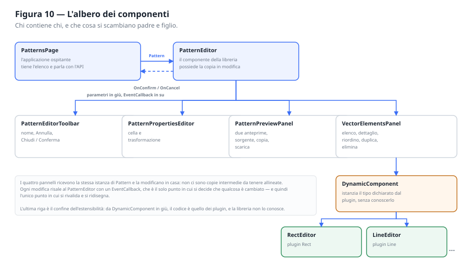

Il componente è un albero di quattro livelli, e ogni livello ha una regola di comunicazione
sola: **i dati scendono come parametri, gli avvisi risalgono come `EventCallback`**.

| Livello | Chi | Che cosa possiede |
|---|---|---|
| 1 | L'applicazione ospitante | L'elenco dei pattern e il dialogo con l'archivio |
| 2 | `PatternEditor` | La copia in modifica, lo stato della sessione, l'esito della validazione |
| 3 | I quattro pannelli | Niente: leggono e scrivono la stessa istanza |
| 4 | L'editor del plugin, dentro `DynamicComponent` | Niente: scrive nel proprio elemento |

I pannelli **non tengono copie**. Non è pigrizia: una copia per pannello vorrebbe dire quattro
copie da riallineare a ogni modifica, e il primo difetto sarebbe un valore che si vede in
un'anteprima e non nell'altra. Lavorando tutti sulla stessa istanza, il disallineamento è
impossibile per costruzione.

L'ultima riga dell'albero è il confine dell'estensibilità. `DynamicComponent` riceve dal plugin
il tipo del componente da istanziare e i parametri da passargli; la libreria non conosce quel
tipo, non lo compila, non lo referenzia. È il motivo per cui un decimo elemento non richiede una
riga di modifica al componente.

### 2.7 Il giro di una modifica

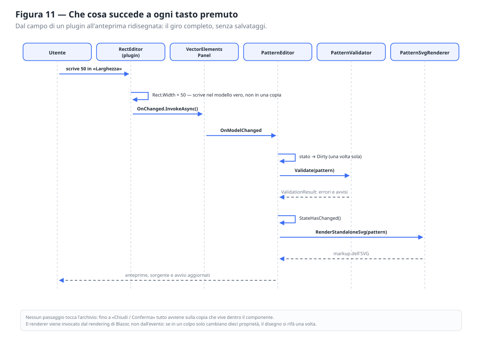

Ogni battuta sulla tastiera percorre lo stesso tracciato. Descriverlo per intero serve a
mostrare che **non esiste un percorso alternativo**: non c'è un caso in cui l'anteprima si
aggiorna senza passare per la validazione, o in cui il modello cambia senza che lo stato diventi
«modifiche non salvate».

1. Il campo di un editor di plugin scrive nel proprio elemento — nel modello vero, non in una
   copia di lavoro.
2. L'editor segnala la modifica con il proprio `EventCallback`.
3. Il pannello lo rilancia al `PatternEditor`, che è l'unico a sapere che cosa farne.
4. Il `PatternEditor` marca la sessione come sporca — una volta sola, non a ogni battuta — e
   rivalida l'intero pattern.
5. Il rendering di Blazor ricostruisce i pannelli; il renderer produce il markup nuovo.

> **Nota di realizzazione.** Il renderer non viene invocato dall'evento ma dal rendering: se un
> gesto cambia dieci proprietà, il disegno si rifà una volta. Chiamare il renderer dentro il
> gestore dell'evento lo farebbe lavorare dieci volte per mostrare lo stesso risultato.

> **Requisito.** Nessun passaggio di questo giro tocca l'archivio. Il pulsante «Applica» non
> esiste perché l'anteprima è già la risposta; il salvataggio è un'altra cosa, e ha un altro
> pulsante.

### 2.8 Il ciclo di una sessione

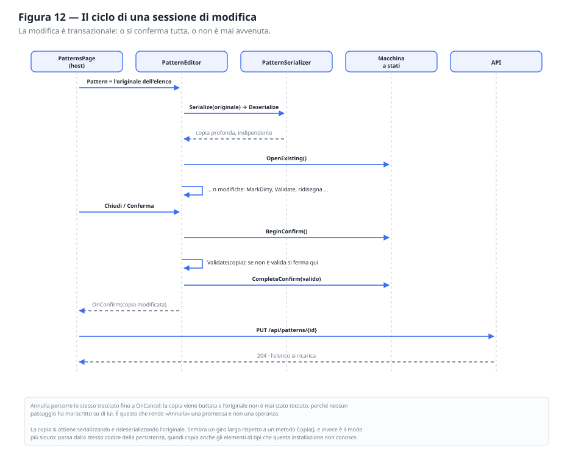

La sessione di modifica è **transazionale**: o si conferma tutta, o non è mai avvenuta. Il
meccanismo che lo garantisce sta in una riga sola — il componente non modifica il pattern che
riceve, ma una copia profonda che si costruisce all'apertura.

La copia si ottiene **serializzando e rideserializzando** l'originale. È un giro più lungo di un
metodo `Copia()`, e la scelta è deliberata: passa dallo stesso codice della persistenza, quindi
copia correttamente anche gli elementi dei tipi che questa installazione non conosce, e non c'è
un secondo luogo da aggiornare quando il modello cresce di un campo.

| Momento | Stato | Che cosa è vero |
|---|---|---|
| Apertura di un pattern esistente | `Editing` | La copia esiste, l'originale non è stato toccato |
| Apertura di un pattern nuovo | `Creating` | La copia viene dalla fabbrica, non dall'archivio |
| Prima modifica | `Dirty` | Da qui in poi chiudere senza confermare perde qualcosa |
| Validazione continua | `Valid` / `Invalid` | L'esito accompagna la modifica, non la blocca |
| Conferma | `Confirming` → `Confirmed` | Si rivalida tutto: la validazione continua può aver saltato l'ultima battuta |
| Annullamento | `Cancelled` | La copia viene abbandonata |

> **Requisito.** La macchina a stati rifiuta le transizioni non previste sollevando
> un'eccezione. Non è severità fine a sé stessa: una conferma che arriva quando l'editor è
> chiuso è un difetto del chiamante, e deve emergere durante lo sviluppo, non produrre un
> salvataggio silenzioso di dati che nessuno stava più modificando.

> **Requisito.** Le date non le decide il componente. `CreatedAt` appartiene al documento già
> salvato e non viene mai riscritta; `ModifiedAt` la assegna il livello di persistenza al
> momento in cui scrive. Aprire un pattern e annullare non deve cambiare nulla, **nemmeno le
> date**.

### 2.9 La catena di generazione dell'SVG

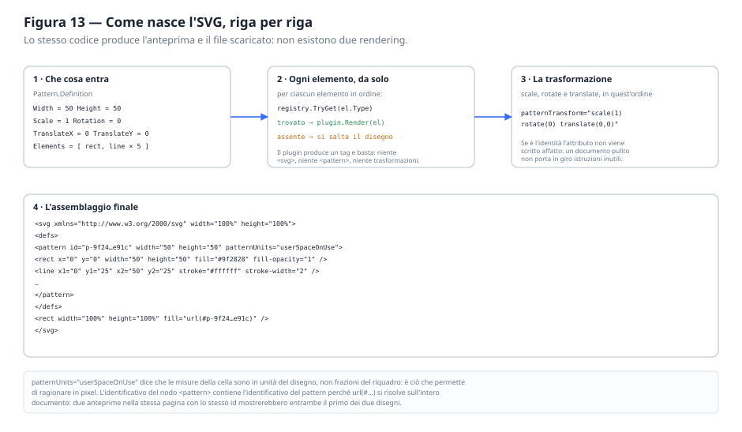

Il markup si costruisce in quattro passaggi, e lo stesso codice produce l'anteprima nell'editor,
la miniatura nella scheda della pagina iniziale e il file che si scarica. Non esistono due
rendering, e quindi non esiste la classe di difetti in cui l'anteprima mostra una cosa e il file
ne contiene un'altra.

| Passaggio | Chi lo fa | Che cosa produce |
|---|---|---|
| 1 · Lettura della definizione | Il renderer | Misure della cella e valori della trasformazione |
| 2 · Disegno dei singoli elementi | Ogni plugin, interrogato per tipo | Un tag per elemento, nell'ordine dell'elenco |
| 3 · Costruzione della trasformazione | Il renderer | `patternTransform`, oppure niente se è l'identità |
| 4 · Assemblaggio | Il renderer | `<svg>`, `<defs>`, `<pattern>`, e il rettangolo che lo usa |

Il confine fra il passaggio 2 e gli altri è la regola più importante del contratto: **il plugin
produce un tag, non un documento**. Non genera `<svg>`, non genera `<pattern>`, non applica
trasformazioni. Se lo facesse, la stessa forma non potrebbe più essere disegnata sia dentro la
cella singola sia dentro la ripetizione, che sono due contenitori diversi.

Un elemento di tipo sconosciuto **non viene disegnato**: nessuno sa come. Resta però
nell'elenco e nel documento salvato (§2.10). L'alternativa — disegnare un segnaposto — mostrerebbe
nell'anteprima una forma che non esiste nel file.

> **Requisito.** L'identificativo del nodo `<pattern>` deve essere univoco nella pagina, perché
> `url(#id)` si risolve sull'intero documento e non sul singolo `<svg>`. Due anteprime con lo
> stesso identificativo mostrerebbero entrambe il primo dei due disegni. L'identificativo si
> deriva da quello del pattern; dove lo stesso pattern compare due volte nella stessa pagina —
> l'editor su schermo stretto ne è l'esempio — il secondo riquadro ne riceve uno proprio.

### 2.10 Il confine con il formato

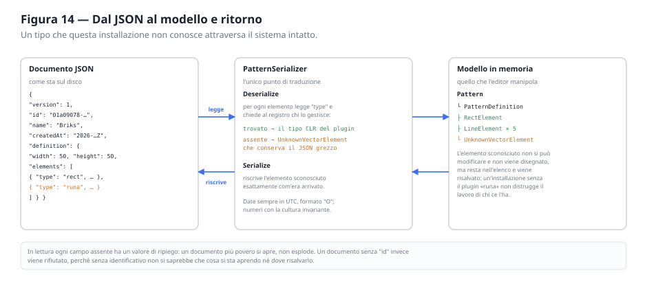

Un solo punto del sistema conosce il formato del documento, ed è il serializzatore. Tutto il
resto lavora su oggetti. La conseguenza pratica è che una modifica al formato si fa in un file,
e i test di andata e ritorno la verificano senza avviare nulla.

Il passaggio che merita attenzione è la **deserializzazione di un elemento**:

1. si legge il campo `type`;
2. si chiede al registro chi lo gestisce;
3. se c'è, si deserializza nel tipo CLR dichiarato dal plugin;
4. se non c'è, si costruisce un `UnknownVectorElement` che **conserva il JSON originale**.

In scrittura, l'elemento sconosciuto viene riscritto esattamente com'era arrivato. Un
documento prodotto da un'installazione con più plugin di questa si apre, si modifica nelle parti
comprese e si risalva **senza perdere niente**. È il requisito T4, e senza questo meccanismo
sarebbe impossibile mantenerlo.

> **Nota di progetto.** In lettura ogni campo assente ha un valore di ripiego, tranne
> l'identificativo. La tolleranza serve ad aprire documenti più poveri; l'eccezione
> sull'identificativo serve perché senza di esso non si saprebbe che cosa si sta aprendo né
> dove risalvarlo, e un identificativo inventato al volo produrrebbe un duplicato al primo
> salvataggio.

### 2.11 I punti di contatto con JavaScript

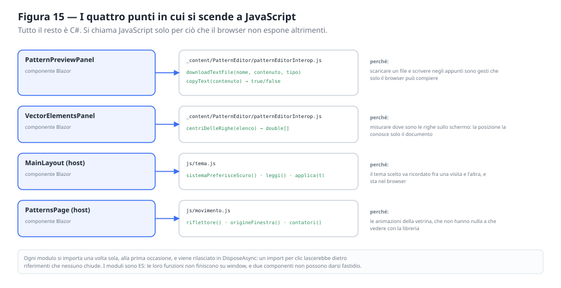

Sono quattro, tutti elencabili, e nessuno contiene logica: scaricare un file, scrivere negli
appunti, misurare dove sono le righe sullo schermo, e — nell'applicazione ospitante — ricordare
il tema e animare la vetrina. Tutto ciò che si può fare in C# si fa in C#.

| Chiamante | Modulo | Perché non si può fare altrimenti |
|---|---|---|
| `PatternPreviewPanel` | `patternEditorInterop.js` | Scaricare un file e scrivere negli appunti sono gesti che solo il browser può compiere |
| `VectorElementsPanel` | `patternEditorInterop.js` | La posizione delle righe sullo schermo la conosce solo il documento |
| `MainLayout` (ospite) | `tema.js` | La preferenza va ricordata fra una visita e l'altra, e sta nel browser |
| `PatternsPage` (ospite) | `movimento.js` | Animazioni della pagina dimostrativa, estranee alla libreria |

> **Requisito.** I moduli si importano una volta sola, alla prima occasione, e si rilasciano in
> `DisposeAsync`. Un import per clic lascerebbe dietro riferimenti che nessuno chiude. Si usano
> moduli ES e non funzioni globali: così due componenti non possono darsi fastidio a vicenda, e
> il nome di una funzione non è un nome pubblico.

### 2.12 Il percorso dei dati, dal campo al file

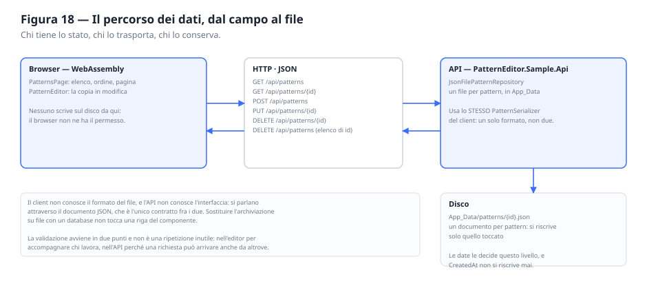

Il quadro d'insieme, dalla casella in cui si scrive fino al file su disco. Le tre parti si
parlano attraverso **un solo contratto**, il documento JSON: il client non conosce il formato
dell'archivio, l'API non conosce l'interfaccia.

La validazione avviene in due punti e non è una ripetizione inutile: nell'editor accompagna chi
lavora, nell'API difende l'archivio, perché una richiesta può arrivare anche da un altro
programma. Sostituire l'archiviazione su file con una base di dati non tocca una riga del
componente.

### 2.13 Registro delle decisioni

Le scelte che hanno formato l'architettura, con l'alternativa scartata e il prezzo pagato. È la
sezione da leggere per prima quando una di queste scelte comincia a dare fastidio: il prezzo era
noto.

| # | Decisione | Alternativa scartata | Perché | Prezzo |
|---|---|---|---|---|
| D1 | Un plugin per tipo di elemento, in un progetto proprio | Un `switch` sul tipo dentro il componente | Un tipo nuovo non tocca il componente | Più progetti, più cerimonia per il primo elemento |
| D2 | Il plugin dichiara anche il proprio componente di modifica | Interfacce di modifica generate da metadati | Ogni elemento ha campi suoi, e i metadati generici li appiattiscono | Il plugin deve dipendere da Blazor |
| D3 | Copia profonda all'apertura | Modifica diretta con annullamento a ritroso | «Annulla» diventa una certezza, non una ricostruzione | Un pattern molto grande si copia due volte per aprirsi |
| D4 | La copia passa dal serializzatore | Un metodo `Copia()` scritto a mano | Copia anche i tipi sconosciuti, e non c'è un secondo posto da aggiornare | Più lento di una copia dedicata |
| D5 | Macchina a stati separata da Blazor | Campi booleani dentro il componente | Si verifica senza renderizzare nulla | Una classe in più da tenere allineata all'interfaccia |
| D6 | Tipi sconosciuti conservati | Scarto silenzioso, o rifiuto del documento | Un'installazione senza un plugin non distrugge il lavoro di chi ce l'ha | Un elemento che si vede nell'elenco e non si può toccare |
| D7 | Una sola pagina per tutte le larghezze | Una versione per telefono | Nessun riconoscimento del dispositivo, un solo codice da mantenere | Fogli di stile più elaborati, con query di contenitore |
| D8 | Riordino con gli eventi del puntatore | Drag-and-drop di HTML | Sul tocco il secondo non esiste | Il trascinamento va scritto a mano, compresa la misura delle righe |
| D9 | L'API legge il corpo come testo | Model binding predefinito | Il binding non gestisce il polimorfismo degli elementi | Gli errori di formato vanno tradotti a mano in 400 |
| D10 | Servizi tutti singleton e senza stato | Servizi con lo stato della sessione | Due editor aperti non si disturbano | Lo stato va passato, non trovato |


---

## 3. Modello di dominio

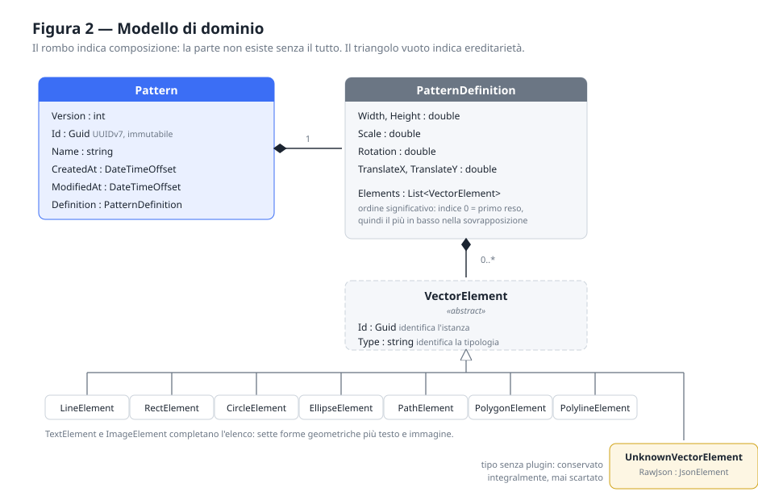

### 3.1 Pattern

| Proprietà | Tipo | Regole |
|---|---|---|
| `Version` | int | Versione del **contratto dati**, non dell'applicazione |
| `Id` | Guid | UUIDv7, assegnato alla creazione, immutabile, non modificabile dall'utente |
| `Name` | string | Descrittivo, modificabile, può essere vuoto |
| `CreatedAt` | DateTimeOffset | Istante di creazione, mai modificato dopo |
| `ModifiedAt` | DateTimeOffset | Istante dell'ultimo salvataggio |
| `Visibility` | PatternVisibility | `Privata` · `InAttesa` · `Pubblica`. Predefinito **`Privata`** (§11.13) |
| `Definition` | PatternDefinition | Definizione grafica completa |

**Perché UUIDv7 e non un intero progressivo.** L'identificativo viene assegnato dal client al
momento della creazione, prima che il pattern raggiunga qualunque archivio: un progressivo
richiederebbe un giro sul server. UUIDv7 aggiunge una proprietà che si è rivelata preziosa:
essendo ordinabile nel tempo e contenendo il proprio istante di generazione, fornisce
gratuitamente sia l'ordinamento naturale dell'elenco sia la data di creazione (§9.3).

**`Visibility` la libreria la trasporta e non la interpreta**, esattamente come l'autore
(§11.10): non sa che cosa sia un portale né chi possa approvare che cosa. I tre stati non sono
tre livelli della stessa scala — `InAttesa` non è «un po' pubblica», è una **richiesta**, e la
differenza è quella che impedisce a chi si registra di pubblicare.

**`Version` non è la versione dell'applicazione.** Descrive il formato del documento. Serve a
poter introdurre in futuro un formato incompatibile senza dover interpretare tutti i documenti
esistenti come appartenenti implicitamente all'ultima versione.

### 3.2 PatternDefinition

| Proprietà | Tipo | Predefinito | Regole |
|---|---|---|---|
| `Width`, `Height` | double | 50 | Maggiori di zero |
| `Scale` | double | 1.0 | Maggiore di zero |
| `Rotation` | double | 0 | Compresa fra 0 e 360 |
| `TranslateX`, `TranslateY` | double | 0 | Nessun vincolo |
| `Elements` | List&lt;VectorElement&gt; | vuoto | **Ordine significativo** |

**L'ordine degli elementi è un dato, non un dettaglio.** L'elemento in posizione 0 viene reso
per primo e risulta quindi sotto ai successivi. L'ordine va preservato in modifica,
serializzazione, deserializzazione e generazione SVG; l'interfaccia deve offrire un modo
esplicito per cambiarlo.

**Il modello non memorizza `patternTransform`.** La trasformazione è descritta da quattro
proprietà indipendenti e leggibili. La loro conversione nell'attributo SVG è responsabilità
esclusiva del generatore (§6.2). Memorizzare direttamente la stringa SVG significherebbe
salvare una decisione di rendering dentro il modello, e renderebbe impossibile modificare la
sola rotazione senza interpretare la stringa.

### 3.3 VectorElement

La classe base contiene **solo** ciò che serve a trattare un elemento genericamente:

- `Id` — identifica l'istanza dell'elemento nel pattern;
- `Type` — identifica la tipologia (`"rect"`, `"circle"`, …).

Le proprietà geometriche e grafiche **non compaiono qui**. Non esiste una `Fill` sulla classe
base: una linea non ha una superficie da riempire, e un modello che glielo permettesse
mentirebbe. Ogni plugin definisce il proprio modello concreto con esattamente le proprietà
che quel tipo possiede.

#### L'eccezione: la posizione nel piano

Sulla base stanno anche `Rotation`, `FlipX`, `FlipY` e il punto `OriginX`/`OriginY` attorno a
cui le due cose avvengono. Non è una contraddizione della regola precedente, è la stessa regola
applicata bene: ruotare **non è una proprietà del rettangolo o del cerchio**, è un'operazione
che vale per qualunque forma e si ottiene allo stesso modo per tutte. Metterla nei plugin
significherebbe scriverla nove volte e dimenticarla alla decima.

Il plugin continua a non saperne niente: produce il proprio tag come prima, e l'involucro
`<g transform="…">` lo aggiunge il renderer, in un punto solo.

> **Requisito.** Il punto di rotazione è **esplicito** e non ricavato dall'ingombro della forma.
> L'ingombro lo conosce solo il plugin, e chiederglielo allargherebbe il contratto per una
> funzione che non lo richiede; in più, nei retini il centro che serve è quasi sempre un punto
> scelto — il centro della cella, un angolo — e un'ipotesi automatica andrebbe corretta a mano
> quasi ogni volta. L'interfaccia offre «il centro della cella» come scorciatoia, non come
> valore predefinito nascosto.

> **Requisito.** Un elemento senza rotazione e senza specchiature **non** deve produrre alcun
> involucro: un `<g>` con una trasformazione identica è rumore in ogni file salvato. E i
> documenti scritti prima che questi campi esistessero devono valere come «nessuna
> trasformazione», altrimenti l'intero archivio cambierebbe aspetto alla prima apertura.

#### L'opacità complessiva: la stessa esigenza, una soluzione diversa

Anche l'opacità dell'elemento intero vale per tutti i tipi, e anche lei merita una sezione
sola nell'interfaccia invece di nove copie. Ma **non** può salire sulla classe base come la
rotazione, e la differenza fra i due casi è istruttiva.

La rotazione era una proprietà **nuova**: nessun modello la dichiarava, e metterla sulla base
non ha nascosto niente. L'opacità invece è già dichiarata da tutti e nove i modelli. Se
salisse sulla base, un plugin compilato prima — che continua a dichiarare la propria — ne
nasconderebbe una omonima ereditata, e il serializzatore, trovando **due** proprietà chiamate
`Opacity`, solleverebbe un'eccezione all'apertura di qualunque documento. Non un dato
sbagliato: un editor che non si apre più. Ed è esattamente la promessa che §3.4 fa il
possibile per mantenere.

> **Requisito.** L'opacità complessiva si dichiara con un'**interfaccia** (`IOverallOpacity`),
> non con una proprietà ereditata. Implementarla significa «la mia opacità la mostra l'editor,
> nella sezione comune»; un plugin che non la implementa continua a mostrarla per conto
> proprio nella sua scheda. Le due cose convivono senza che nessuna delle due si accorga
> dell'altra, e nessun documento cambia formato — nel JSON la proprietà si chiama `opacity`
> prima e dopo.

> **Requisito.** Le due sezioni comuni — «Posizione» e «Generale» — stanno **dopo** quelle del
> plugin e in quest'ordine: prima la forma, poi dove sta, infine quanto è trasparente il
> risultato. La riga tratteggiata che separa i gruppi va chiesta esplicitamente, perché queste
> sezioni non sono sorelle di quelle del tipo: quelle vivono dentro il contenitore del plugin.

> **Requisito.** Su foglio largo i campi di un gruppo si affiancano a due a due (§7.7), e ciò
> che **non** è un campo — gli interruttori di specchiatura, un pulsante, una nota — deve
> dichiarare di occupare la riga intera. Senza dirlo, entra anch'esso nella distribuzione a
> coppie: gli interruttori finiscono in una colonna e «Centro X» accanto a loro, con «Centro Y»
> sfalsato sulla riga dopo. I due interruttori, fra loro, stanno **affiancati**: sono la stessa
> domanda posta sui due assi, e incolonnarli li fa leggere come due scelte scollegate.

> **Requisito.** Il pulsante che riempie il centro con la metà della cella porta sotto di sé una
> nota che dice **quali numeri scriverà**, ricavati dalla cella corrente. Un pulsante che si
> deve premere per scoprire che cosa fa costringe a premerlo e poi ad annullare, e mostrare i
> valori evita anche di andarli a cercare nella scheda delle proprietà.

> **Requisito.** Nessun plugin deve chiamare «Posizione» una propria sezione. Il testo lo
> faceva — erano le coordinate del punto di ancoraggio — e due sezioni con lo stesso nome
> nella stessa scheda si contendono il significato: la sua ora si chiama «Coordinate».

#### Da dove viene l'unicità dell'identificativo

Gli identificativi sono UUIDv7 e vengono generati con la funzione della piattaforma. Vale la
pena dire **come** garantiscono l'unicità, perché il meccanismo non è quello che si immagina:

- i primi 48 bit sono l'istante in millisecondi, e servono a rendere gli identificativi
  **ordinabili nel tempo** — non a distinguerli;
- i restanti 74 bit sono **casuali**, prodotti dal generatore crittografico del sistema.

Non c'è quindi un contatore condiviso, e non c'è niente da rendere atomico: due chiamate nello
stesso millisecondo, anche da thread diversi, differiscono per quei 74 bit. La probabilità che
coincidano è dell'ordine di quella di indovinare una chiave, e non dipende da quante chiamate
avvengono insieme.

> **Nota.** Un identificativo ripetuto, quando capita, non arriva dal generatore: arriva da un
> **documento costruito da un programma esterno** che rigioca la propria sequenza
> pseudo-casuale — è quello che succede a uno script che, per riottenere due volte la stessa
> forma, riporta indietro lo stato del proprio generatore e nello stesso millisecondo riottiene
> anche lo stesso identificativo. Il sistema non può impedirlo, ma deve accorgersene: il
> validatore segnala i duplicati come errore bloccante (§8.1), e l'elenco degli elementi si
> appoggia all'istanza e non all'identificativo proprio per non morire su un documento fatto
> così.

### 3.4 Elementi senza plugin

Un documento può contenere un `type` per cui nessun plugin è registrato: perché il documento
proviene da un'installazione con più estensioni, o perché un plugin è stato temporaneamente
disattivato.

**La soluzione prevista** è `UnknownVectorElement`: l'elemento viene conservato con il proprio
JSON originale intatto e riscritto identico al salvataggio successivo. Non viene eliminato,
non viene convertito in un altro tipo, non impedisce il salvataggio. Non viene disegnato —
non c'è nessuno che sappia come — e la sua presenza è segnalata come avviso, non come errore.

> **Requisito.** Aprire e risalvare un documento con un elemento sconosciuto deve produrre un
> documento equivalente all'originale. È una perdita di dati silenziosa il difetto più grave
> che questo sistema possa avere.

---

## 4. Sistema a plugin

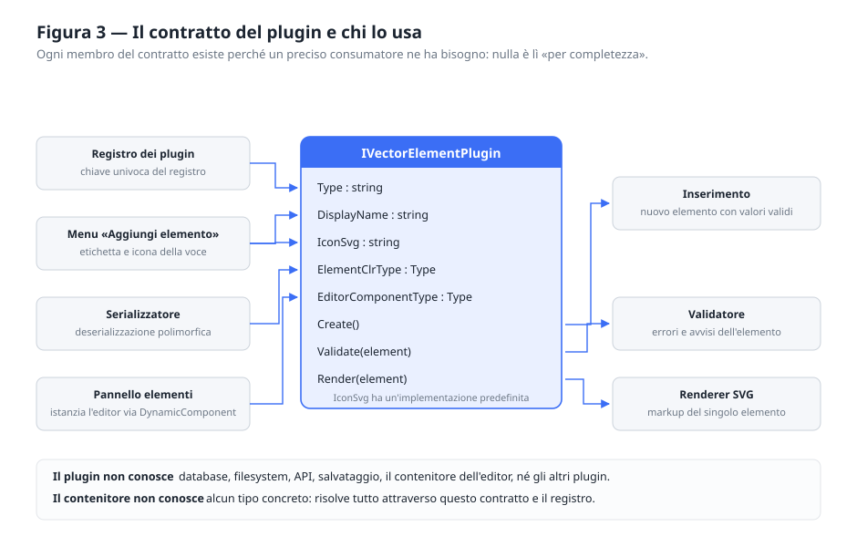

### 4.1 Il contratto

| Membro | Serve a |
|---|---|
| `Type` | Chiave univoca nel registro e discriminatore nel JSON |
| `DisplayName` | Etichetta per l'utente (mai usata per identificare tecnicamente il tipo) |
| `IconSvg` | Icona nel menu di inserimento e nella riga dell'elemento |
| `ElementClrType` | Deserializzazione polimorfica |
| `EditorComponentType` | Componente Blazor per modificare l'elemento |
| `Create()` | Nuova istanza con valori predefiniti **validi** |
| `Validate(element)` | Regole specifiche del tipo |
| `Render(element)` | Markup SVG dell'elemento |

**`Type` e `DisplayName` sono cose diverse e devono restare separate.** Il primo è tecnico,
stabile nel tempo, indipendente dalla lingua, e finisce nei documenti salvati. Il secondo è
testo per l'utente e può cambiare o essere tradotto. Confonderli significherebbe rendere
illeggibili i documenti salvati alla prima traduzione dell'interfaccia.

**`IconSvg` ha un'implementazione predefinita.** L'icona è una rifinitura dell'interfaccia, non
parte del contratto funzionale: un plugin esistente che non la fornisce deve continuare a
funzionare, mostrando un'icona generica. Si adotta quindi un membro con implementazione
predefinita, e il contratto lo dichiara esplicitamente.

**`Create()` deve restituire un elemento valido.** Inserire un elemento non deve rendere
immediatamente non valido l'intero pattern: l'utente si troverebbe un errore prima ancora di
aver fatto qualcosa. Dove un valore predefinito sensato non esiste — il caso dell'immagine —
il plugin fornisce un segnaposto.

**Il plugin non conosce** database, filesystem, API, salvataggio, il contenitore dell'editor,
né gli altri plugin. Se un plugin avesse bisogno di una di queste cose, la responsabilità
sarebbe collocata nel posto sbagliato.

### 4.2 Il registro

Il registro associa `Type` al plugin ed è l'unico modo con cui il componente risolve un tipo.
`TryGet` restituisce `false` per un tipo non registrato: in quel caso **il chiamante non deve
eliminare né trasformare l'elemento**, ma preservarlo (§3.4).

---

## 5. Catalogo degli elementi

Nove tipi. Tutti condividono le proprietà di aspetto (`Fill`/`FillOpacity`, `Stroke`/
`StrokeWidth`/`StrokeOpacity`, `Opacity`) salvo dove indicato, e tutti hanno le stesse regole
comuni: opacità comprese fra 0 e 1, spessori non negativi.

| Tipo | Nome | Geometria | Predefiniti (cella 50×50) | Regole specifiche |
|---|---|---|---|---|
| `line` | Linea | `X1 Y1 X2 Y2` | 0,0 → 30,30 · tratto nero 1 | Nessun riempimento: una linea non ha superficie interna |
| `rect` | Rettangolo | `X Y Width Height` | 10,10 · 30×30 · riempito | Larghezza e altezza maggiori di zero |
| `circle` | Cerchio | `Cx Cy R` | centro 25,25 · raggio 15 | Raggio maggiore di zero |
| `ellipse` | Ellisse | `Cx Cy Rx Ry` | centro 25,25 · 20×12 | Entrambi i semiassi maggiori di zero |
| `path` | Tracciato | `D` (attributo SVG) | `M 0 25 L 25 0 L 50 25` · tracciato | Non vuoto; inizia con `M`/`m`; solo caratteri ammessi nei path data |
| `polygon` | Poligono | `Points` | pentagono · riempito | Almeno 3 vertici; coppie `x,y` valide |
| `polyline` | Spezzata | `Points` | zig-zag · tracciato | Almeno 2 vertici; coppie `x,y` valide |
| `text` | Testo | `Content X Y` + carattere | «Testo» centrato · 12 px | Testo non vuoto; dimensione maggiore di zero |
| `image` | Immagine | `Href X Y Width Height` | segnaposto · 5,5 · 40×40 | Sorgente `data:image/…` o `http(s)`; dimensioni maggiori di zero |

### 5.1 Coordinate non normalizzate

Le coordinate di ogni elemento sono espresse nel sistema di riferimento del pattern e **non
vengono normalizzate rispetto alla cella**. Un elemento può sporgere o trovarsi interamente
fuori: è il modo con cui si ottengono motivi che proseguono oltre il bordo e si ricongiungono
nella cella adiacente. Il rettangolo a `x = -25` del motivo «mattoni» è l'esempio tipico.

### 5.2 Poligono e spezzata sono elementi distinti

Condividono l'attributo `points` ma differiscono per specifica SVG, e la differenza si
riflette nel modello, nella validazione e nei valori predefiniti.

| | Poligono | Spezzata |
|---|---|---|
| Contorno | Si chiude fra ultimo e primo vertice | Resta aperto |
| Vertici minimi | 3 (serve una superficie) | 2 (basta un segmento) |
| Predefinito | Riempito | Tracciato, non riempito |

La lettura dell'attributo `points` è logica comune a due plugin che non possono conoscersi: va
collocata nel livello di base (`SvgPoints`). Attenzione a un dettaglio insidioso: **in `points`
la virgola separa le coordinate, non è un separatore decimale**. `"1,5"` è il punto (1, 5), non
il numero 1.5.

### 5.3 Il testo è l'unico elemento con contenuto

`<text>` porta la propria parte principale **fra i tag**, non in un attributo. Ne conseguono due
requisiti: il rendering non produce un tag autochiuso, e il testo va protetto con le regole del
contenuto e non con quelle di un attributo (§6.4).

Il carattere **non viene incorporato** nell'SVG: `font-family` è un riferimento a ciò che è
installato su chi apre il documento. Indicare un carattere specifico è legittimo ma produce un
avviso, perché il risultato fuori dall'applicazione può differire.

### 5.4 L'immagine e il compromesso sulla sorgente

Due forme ammesse, con conseguenze diverse che l'interfaccia deve rendere esplicite:

- **data URI** — l'immagine viaggia dentro il documento. Il pattern resta autosufficiente e
  l'SVG scaricato funziona ovunque; il documento cresce di circa un terzo rispetto al file
  originale. Oltre 512 kB si emette un avviso.
- **indirizzo http/https** — documento leggero, ma dipendente dalla raggiungibilità della
  risorsa.

Non sono ammesse altre sorgenti. Un `data:text/html`, uno schema `javascript:` o un percorso
locale non hanno alcun uso legittimo qui: il primo e il secondo sono vettori di rischio in un
documento condivisibile, il terzo non significa nulla per chi riceve il file.

L'attributo generato è `href` (SVG 2). Il vecchio `xlink:href` richiederebbe la dichiarazione
del namespace sul nodo `<svg>` radice, che è responsabilità del renderer e non del plugin.

---

## 6. Generazione dell'SVG

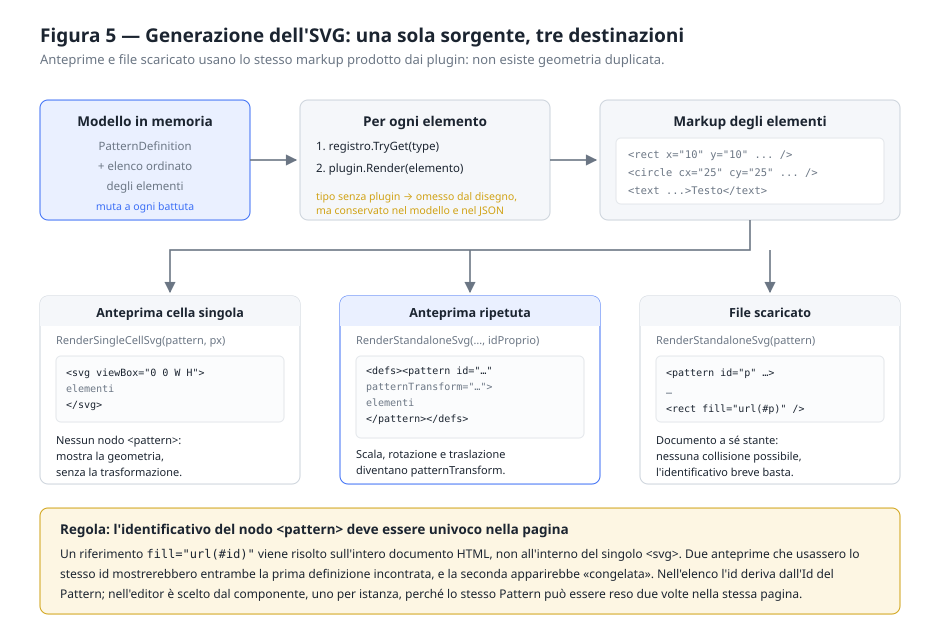

### 6.1 Una sola sorgente

Anteprima ingrandita, anteprima ripetuta e file scaricato **devono usare lo stesso markup**
prodotto dai plugin. Non deve esistere una seconda implementazione della geometria «solo per
l'anteprima»: due implementazioni divergono, e l'utente scoprirebbe la divergenza dopo aver
scaricato il file.

### 6.2 La trasformazione

Le quattro proprietà del modello diventano l'attributo `patternTransform`:

```
patternTransform="scale(S) rotate(R) translate(TX,TY)"
```

L'attributo **non viene emesso** quando la trasformazione è l'identità, per non sporcare il
documento con informazione priva di effetto.

All'utente la scala è presentata in percentuale (100 = dimensione reale), che è il modo in cui
si ragiona su un ingrandimento; il modello e l'SVG continuano a usare il fattore
moltiplicativo. La conversione resta confinata nell'editor delle proprietà, e va arrotondata
per non generare `scale(1.4500000000000002)`.

### 6.3 L'identificativo del nodo pattern

> **Requisito critico.** L'identificativo del nodo `<pattern>` deve essere univoco all'interno
> della pagina che lo ospita.

Un riferimento `fill="url(#id)"` viene risolto **sull'intero documento HTML**, non all'interno
del singolo `<svg>` che lo contiene. Due anteprime che usassero lo stesso identificativo
mostrerebbero entrambe la prima definizione incontrata: la seconda apparirebbe correttamente
disegnata ma **immobile**, insensibile a ogni modifica. È un difetto particolarmente insidioso
perché il markup generato è corretto e il modello anche: sbagliata è solo la risoluzione del
riferimento.

La regola si applica così:

| Destinazione | Identificativo | Motivo |
|---|---|---|
| Anteprima nell'elenco | derivato dall'Id del Pattern | Righe diverse, pattern diversi |
| Anteprima nell'editor | uno per istanza del componente | Lo stesso pattern può comparire due volte nella pagina |
| File scaricato | `p` | Documento a sé stante, nessuna collisione possibile |

### 6.4 Testo dentro il markup

I valori testuali arrivano dall'utente o da un documento esistente. Inseriti tal quali nel
markup possono produrre un SVG malformato, e la protezione è **diversa** a seconda di dove
finiscono:

| Destinazione | Da proteggere | Da lasciare intatto |
|---|---|---|
| Valore di attributo | `&` `<` `>` `"` `'` | — |
| Contenuto di un nodo | `&` `<` `>` | apici e virgolette |

Dentro il contenuto di un nodo gli apici non chiudono nulla: sostituirli renderebbe il sorgente
illeggibile senza cambiare ciò che si vede.

La protezione va applicata **sempre**, anche quando la validazione segnala il valore come non
valido: l'anteprima viene rigenerata a ogni battuta, quindi anche mentre l'utente sta scrivendo
qualcosa di incompleto, e non deve mai produrre markup rotto.

### 6.5 Numeri

Tutti i numeri, nel markup SVG come negli attributi `value` dei campi, devono usare il **punto**
come separatore decimale.

In Blazor WebAssembly la cultura corrente è quella del browser. Su un sistema italiano un
banale `ToString()` produce `"1,5"`, che un `<input type="number">` considera un valore non
valido: il campo si svuota sotto le dita dell'utente. Formattazione e interpretazione dei
numeri passano quindi da un punto unico che impone la cultura invariante.

### 6.6 Il percorso inverso: l'importazione

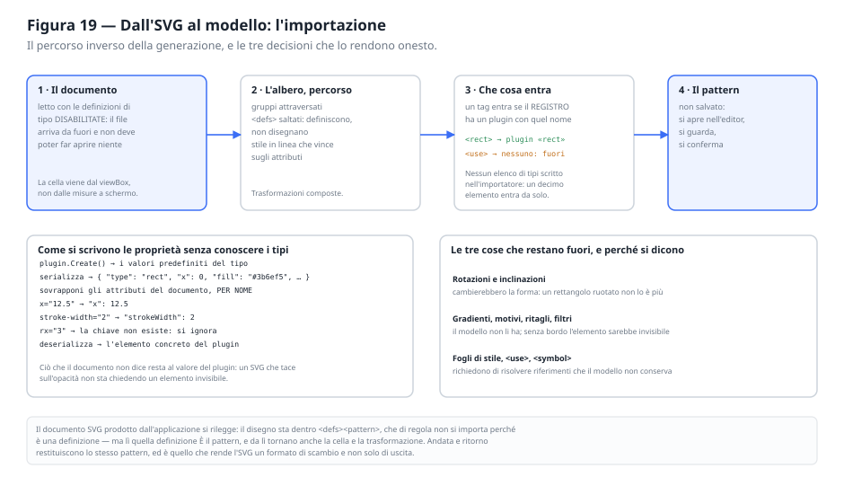

Il capitolo descrive come dal modello nasce un documento SVG. L'operazione contraria — da un
documento SVG al modello — non è la sua simmetrica, perché **SVG è molto più ampio del
modello**: gruppi, riferimenti, gradienti, ritagli, maschere, filtri, fogli di stile. Un
importatore può quindi solo prendere ciò che il modello sa rappresentare, e deve dire il resto.

**Tre decisioni lo tengono in piedi.**

1. **Che cosa entra lo decide il registro, non un elenco scritto.** Il nome del tag SVG e
   l'identificativo del plugin coincidono per costruzione (`rect`, `circle`, `path`, …): un tag
   è importabile se esiste un plugin con quel nome. L'importatore non nomina alcun tipo
   concreto, e un decimo elemento sarà importabile senza toccarlo.
2. **Le proprietà si scrivono per nome, partendo dai valori del plugin.** Si chiede al plugin
   un elemento predefinito, lo si serializza, e sugli attributi del documento si sovrascrive
   ciò che corrisponde. Una proprietà che il modello non ha viene ignorata; una che il
   documento non indica resta al valore del plugin. È questo a evitare il difetto peggiore:
   un documento che tace sull'opacità non sta chiedendo un elemento invisibile.
3. **Le trasformazioni si dividono in due.** Il modello non ha gruppi. Traslazioni e scale,
   composte lungo l'albero, vengono riscritte dentro le coordinate — comprese quelle di un
   tracciato, dove i comandi assoluti si trasformano per intero e quelli relativi si scalano
   soltanto. La **rotazione** invece non si cuoce nella geometria: diventa la rotazione propria
   dell'elemento (§3.3).

   La matrice accumulata viene scomposta: se è una **similitudine** — scala uniforme,
   rotazione, eventuale specchiatura, traslazione — si separa in una parte geometrica e in un
   angolo. Il conto che lo permette è breve: ruotando attorno al punto in cui la traslazione
   arriva, il risultato è R·(S·g + T − T) + T, cioè R·S·g + T, che è la matrice di partenza.
   Restano fuori l'inclinazione e la rotazione combinata con una scala non uniforme: lì gli
   angoli fra i lati cambiano, e nessuna forma del modello resterebbe sé stessa.

> **Requisito.** Sulle proprietà di **tinta** il valore predefinito lo detta la *specifica*,
> non il plugin: riempimento nero, nessun bordo, bordo spesso uno. È una distinzione che si
> paga cara a sbagliarla. Il plugin «path» nasce per disegnare linee e ha come predefiniti
> nessun riempimento e un bordo nero; un tracciato senza `fill`, che in SVG è nero pieno,
> veniva quindi importato a contorno — e il resoconto dichiarava di aver preso tutto, perché
> in effetti nessuna forma era stata scartata. Un logo intero cambiava aspetto senza che
> niente lo segnalasse.

> **Requisito.** Ciò che non entra va **detto**, raggruppato per motivo e in italiano. Un
> importatore che tace lascia credere di aver portato dentro tutto, e l'unico modo per
> accorgersene sarebbe confrontare l'originale con l'anteprima — cioè il lavoro che lo
> strumento dovrebbe risparmiare.

> **Requisito.** Vanno segnalate anche le perdite **parziali**, quelle in cui la forma entra
> ma non tutto il suo aspetto: angoli arrotondati, ritagli, maschere, filtri. Non sono forme
> scartate e non vanno contate come tali, ma senza una riga che le nomini il resoconto dice
> «tutto preso» mentre il rettangolo importato ha perso gli angoli, e chi guarda dà la colpa
> al disegno.

> **Nota di realizzazione.** Il messaggio di un `XmlException` non va riportato all'utente:
> in WebAssembly le risorse di traduzione del framework non ci sono, e al loro posto compare
> il nome interno del messaggio — «Xml_InvalidRootData, 1, 1». Riga e posizione, che sono
> numeri, si capiscono in qualunque lingua.

> **Nota di progetto.** Gli elementi fuori dallo spazio dei nomi SVG non sono forme scartate:
> sono i dati privati del programma che ha prodotto il file — `sodipodi:namedview`,
> `rdf:RDF`, `cc:Work` — e contarli fra le perdite farebbe leggere come un difetto ciò che
> non è nemmeno un disegno.

> **Requisito.** Una forma che perderebbe entrambe le tinte — riempita con un gradiente e senza
> bordo — **non** va importata: comparirebbe nell'elenco degli elementi e in nessun altro
> posto. Attenzione però ai due valori assenti, che non significano la stessa cosa: in SVG un
> elemento senza `fill` è nero, uno senza `stroke` non ha bordo.

> **Requisito.** Il documento arriva dall'esterno e va letto con le definizioni di tipo
> disabilitate: un XML con una DTD può essere costruito per far leggere file locali o aprire
> connessioni.

> **Requisito.** L'importazione **non salva**. Produce un pattern nuovo, che passa dall'editor
> come qualunque altro: si guarda, si corregge, si conferma. È la stessa promessa del §7.2, e
> qui vale doppio, perché il risultato di un'importazione va sempre guardato.

**Il giro completo.** Un documento prodotto da questa applicazione si rilegge: il disegno sta
dentro `<defs><pattern>`, che di regola non si importa perché è una definizione — ma lì quella
definizione *è* il pattern, e da lì tornano anche la cella e la trasformazione. Andata e
ritorno restituiscono lo stesso pattern, ed è ciò che rende l'SVG un formato di scambio e non
solo di uscita.

---

## 7. Il componente PatternEditor

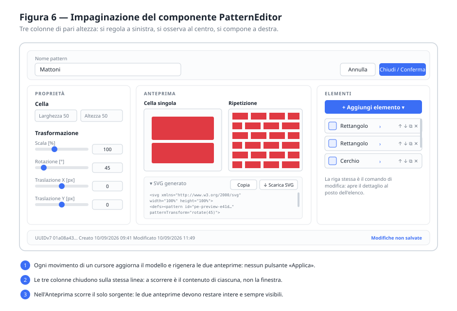

### 7.1 API pubblica

L'interfaccia esposta all'applicazione ospitante è deliberatamente minima:

| Parametro | Significato |
|---|---|
| `Pattern` | `null` → creazione di un nuovo pattern; valorizzato → modifica di quello indicato |
| `OnConfirm` | Invocato con il pattern modificato, solo se valido |
| `OnCancel` | Invocato all'annullamento; nessuna informazione viene propagata |
| `Theme` | Tema cromatico: `System` (predefinito), `Light`, `Dark` |

**Il componente non salva.** Non conosce API, database o filesystem: consegna il risultato e
l'host decide. È ciò che lo rende riutilizzabile in contesti diversi da quello dimostrativo.

**Il tema ha tre stati, non due.** Senza indicazioni il componente segue il sistema operativo,
come farebbe qualunque interfaccia priva di opinioni proprie. Un host che offra all'utente una
scelta esplicita passa `Light` o `Dark`, che prevalgono sempre — anche quando contraddicono il
sistema, perché una scelta esplicita vale più di una preferenza dedotta. Senza questo parametro
l'editor aperto in una modal resterebbe chiaro sopra un'applicazione scura.

### 7.2 Modifica transazionale

Il componente **non modifica mai l'istanza ricevuta**. All'apertura ne crea una copia profonda
e lavora su quella; solo la conferma propaga il risultato. Annullare deve lasciare il pattern
del chiamante esattamente com'era, senza che questi debba adottare precauzioni.

La copia profonda si ottiene con un giro di serializzazione e deserializzazione: garantisce
che non resti alcun riferimento condiviso, comprese le proprietà degli elementi concreti che
il componente non conosce.

> **Attenzione.** La copia va rigenerata quando cambia l'**identità** del pattern ricevuto, non
> a ogni ciclo di rendering: un componente Blazor viene ridisegnato molte volte, e rigenerare
> la copia a ogni passaggio produrrebbe un nuovo identificativo a ogni respiro dell'interfaccia.

La transazione è una garanzia sui **dati**, non un aiuto a chi disegna: dice che o si accetta
tutto o non si accetta niente, e non offre alcuna via di mezzo. Il passo indietro dentro la
sessione è un'altra cosa e vive altrove (§7.6).

> **Requisito.** Il componente accetta un parametro di **sola lettura**: aperto così, tutto si
> può ancora toccare — l'anteprima risponde, il sorgente si copia e si scarica — e manca il
> solo salvataggio. È una decisione dell'ospite, e la libreria non sa perché: un permesso
> mancante, un archivio in manutenzione, un documento altrui (§11). Non è un controllo di
> sicurezza e non va scambiato per tale: nasconde un pulsante, non difende un dato.

> **Requisito.** In sola lettura la via della conferma non propaga niente, anche se qualcuno la
> chiamasse per altra strada. È la difesa di un invariante, non dell'interfaccia: il pulsante
> non c'è, ma il componente aveva promesso di non salvare.

> **Requisito.** Lo stato mostrato in sola lettura non è «modifiche non salvate», che suonerebbe
> come un promemoria a salvare, cioè il contrario di quello che c'è da capire. Dev'essere la
> stessa frase prima e dopo aver toccato qualcosa.

### 7.3 Ciclo di vita

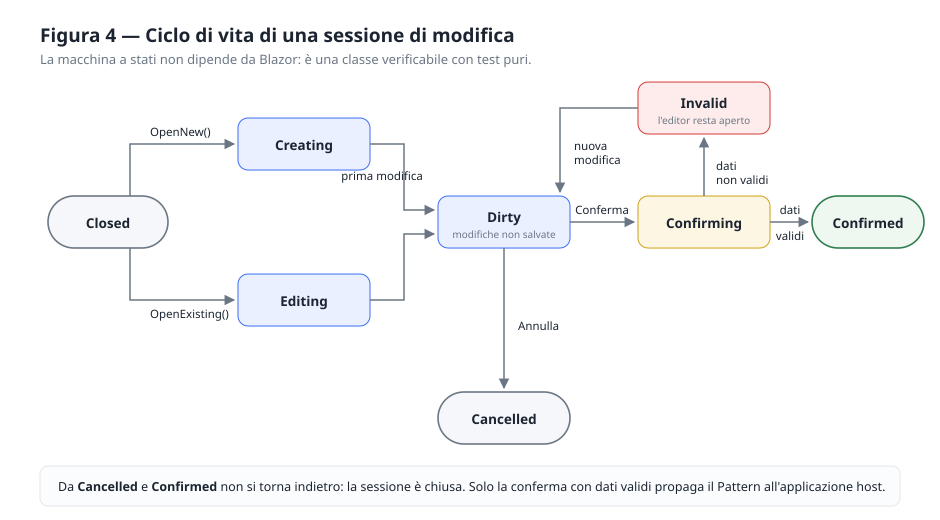

Il ciclo di vita è descritto da una macchina a stati esplicita, **priva di dipendenze da
Blazor**, così da poter essere verificata con test puri. Regole:

- la conferma con dati non validi **non chiude** l'editor: lo stato diventa `Invalid` e
  l'utente vede cosa correggere;
- da `Cancelled` e `Confirmed` non si torna indietro;
- lo stato è mostrato all'utente in modo discreto («Modifiche non salvate»).

### 7.4 Anteprima in tempo reale

Ogni modifica aggiorna il modello e rigenera entrambe le anteprime **immediatamente**. Non
esiste un pulsante «Applica»: la sua assenza è una scelta, perché il valore di questo strumento
è vedere l'effetto mentre si regola.

Le anteprime sono due e mostrano cose diverse:

- **cella singola** — la geometria degli elementi, ingrandita, **senza** trasformazione. Serve a
  posizionare gli elementi;
- **ripetizione** — il pattern applicato, con scala, rotazione e traslazione. Serve a valutare
  il motivo.

Entrambe su fondo a scacchiera, perché senza un riferimento non si distingue una zona
trasparente da una bianca.

> **Requisito.** Il riquadro della cella singola ha il **rapporto di forma della cella**: la
> misura indicata è l'ingombro, il lato maggiore la occupa tutta e l'altro segue la proporzione.
> Dentro un riquadro quadrato il disegno ci sta ugualmente — viene centrato e circondato di
> vuoto — ma la proporzione è una delle poche cose che quell'anteprima deve dire, ed è proprio
> quella che andava perduta.
>
> La regola vale anche per la miniatura incorniciata dello schermo stretto (§7.9), e sta scritta
> in **un punto solo**: il renderer espone le due misure del riquadro, e chi disegna la cornice
> le chiede a lui invece di ricalcolarle. Due calcoli separati sono due cose che divergono.
>
> Una cella con un lato nullo o negativo non ha una forma da rispettare: è un documento che il
> validatore segnala, e nel frattempo il riquadro torna quadrato invece di dividere per zero —
> l'anteprima si ridisegna a ogni battuta, anche mentre il campo è vuoto perché lo si sta
> riscrivendo.

> **Requisito.** Le due anteprime stanno in **un corpo solo**: la ripetizione fa da fondo e
> prende tutta la superficie della card, la cella singola le sta sopra, incorniciata in un
> angolo. È la disposizione che lo schermo stretto aveva già.
>
> Affiancate non riuscivano a riempire lo spazio che avevano. Ciascuna delle due ha una forma
> propria — la cella la sua, la ripetizione quella del riquadro che le tocca — e quello che
> avanzava restava bianco: sopra, sotto e in mezzo. Tre fasce vuote che non dicevano niente,
> in un pannello il cui unico scopo è far vedere.
>
> C'è anche un guadagno di coerenza. Sotto una certa larghezza la cella singola veniva
> nascosta del tutto, perché affiancata non ci stava: erano due disposizioni diverse, e una
> funzione che compariva e spariva a seconda di quanto era larga la finestra. Sovrapposta, la
> cella c'è sempre, e l'editor mostra la stessa cosa su un telefono e su un monitor.

> **Requisito.** Sovrapporre due immagini costa una **legenda**. Affiancate, due didascalie
> bastavano a dire quale fosse quale; sovrapposte, la domanda «che cosa sto guardando» non ha
> più una risposta ovvia.
>
> Sta **sotto** il palco e non sopra: è una didascalia, e una didascalia si legge dopo aver
> guardato — sopra il disegno sarebbe una premessa da superare ogni volta per arrivare a ciò
> per cui il pannello esiste. Le due voci sono **incolonnate**, così ciascuna dispone della riga
> intera e non si spezza a metà frase su due colonne strette.
>
> Ogni voce porta un segno che ripete l’aspetto della cosa a cui si riferisce — la cornice
> chiara del riquadro, la scacchiera del fondo — e l’attacco nel colore d’accento, perché sono
> le due parole su cui l’occhio deve cadere.
>
> Il testo di ciascuna voce sta in un **contenitore proprio** accanto al segno. In un
> contenitore flessibile ogni pezzo di testo diventa un elemento a sé: lasciato sciolto,
> «Nel riquadro» finiva in una colonnina stretta con il resto della frase di fianco invece
> che di seguito.

> **Requisito.** La miniatura della cella è governata dalla **larghezza**, e l'altezza discende
> dalla forma dichiarata nel markup. Il contrario — altezza fissa e un limite di larghezza —
> sembra più naturale e rompe la proporzione: con entrambe le misure definite il rapporto viene
> ignorato, e una cella molto allungata darebbe una cornice di forma sbagliata. La larghezza ha
> due limiti: un terzo del palco, perché oltre coprirebbe l'anteprima che le sta sotto, e
> un'altezza massima espressa in `rem` — non in percentuale, perché una percentuale dentro una
> larghezza si misura sulla larghezza anche quando quel numero nasce come un'altezza.

> **Requisito.** La cornice della miniatura è **doppia**: due pixel chiari all'interno e un
> filo scuro all'esterno. La prima la stacca da un pattern scuro, il secondo da uno chiaro. Una
> cornice sola, di qualunque colore, sparirebbe su metà dei pattern dell'archivio.

Una card a sé mostra l'**SVG generato**, **aperta all'apertura dell'editor**: è parte di
ciò che lo strumento mostra, non un supplemento da andare a cercare. Il sorgente va rientrato
con un attributo per riga: un elemento con molti attributi produrrebbe una riga leggibile solo
scorrendo in orizzontale. La riformattazione riguarda la sola visualizzazione; il file
scaricato e quello copiato restano quelli prodotti dal renderer.

**Le azioni sul documento — copiare e scaricare l'SVG — appartengono a questo riquadro**, non
alla barra dei comandi: riguardano il sorgente, ed è accanto al sorgente che si cercano. Vanno
però collocate nell'*intestazione* del riquadro, così da restare raggiungibili anche quando è
chiuso.

> **Nota di realizzazione.** Il riquadro non va costruito con `<details>`/`<summary>`: un
> pulsante dentro il sommario ne provocherebbe l'apertura a ogni clic. L'apertura va gestita
> dal componente.

### 7.5 Inserimento e modifica degli elementi

L'inserimento avviene con **un solo pulsante** che apre il menu dei tipi disponibili, ciascuno
con la propria icona: scegliere il tipo *è* l'inserimento.

> **Nota di progetto.** Si eviti la soluzione «tendina di selezione + pulsante Aggiungi»: dopo
> il primo inserimento la tendina resta sulla voce scelta, e riselezionarla non produce alcun
> evento. Inserire due elementi dello stesso tipo richiederebbe di riportare la tendina su un
> segnaposto e riselezionare — un attrito che si paga a ogni singolo inserimento.

Il menu va dimensionato per mostrare **tutti** i tipi senza scorrimento — su due colonne, se
serve. Un elenco che scorre nasconde proprio le voci che si stanno cercando, e la scelta del
tipo è un'operazione da fare a colpo d'occhio.

#### Elenco e dettaglio si escludono

Il pannello ha **due modalità alternative**: l'*elenco* serve a disporre, il *dettaglio* a
configurare. Aprire il dettaglio sostituisce l'elenco; un pulsante «‹ Elenco» riporta indietro.

> **Nota di progetto.** Si eviti l'editor che si espande sotto la propria riga lasciando
> visibile l'elenco. Con più elementi aperti il pannello cresce senza limite e spinge fuori
> vista le anteprime — proprio mentre si modificano i valori che le cambiano, e cioè proprio
> quando servono. Con il dettaglio che *sostituisce* l'elenco l'altezza resta costante con
> qualunque numero di elementi.

La divisione dei compiti è netta e **nessun comando compare in due posti**:

| | Elenco | Dettaglio |
|---|---|---|
| Serve a | Disporre | Configurare |
| Comandi | Ordine (per trascinamento), duplicazione, eliminazione | Le proprietà fornite dal plugin |
| Riferimenti | Icona e nome del tipo | Da dove si torna, cosa si modifica, «*n* di *N*» |

**La riga dell'elenco è essa stessa il comando di modifica.** Non un pulsante «modifica»
accanto ad altre quattro icone: l'intera riga apre il dettaglio, e una freccia in coda dice che
porta da qualche parte.

La riga **non mostra il numero di posizione**: la posizione è già data dall'ordine in cui le
righe stanno, e quella cifra occupava spazio che sullo schermo stretto serve ai comandi. Il
numero resta nel dettaglio, come «*n* di *N*», dove è l'unico riferimento disponibile.

> **Nota di realizzazione.** L'area di apertura va costruita come un `<button>` vero che avvolge
> icona e nome, **non** come un gestore di clic sul contenitore. Così resta
> raggiungibile da tastiera e viene annunciata come comando. I pulsanti di disposizione devono
> stargli *accanto*, non dentro: elementi interattivi annidati sono markup non valido e
> costringerebbero a fermare la propagazione dell'evento a ogni clic.

Due comportamenti che sembrano dettagli ma decidono quanto scorre il pannello:

- **dopo l'inserimento il dettaglio si apre da solo** sull'elemento appena aggiunto: chi preme
  «Aggiungi» vuole configurarlo, non tornare a guardare l'elenco;
- **la duplicazione non apre il dettaglio**: si duplica spesso più volte di seguito, e uscire
  dall'elenco a ogni copia costringerebbe a rientrarci ogni volta.

La duplicazione produce una copia profonda con nuovo identificativo, ottenuta con lo stesso
meccanismo agnostico usato per la copia dell'intero pattern.

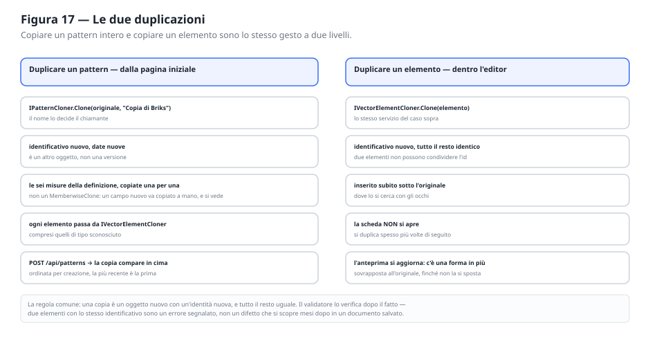

> **Nota.** La libreria espone anche la duplicazione di un **pattern intero**, che riusa quella
> del singolo elemento. Non è una funzione dell'applicazione di esempio ma del modello, e sta
> quindi nella libreria: replicarla in ogni ospite significherebbe replicarne anche le insidie,
> cioè dimenticare i nuovi identificativi agli elementi o condividere la stessa istanza di
> definizione fra originale e copia. Le date non si copiano: la copia è un pattern nuovo, e le
> sue date le assegna il livello di persistenza alla creazione.

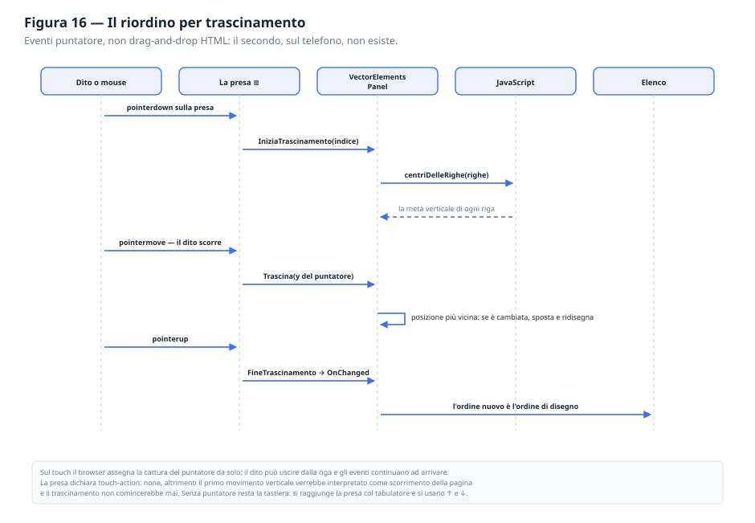

> **Requisito.** Il riordino si costruisce sugli eventi del **puntatore**, non sul
> drag-and-drop di HTML: quest'ultimo non esiste sul tocco, e toglierebbe il riordino a chi
> usa un telefono. Gli eventi del puntatore valgono per mouse, dito e penna con lo stesso
> codice. L'appiglio deve inoltre dichiarare `touch-action: none`, altrimenti il browser
> legge il movimento del dito come uno scorrimento e il trascinamento non parte.

> **Requisito.** Il riordino resta possibile **senza mouse**: l'appiglio riceve il fuoco da
> tastiera e risponde alle frecce. Sostituire due pulsanti con un gesto non deve togliere una
> funzione a chi quel gesto non può farlo.

> **Requisito.** Oltre il centinaio di elementi — un disegno importato ne porta facilmente
> trecento — l'elenco va reso **navigabile**: un filtro per tipo con il conteggio di ciascuno, e
> una modalità di scelta multipla per eliminare in blocco. Il conteggio per tipo non è un
> ornamento: su un documento importato dice in una riga com'è fatto.

> **Requisito.** Sotto filtro il **trascinamento va disattivato**, e va detto perché. L'ordine
> mostrato non è quello vero, e spostare una riga significherebbe spostarla rispetto a righe che
> non si vedono: il risultato sarebbe imprevedibile, e nessuno collegherebbe l'effetto alla
> causa. La presa resta visibile ma spenta — sparire del tutto farebbe ballare la riga.

> **Requisito.** L'eliminazione in blocco rimuove per **identificativo**, non per posizione:
> togliendo per indice, ogni rimozione sposta indietro le successive e si finisce per cancellare
> la riga sbagliata. Se dopo l'eliminazione il filtro non ha più niente da mostrare, si azzera da
> solo: restare su un tipo che non esiste più lascia un elenco vuoto con un contatore a zero, e
> sembra che l'eliminazione abbia portato via tutto.

> **Requisito.** L'elemento in modifica va tenuto per **identificativo**, non per riferimento,
> e risolto a ogni rendering: può essere stato spostato o eliminato nel frattempo, e un
> riferimento diretto resterebbe indietro. Se l'elemento aperto viene eliminato, il pannello
> torna all'elenco.

### 7.6 Annullare e rifare

L'editor lavora su una copia e la conferma è un atto unico: o si accetta tutto, o si butta via
tutto. È una garanzia sui dati, non un aiuto a chi disegna — chi sbaglia una coordinata non
vuole ricominciare da capo, vuole tornare indietro di un passo.

> **Requisito.** La cronologia si costruisce su **istantanee** dell'intero pattern serializzato,
> non su comandi reversibili. Un sistema a comandi obbligherebbe ogni plugin a descrivere le
> proprie modifiche in forma invertibile: nove implementazioni da scrivere oggi, e quella del
> decimo plugin da ricordarsi domani — cioè da dimenticare. L'istantanea non chiede niente a
> nessuno e non ha modo di essere incompleta. Il prezzo è la memoria, e a questa scala è
> trascurabile: un pattern di trecento elementi sta in qualche decina di migliaia di caratteri.

> **Requisito.** Le modifiche ravvicinate contano come **una sola**. Cursori e campi notificano
> a ogni pixel e a ogni battuta: senza accorpamento, disfare uno spostamento del cursore
> richiederebbe quaranta pressioni, una per ogni valore intermedio, e il comando diventerebbe
> inutilizzabile proprio dove serve di più.

> **Requisito.** Lo stato di **apertura** è il primo passo e non si accorpa mai: è il punto a
> cui «Annulla» deve poter riportare, e una modifica fatta nell'istante stesso in cui l'editor
> si apre rientrerebbe nella finestra di accorpamento e lo cancellerebbe.

> **Requisito.** Modificare dopo aver annullato **scarta** ciò che si sarebbe potuto rifare.
> Conservare anche il ramo abbandonato farebbe della cronologia un albero, e «Ripeti» dovrebbe
> chiedere quale ramo: una domanda che nessuno vuole ricevere.

> **Requisito.** Una notifica di modifica che **non cambia niente** non lascia un passo nella
> cronologia. Alcuni campi notificano anche riscrivendo lo stesso valore, e un «Annulla» che
> non annulla niente si legge come un guasto.

> **Requisito.** Il ripristino **sostituisce** la copia di lavoro invece di modificarla sul
> posto: ricostruirla dall'istantanea è l'unico modo per essere certi che non ne resti un
> pezzo. Il dettaglio dell'elemento aperto sopravvive perché è tenuto per identificativo
> (§7.5) e gli identificativi attraversano la serializzazione intatti.

> **Requisito.** Dopo un annullamento lo stato resta «modifiche non salvate», anche quando si è
> tornati al punto di partenza. Che la copia di lavoro coincida di nuovo con l'originale è una
> coincidenza di contenuto, non un salvataggio: dichiararla tale inviterebbe a chiudere senza
> confermare credendo di aver già confermato.

> **Requisito.** La cronologia ha un **tetto**, oltre il quale si perdono i passi più lontani.
> Illimitata crescerebbe per tutta la durata della sessione, e nessuno rifà cento passi
> indietro.

> **Requisito.** Le scorciatoie da tastiera si ascoltano sul **documento**, non su un elemento:
> devono valere ovunque sia il fuoco, compresi i cursori e i selettori di colore che se lo
> prendono volentieri. Nei campi di **testo** però non intervengono: lì Ctrl+Z è l'annullamento
> della scrittura, che il browser fa meglio e che chi scrive si aspetta. L'ascoltatore va tolto
> alla chiusura del componente, altrimenti aprire e chiudere l'editor più volte lascia una pila
> di ascoltatori che chiamano istanze ormai scomparse.

> **Requisito.** Le due frecce non stanno **accanto** ad «Annulla» senza uno stacco. In quella
> barra «Annulla» significa già «chiudi senza salvare»: due comandi che si somigliano nel nome
> e differiscono in tutto il resto, a un centimetro di distanza, sono una trappola. Le frecce
> portano il simbolo, dicono il resto nel suggerimento, e un filo verticale le separa.

> **Requisito.** Le due frecce sono **pulsanti rotondi** con il tratto nel colore d'accento.
>
> Erano due glifi grigi su fondo trasparente, e si vedevano poco ovunque — sulla barra dello
> schermo stretto, che galleggia sopra il disegno, quasi per niente. Il cerchio dà loro un
> corpo e li stacca da qualunque cosa ci finisca dietro; il colore dice che sono comandi e non
> decorazioni. Restano comunque più quieti della conferma: il blu è nel **tratto**, non nel
> fondo — un cerchio pieno accanto a «Chiudi / Conferma» sarebbero due pulsanti che gridano
> la stessa cosa, mentre tornare indietro di un passo non ha il peso di chiudere una sessione.

> **Requisito.** Le frecce sono **disegnate**, non prese dai caratteri. ↶ e ↷ sono glifi
> sottili, resi diversamente da ogni carattere di sistema, e su un fondo qualunque sparivano:
> un tracciato di due pixel si vede allo stesso modo ovunque.

> **Requisito.** Sulla barra dello schermo stretto i due cerchi hanno **fondo pieno chiaro,
> tratto blu e un'ombra**, scritti in cifre invece che presi dalla tavolozza. Valgono le stesse
> ragioni del velo della barra (§7.9): quei pulsanti non stanno su una superficie
> dell'interfaccia, stanno su un pattern che può essere bianco, nero o a righe, e un colore che
> segue il tema indovinerebbe il contrasto solo metà delle volte. Sono anche più grandi, perché
> lì si toccano con un dito.

> **Requisito.** Spento, il cerchio **resta visibile e perde il colore**: è il tratto a
> spegnersi, non il pulsante a sparire. Un comando che scompare quando non è disponibile fa
> ballare quelli accanto e si cerca invano la volta dopo.

### 7.7 Uso dello spazio verticale

L'editor vive in una finestra, e la finestra ha un fondo. La disposizione dei comandi segue una
regola sola: **in alto le decisioni, in basso i dati di servizio.**

| Posizione | Contenuto | Perché |
|---|---|---|
| Barra superiore | Nome del pattern · Annulla · Chiudi/Conferma | Sono le decisioni sulla sessione, e si prendono dove si guarda per prima cosa |
| Colonne | Proprietà e sorgente · Anteprima e filtri · Elementi | Il lavoro |
| Testata del sorgente | Copia · Scarica SVG | Azioni sul documento, accanto al documento, e raggiungibili anche a riquadro chiuso |
| Piede | Identificativo · date · stato delle modifiche | Informazioni da consultare, non comandi |

**Le tre colonne hanno la stessa altezza e chiudono sulla stessa linea**, appena sopra il piede.
Una scheda che finisce a metà finestra perché il suo contenuto è più corto fa sembrare
l'impaginazione incompiuta.

Nel layout a tre colonne le schede riempiono la finestra e **a scorrere è il contenuto di
ciascuna, non la pagina**. È questo che tiene le anteprime sotto gli occhi mentre si regolano i
valori; sostituisce l'ancoraggio della sola colonna centrale, che con le colonne a tutta
altezza non avrebbe più margine entro cui scorrere.

> **Requisito.** L'Anteprima **non scorre**: dev'essere intera e sempre visibile, è il
> riscontro di ogni modifica. A scorrere sono le card che stanno sotto — i filtri, il sorgente —
> e il foglio degli elementi. Una barra di scorrimento dentro un'altra è, oltre che
> sgradevole, un modo per far sparire dalla vista ciò che si sta osservando.
>
> Il requisito ha una storia. Le due anteprime erano affiancate, e affiancate non ci stavano
> sotto una certa larghezza: si impilavano, raddoppiavano in altezza e finivano per coprire il
> piede della finestra. La difesa di allora — nascondere la cella singola quando la colonna si
> stringeva — costava una funzione che compariva e spariva a seconda di quanto era larga la
> finestra. Sovrapposte (§7.4) il problema non si pone: la ripetizione riempie il riquadro e la
> cella singola le sta sopra, quindi l'altezza necessaria è una sola e non due.

> **Nota di realizzazione.** Il menu di inserimento è posizionato in modo assoluto e va tenuto
> **fuori** dall'area che scorre: un contenitore con `overflow` lo ritaglierebbe. Nella colonna
> degli Elementi scorre quindi il solo elenco, e il pulsante «Aggiungi» resta sempre a portata.

### 7.8 Il colore si sceglie o si scrive

Ogni colore è esposto due volte: come **selettore** e come **valore scritto**, affiancati e
sempre allineati fra loro. Il selettore serve a cercare un colore che non si conosce; il campo
di testo a scriverne uno che si conosce già — un colore aziendale, uno copiato da un'altra
schermata — senza doverlo inseguire dentro una tavolozza.

La conversione fra le due forme non è banale, perché il selettore del browser accetta e
restituisce **solo** la forma canonica `#rrggbb`: non tollera la forma abbreviata, l'assenza
del cancelletto, né un testo a metà. Chi scrive a mano fa naturalmente tutte e tre le cose.

| Momento | Cosa si accetta | Perché |
|---|---|---|
| Mentre si digita | Solo `#rrggbb` | Normalizzando a ogni carattere, il campo verrebbe riscritto sotto le dita e il cursore salterebbe a fine riga |
| All'uscita dal campo | Anche `abc`, `#abc`, `3b6ef5` | Lì riscrivere il testo non dà fastidio a nessuno |
| Sempre | Nient'altro | I nomi di colore della specifica SVG («red») sono validi in SVG ma il selettore non saprebbe mostrarli |

Un valore incompleto **non arriva mai al modello**: il campo lo segnala mentre lo si scrive, e
all'uscita torna a mostrare il valore effettivo. Un testo lasciato a metà non deve restare a
schermo facendo credere che sia stato applicato.

> **Nota di realizzazione.** Riportare il campo al valore del modello richiede di **ricostruire
> l'elemento**, non solo di richiedere un rendering: se il valore del modello non è cambiato, il
> confronto fra un rendering e il precedente non trova differenze e il DOM resta com'è, con il
> testo sbagliato ancora dentro.

Le maiuscole si lasciano come sono state scritte: `#AEFAEF` e `#aefaef` sono lo stesso colore, e
riscriverle darebbe l'impressione che il valore sia stato cambiato.

La lettura e la normalizzazione del colore sono **logica condivisa fra più plugin** e vanno
quindi nel livello comune (regola 2 del §2.2), non duplicate in ciascun editor.

### 7.9 Schermo stretto


L'editor deve funzionare anche su un telefono, **con le stesse funzioni**. Non con una seconda
versione dei componenti: lo stesso markup, disposto diversamente.

> **Requisito.** Esistono **due disposizioni e nessuna via di mezzo**: fino a 1024 px le fasce,
> da 1025 px le tre colonne. Le tre colonne entrano a 1025 px perché le loro larghezze minime
> sommano 922 px.

> **Requisito.** Il documento ospite dichiara il **riquadro di visualizzazione**
> (`width=device-width`). Senza, un telefono impagina a 980 pixel finti e poi rimpicciolisce
> tutto: nessuno dei due punti di rottura scatta mai, e l'intera impaginazione stretta
> descritta qui resta scritta e inutilizzata. È una riga sola, e senza di essa tutto il resto
> di questo paragrafo è teoria.

La via di mezzo è da evitare per esperienza diretta: una disposizione intermedia a due colonne,
con l'anteprima a tutta larghezza in cima, lascia fuori vista *sia* le proprietà *sia* gli
elementi appena si apre l'editor. Metà disposizione è peggio di una disposizione diversa.

Sullo schermo stretto le tre colonne diventano **tre fasce fisse più un foglio**:

| Fascia | Contenuto | Scorre |
|---|---|---|
| Barra | Nome del pattern · Annulla · Conferma | no |
| Anteprima | La sola ripetizione | no |
| Schede | Proprietà · Elementi · SVG | no |
| Foglio | La scheda scelta | **sì, solo lui** |

Le regole che ne discendono:

- **la cella singola non si affianca ma si sovrappone**: affiancarla, a 390 px, darebbe due
  francobolli, ma toglierla costringerebbe a immaginarsi dove sono gli elementi mentre li si
  sposta. Sta quindi in un riquadro incorniciato sopra la ripetizione, come la barra: copre
  una porzione di un disegno che si ripete identico poco più in là, e non costa altezza al
  foglio dei comandi;
- **un campo per riga**, e il cursore sopra il suo numero invece che accanto: affiancati, al
  dito resta una corsa di due centimetri;
- **i comandi di una riga stanno accanto al nome**, non sotto: una seconda fascia per elemento
  costa una cinquantina di pixel a testa, e con nove elementi fa mezzo schermo speso in comandi;
- **l'identificativo non si mostra** nel piede: occupa una riga intera e non serve a nulla lì.
  Resta nella scheda SVG, dove si va apposta a cercarlo.

> **Requisito.** I comandi non scendono sotto i **44 px** e i campi di testo non sotto i
> **16 px**. Il primo è la misura sotto la quale il dito comincia a sbagliare bersaglio; il
> secondo quella sotto la quale Safari ingrandisce la pagina appena si tocca un campo — e poi
> ci resta.

> **Nota di realizzazione.** L'altezza dell'editor va espressa in `dvh` e non in `vh`: la barra
> del browser mobile compare e scompare mentre si scorre, e con `vh` il piede finirebbe sotto
> di essa. Il foglio ha bisogno di `overscroll-behavior: contain`, altrimenti arrivato in fondo
> trascina la pagina che sta sotto.

> **Nota di realizzazione.** L'anteprima ancorata è una **seconda resa** dello stesso pattern e
> non una copia del pannello: un elemento non può stare in due punti dell'impaginazione. Averne
> due nella stessa pagina è sicuro solo perché ogni resa genera un identificativo di nodo
> `<pattern>` tutto suo (§6.3).

---

### 7.10 Che cosa costa una modifica

Una notifica di modifica non cambia soltanto il modello: fa ripartire un **giro** di lavoro che
tocca quasi tutto il componente — convalida, due anteprime, documento del sorgente, istantanea
per la cronologia. Finché il documento è di qualche kilobyte il giro costa una decina di
millisecondi e la cosa non si nota. Su un pattern che incorpora un'**immagine**, dove
l'indirizzo `data:` vale da solo novantasei kilobyte su novantasette, lo stesso giro costava
un sesto di secondo — e un selettore di colore ne emette decine al secondo.

> **Il caso misurato.** Un pattern dell'archivio con tre soli elementi (un rettangolo,
> un'immagine, un testo) e 95 kB di documento: **160-195 ms per notifica**, contro i **13-29 ms**
> di un pattern vettoriale con lo stesso numero di elementi. Non è il browser: reinserire
> l'intero SVG nel documento, immagine compresa, costa 1,4 ms. È il lato .NET, che di quella
> stringa da 96 kB ne costruiva cinque copie per notifica.

> **Requisito.** Il **modello** si aggiorna sempre e subito. A essere differito è solo il modo
> in cui il componente ci reagisce: chi scrive un valore non deve mai vedersi rifiutare o
> ritardare la scrittura.

> **Requisito.** I giri si **accorpano**: al massimo uno ogni decimo di secondo. Il primo parte
> subito — un gesto isolato non deve avere latenza — e le notifiche che arrivano mentre il giro
> è in corso si limitano a segnalarsi. Dopo l'ultima ne parte sempre uno finale, così lo stato
> definitivo si vede comunque.

> **Requisito.** Il ridisegno automatico che Blazor esegue dopo un `EventCallback` va
> **soppresso** per le notifiche rimandate. Senza, l'accorpamento non accorpa niente: il giro
> che si era deciso di rimandare verrebbe eseguito lo stesso dal framework. La soppressione
> vale per un solo ridisegno e si disarma da sé — un interruttore permanente fermerebbe anche
> i ridisegni che con le modifiche a raffica non c'entrano.

> **Requisito.** L'**istantanea** per la cronologia si prende una volta per finestra di
> accorpamento, non a ogni notifica. È l'operazione più cara del giro — serializzare l'intero
> pattern e confrontarlo carattere per carattere con la precedente — e la cronologia ne
> conservava comunque una su decine. La **prima** modifica però si fotografa subito: è quella
> che accende «Annulla», e un pulsante che si accende mezzo secondo dopo il gesto sembra un
> difetto.

> **Requisito.** L'attesa prima di fotografare è **metà** della finestra di accorpamento della
> cronologia (§7.6), non uguale. Aspettando quanto la finestra, ogni istantanea differita
> cadrebbe appena fuori e mezzo secondo di trascinamento diventerebbe un passo di «Annulla» a
> sé: il contrario di quello che l'accorpamento serve a ottenere.

> **Requisito.** Prima di leggere la cronologia — annulla, ripeti, conferma — l'istantanea in
> sospeso va **scaricata**. Senza, annullare subito dopo una modifica tornerebbe a uno stato più
> vecchio di quello che si voleva annullare, perché l'ultima modifica non sarebbe mai entrata.

> **Requisito.** Il documento del sorgente si **riformatta solo a riquadro aperto**. Il
> documento non formattato invece si costruisce sempre: lo usano copia, scarico e il peso, che
> restano raggiungibili a riquadro chiuso.

**Risultato misurato.** Una raffica di dieci notifiche ravvicinate sullo stesso pattern da
95 kB: **114 ms in tutto**, di cui 94 il primo giro e 2-3 ciascuna le altre nove. Prima erano
dieci giri interi, circa 1,7 secondi, con la coda che continuava a smaltire modifiche già
superate dopo che il dito si era fermato.

> **Nota.** Un pattern con un'immagine incorporata resta comunque il caso più pesante, e lo
> sarà sempre: quel peso viaggia dentro ogni copia del documento. Le difese qui sopra tolgono
> il lavoro inutile, non il lavoro.

## 8. Validazione

La validazione è a due livelli: le proprietà generali del pattern sono verificate dal
componente, quelle di ciascun elemento dal rispettivo plugin. Il componente principale **non
contiene regole specifiche di alcun tipo concreto**.

### 8.1 Errori e avvisi

| | Errori | Avvisi |
|---|---|---|
| Effetto | Impediscono la conferma | Non impediscono nulla |
| Significato | Il dato è sbagliato | La scelta è legittima ma ha una conseguenza |
| Presentazione | Riquadro rosso, «Correggi i seguenti errori» | Riquadro ambra, «Da tenere presente» |

Gli avvisi previsti riguardano situazioni in cui il documento resta valido ma **qualcosa cambia
fuori dall'applicazione**: un carattere che chi apre l'SVG potrebbe non avere; un'immagine
incorporata che rende pesante il documento; un elemento privo di plugin che non verrà disegnato.

> **Requisito.** Se un avviso viene calcolato, deve essere mostrato. Un avviso prodotto dai
> plugin e scartato dall'interfaccia è codice inutile che dà una falsa sensazione di copertura.

### 8.2 Validazione continua

La rivalidazione avviene a ogni modifica, non alla conferma: l'utente vede l'errore quando lo
commette, non alla fine. La conferma rivalida comunque, perché è l'unico momento in cui il
risultato esce dal componente.

---

## 9. Persistenza

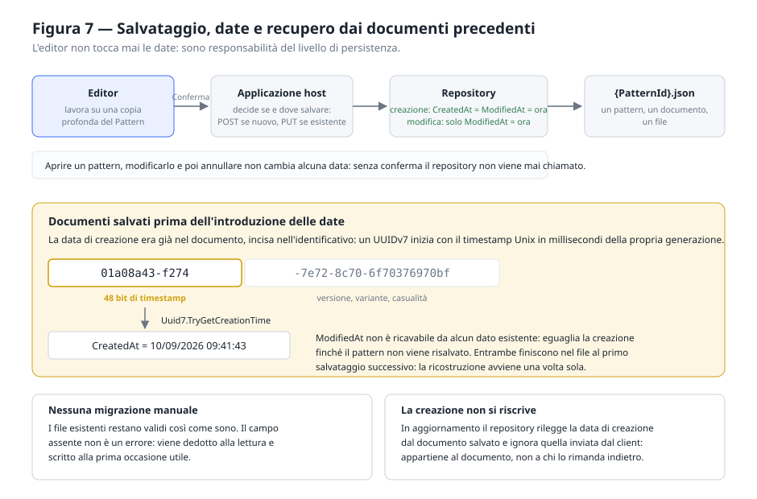

### 9.1 Formato

**Un pattern, un documento JSON, un file.** Il nome del file è l'identificativo del pattern e
non cambia mai, nemmeno quando cambia il nome descrittivo.

Il documento è un contratto indipendente da .NET: il campo `type` di ciascun elemento è l'unico
discriminatore tecnico. La deserializzazione polimorfica avviene risolvendo `type` nel registro
e usando il tipo CLR dichiarato dal plugin — così né il dominio né i contratti devono
referenziare gli assembly dei singoli elementi.

### 9.2 Robustezza in lettura

Le eccezioni specifiche del formato JSON **non devono uscire dal serializzatore**: che il
formato sia JSON è un suo dettaglio implementativo. Ogni difetto — documento malformato,
identificativo assente o non valido, definizione mancante, valore di tipo sbagliato — viene
segnalato con un unico tipo di eccezione e un messaggio leggibile, così che chi lo usa abbia
un solo caso da gestire.

### 9.3 Le date

Le due date sono gestite dal **livello di persistenza**, non dall'editor:

- alla creazione, `CreatedAt` e `ModifiedAt` coincidono;
- a ogni salvataggio successivo si sposta solo `ModifiedAt`;
- aprire un pattern, modificarlo e poi annullare **non cambia alcuna data**;
- la data di creazione appartiene al documento salvato: se un client ne inviasse una diversa,
  il repository la ignora.

**Recupero dai documenti precedenti.** I documenti salvati prima dell'introduzione delle date
non le contengono, ma contengono un Id UUIDv7, che per definizione (RFC 9562) inizia con il
timestamp Unix in millisecondi della propria generazione. La data di creazione va quindi
ricostruita da lì; l'ultima modifica, non ricavabile da alcun dato esistente, eguaglia la
creazione. Entrambe vengono scritte nel file al primo salvataggio successivo: la ricostruzione
avviene una sola volta e **non serve alcuna migrazione**.

---

## 10. Applicazione di riferimento

Ha finalità esclusivamente dimostrativa: mostra come si integra il componente, non come si
costruisce un servizio di produzione.

### 10.1 Endpoint

| Metodo | Percorso | Esito | Errori |
|---|---|---|---|
| GET | `/api/patterns` | Elenco con nome, anteprima SVG, date, stato e peso, **filtrato su chi chiede** | — |
| GET | `/api/patterns/{id}` | Pattern completo | 404 se assente **o non visibile** |
| POST | `/api/patterns` | 201 con il pattern creato | 400 corpo non valido · 401 senza accesso · 409 Id già esistente |
| PUT | `/api/patterns/{id}` | 200 con il pattern aggiornato | 400 corpo non valido o Id discordante · 401 · 403 non è tuo · 404 se assente |
| PUT | `/api/patterns/{id}/visibilita` | 200 con lo stato **concesso** | 400 stato non riconosciuto · 401 · 403 non sei l'autore · 404 se assente o non visibile |
| DELETE | `/api/patterns/{id}` | 204 | 401 · 403 · 404 se assente |
| DELETE | `/api/patterns` | Esito per ciascun Id | 401 |
| GET | `/api/moderation/pending` | Le richieste in attesa, nel formato dell'elenco | 401 · 403 se non amministratore |
| POST | `/api/moderation/{id}/approve` | 200, il pattern diventa pubblico | 401 · 403 · 404 · 409 se non è più in attesa |
| POST | `/api/moderation/{id}/reject` | 200, il pattern torna privato | 401 · 403 · 404 · 409 se non è più in attesa |

> **Requisito.** Il riepilogo porta anche **quanto pesa il documento SVG**. Lo conta il server
> sulla stessa stringa che ha appena prodotto per l'anteprima: renderla due volte per misurare
> dei byte che si hanno già sotto mano sarebbe lavoro pagato due volte su quattrocento righe, e
> farla generare al client vorrebbe dire spedirgli quattrocento definizioni complete per contare.
> È il peso del file che l'utente scarica, a meno di due byte negli attributi di dimensione.

**Il corpo delle richieste viene letto come testo** e interpretato dal serializzatore, non dal
model binding predefinito: quest'ultimo, basandosi sul tipo dichiarato `VectorElement`, non
gestirebbe il polimorfismo degli elementi.

> **Requisito.** Un corpo malformato è un errore di chi chiama e deve produrre **400**, non 500.
> Poiché il corpo viene interpretato manualmente, gli errori arrivano come eccezioni: vanno
> intercettate e tradotte, non lasciate risalire al gestore predefinito.

**La cancellazione multipla tratta ogni identificativo indipendentemente**: uno non trovato non
impedisce la cancellazione degli altri, ed è comunque segnalato nel risultato.

### 10.2 Archiviazione

Un file JSON per pattern in una cartella configurabile. Se il percorso configurato è relativo
**va risolto sulla content root**, non sulla directory di lavoro del processo: quest'ultima
cambia a seconda di come si avvia l'applicazione, e i pattern finirebbero in cartelle diverse
dando l'impressione che i dati «tornino indietro».

Per la stessa ragione la cartella dei dati va esclusa dagli item di contenuto del progetto:
altrimenti la compilazione ne ricopia la versione presente nel progetto sopra quella scritta a
runtime, e una pulizia la cancella dalla cartella di output.

### 10.3 Le funzioni della pagina di gestione

Non sono funzioni della libreria, ma dell'ospite: sono elencate qui perché mostrano che cosa
resta da scrivere a chi integra il componente, e perché alcune di esse hanno lasciato una regola.

| Funzione | Comportamento |
|---|---|
| Elenco | Una scheda per pattern, con l'anteprima **vera** generata dal renderer della libreria, non un'icona |
| Ricerca | Sul nome, mentre si scrive; l'elenco è già in memoria e non si interroga l'API |
| Filtro per tipo | Mostra i soli pattern che contengono un dato tipo di elemento |
| Ordinamento | Per data di creazione, di modifica o per nome |
| Impaginazione | 4, 8, 12, 24 o 48 schede per pagina |
| Apertura | Un clic sull'anteprima apre l'editor sul pattern |
| Scarico diretto | Un pulsante sulla miniatura consegna l'SVG senza aprire l'editor: prendere un file non deve richiedere di entrare in un editor. Non modifica e non crea niente, quindi vale anche per chi non ha fatto l'accesso |
| Creazione | Apre l'editor su un pattern nuovo, prodotto dalla fabbrica |
| Importazione | Legge un documento SVG e ne ricava un pattern, con un resoconto di che cosa è entrato e che cosa no (§6.6) |
| Accesso | Un pulsante in alto a destra; fatto l'accesso, il cerchio dell'utente con il menù di profilo e uscita (§11) |
| Filtro per autore | Tutti, solo i miei, solo degli altri. Compare solo a chi ha fatto l'accesso. Non c'è una voce per i pattern senza autore: l'applicazione non ne produce, e quelli che comparissero comunque rientrano fra «degli altri» invece di sparire dal conteggio |
| Duplicazione | Copia completa chiamata «Copia di *nome*», indipendente dall'originale. Richiede un accesso: duplicare è creare, e la copia appartiene a chi la fa |
| Eliminazione | Singola o multipla, con conferma |
| Tema | Chiaro, scuro o come il sistema; la scelta vale anche per l'editor e viene ricordata |

> **Requisito.** Filtro, ordinamento e impaginazione si compongono **in quest'ordine**: si
> sceglie di che cosa si parla, poi come lo si dispone, poi quanto se ne mostra per volta.
> Invertirli darebbe una pagina di risultati presa da un elenco che comprende anche gli esclusi.
> Cambiando un filtro si torna alla prima pagina: restare alla dodicesima di un elenco che ora
> ne ha due mostrerebbe una pagina vuota, e sembrerebbe che non ci sia niente.

Le date sulla scheda seguono una regola sola: **la data di modifica compare solo se dice
qualcosa di nuovo**. Il confronto si fa sul testo mostrato e non sull'istante esatto — un
pattern creato e confermato nello stesso minuto ha due istanti diversi ma la stessa data a
schermo, e vederla ripetuta sembrerebbe un difetto invece di un'informazione.

> **Requisito.** La conferma di un'eliminazione deve essere una finestra dell'applicazione, non
> il dialogo nativo del browser. Quest'ultimo si può vestire in nessun modo, blocca il thread su
> cui gira l'applicazione e — soprattutto — il browser lo può sopprimere: dopo qualche
> apparizione offre di «impedire a questa pagina di creare altre finestre», e da quel momento
> restituisce *falso* all'istante senza mostrare niente. Il risultato è un pulsante Elimina che
> non elimina, senza alcuna spiegazione.

> **Requisito.** Un'operazione su più elementi deve restituire **che cosa è successo**, non
> `void`. Un'eliminazione multipla che non riferisce nulla non permette né di aggiornare
> l'elenco con cognizione né di accorgersi che non ha eliminato niente.

---

### 10.4 Una seconda lettura: la pagina di prodotto

Accanto al pannello di gestione l'applicazione di riferimento ospita una **pagina di
presentazione** (`/prodotto`). Non sostituisce la prima e non la tocca: risponde a un'altra
domanda. Il pannello risponde a «dove sono i miei pattern», la presentazione a «che cos'è
questa cosa e perché dovrebbe interessarmi». Mescolarle darebbe una vetrina scomoda da usare
e un pannello di lavoro che si mette in posa.

> **Requisito.** Le due pagine condividono i **servizi** e non il markup: archivio, accesso e
> renderer sono gli stessi, il resto è indipendente. È anche la prova che il componente
> regge: se è fatto bene, una presentazione e uno strumento di lavoro si costruiscono sopra
> lo stesso motore senza che nessuno dei due sappia dell'altro.

> **Requisito.** La **radice è la presentazione**; la gestione ha un indirizzo proprio,
> `/gestione`. Chi arriva senza sapere che cosa sia questa cosa merita la risposta prima
> dell'elenco: un pannello di quattrocento miniature è utilissimo a chi già lavora qui e muto
> con chiunque altro. Il vecchio `/prodotto` resta valido come sinonimo — un indirizzo
> pubblicato non si ritira, si affianca — e la gestione, essendo un indirizzo e non una
> schermata dentro un'altra, si può mandare a qualcuno e ritrovare fra i segnalibri.

> **Requisito.** La navigazione fra le due sta **nel guscio**, non nelle pagine: il marchio in
> alto a sinistra riporta alla presentazione e due voci dicono dove ci si trova. Il titolo di
> primo livello torna invece alle pagine — il guscio ne conteneva uno, e ogni schermata ne
> aveva quindi due.

> **Requisito.** Chi si registra torna **da dove è partito**. Il punto di partenza viaggia
> nell'indirizzo, e proprio per questo si convalida: si accetta un percorso interno e si
> rifiuta tutto il resto. Un valore assoluto, o che comincia con due barre, sarebbe un
> *redirect* aperto — si manda a qualcuno un collegamento alla registrazione che, appena
> conclusa, lo deposita su un sito somigliante a questo dove gli si richiede la password
> appena scelta.

> **Requisito.** Il materiale scenico è **generato**, non preparato. Le trame che si muovono,
> la tessera che si moltiplica e il sorgente che si accende escono dal renderer del
> componente a partire dai pattern che ci sono davvero in archivio. Una pagina che racconta
> uno strumento usando immagini disegnate altrove racconta qualcosa che non si può verificare.

> **Requisito.** L'elenco delle proprietà regolabili di ciascun tipo si **legge dal modello**
> del plugin, non si scrive a mano. Un elenco compilato su una pagina di presentazione
> invecchia al primo plugin che cambia, e nessuno se ne accorge; letto dal modello non può
> divergere nemmeno volendo, e il decimo plugin comparirà con le sue proprietà senza che
> nessuno scriva una riga. Le etichette in italiano vengono da un dizionario, e ciò che manca
> compare con il nome tecnico: brutto ma visibile, che è il punto — una traduzione inventata
> al volo nasconderebbe la novità.

> **Requisito.** I pannelli agganciati si fermano **sotto la barra** dell'applicazione, e sono
> alti quel che resta della finestra. La barra è essa stessa agganciata e resta sempre a
> schermo: un pannello che si fermasse a `top: 0` finirebbe sotto di lei, scorrerebbe per la
> sua altezza prima di bloccarsi — uno scatto proprio all'inizio, lì dove l'apertura deve
> sembrare immobile — e terrebbe il proprio fondo appena fuori dallo schermo per tutta la
> sezione, tagliando l'invito a scorrere.
>
> L'altezza della barra si **misura**, non si scrive: cambia con la larghezza (sul telefono va
> su due righe) e cambia anche dopo il primo disegno, perché l'angolo dell'utente parte con un
> segnaposto e diventa un avatar quando la sessione viene ripresa. Un `ResizeObserver` sulla
> barra tiene aggiornata la misura: rimandarla al primo scorrimento la farebbe correggere
> proprio mentre si guarda, e correggere l'altezza della barra sposta il pannello.

> **Requisito.** Lo zero dell'avanzamento cade dove il pannello si ferma, non dove il bordo
> della sezione tocca il bordo della finestra. Misurato dal bordo, i primi pixel di
> scorrimento — tanti quanto è alta la barra — non muoverebbero niente, e il movimento
> comincerebbe di scatto qualche decina di pixel dopo il gesto.

> **Requisito.** JavaScript non anima niente. Misura tre cose che i CSS non sanno leggere —
> quanto una sezione è avanzata nello scorrimento, quanto è alta la barra, e se un elemento è
> entrato in vista — e le scrive in variabili CSS. Il movimento resta fluido anche quando il thread principale è
> occupato, e togliendo lo script la pagina perde le animazioni, non i contenuti.

> **Requisito.** L'osservatore delle comparse dev'essere **richiamabile**. Una parte della
> pagina nasce dopo il primo disegno — l'archivio arriva dalla rete e le sue schede cambiano
> a ogni ricerca — e un osservatore registrato una volta sola non le vedrebbe mai: resterebbero
> trasparenti per sempre, cioè presenti e invisibili, che è il modo peggiore di non esserci.

> **Requisito.** Gli ascoltatori dello scorrimento si tolgono alla chiusura. Una pagina
> singola non ricarica il documento cambiando schermata, e uno rimasto acceso continuerebbe a
> misurare elementi che non esistono più, a ogni pixel, per tutta la sessione.

> **Requisito.** Chi ha chiesto meno animazioni al sistema non trova una pagina mutilata:
> trova la stessa pagina, ferma. Le sezioni agganciate diventano riquadri in colonna e le
> trasformazioni legate allo scorrimento si fermano al valore in cui ogni sezione mostra il
> proprio contenuto al meglio.

> **Requisito.** Il riquadro che mostra la tessera moltiplicata prende la **forma della cella**
> e non una propria. Un riquadro con proporzioni decise dal foglio di stile stirerebbe la
> tessera; l'SVG, che la propria proporzione la difende, si incornicerebbe lasciando due bande
> vuote che nella trama vera non esistono — e la pagina mostrerebbe, proprio nella sezione che
> spiega il meccanismo, una trama che il meccanismo non produce. Il limite di ingombro va messo
> sulla **larghezza**: un limite di altezza su un riquadro a proporzione fissa accorcia un lato
> senza toccare l'altro, cioè rompe esattamente ciò che si voleva difendere. Le celle estreme
> dell'archivio — dalla striscia larga otto volte l'altezza a quella alta nove volte la
> larghezza — restano dentro la finestra senza deformarsi.

> **Requisito.** I pattern in scena si **estraggono a sorte a ogni avvio**, e l'apertura mostra
> un disegno diverso da quello del meccanismo. Un elenco di nomi scelti a mano è una scorciatoia
> che funziona su questo archivio e su nessun altro: altrove quei nomi non ci sono e la pagina
> ripiegherebbe sempre sullo stesso. Il criterio di scelta è la ricchezza del disegno — abbastanza
> forme da reggere l'ingrandimento a schermo intero, non tante da diventare una macchia — e se
> nessuno lo soddisfa la rete si allarga invece di arrendersi: una scena ripetuta è un difetto,
> una scena vuota un guasto.

---

### 10.5 La presentazione da ferma

Una presentazione si guarda anche **senza scorrere**: chi arriva prima legge, poi decide se
proseguire. Una pagina il cui movimento dipende tutto dallo scorrimento, in quel momento, è
un'immagine fissa. Questa sezione raccoglie ciò che la tiene viva a pagina ferma, e ciò che le
dà qualcosa da mostrare oltre al primo disegno capitato.

#### Una serie, non un esempio

> **Requisito.** Il palco alterna **più pattern** dell'archivio, non uno solo. Un esempio
> isolato racconta un pattern; una serie racconta che cosa lo strumento produce. Sei sono
> abbastanza per far capire che la varietà c'è, e chi resta abbastanza a lungo da vederli tutti
> ha già capito.

> **Requisito.** Il **primo** pattern si mostra subito; gli altri arrivano uno alla volta,
> mentre la pagina è già in piedi. Sono documenti interi: aspettarli tutti significherebbe
> tenere la scena vuota per il tempo di sei richieste, e nessuno guarda la sesta scena nel
> primo secondo di visita.

> **Requisito.** Il cambio di scena passa da **due strati** alternati, non da un nodo che
> cambia contenuto: il disegno nuovo si scrive in quello nascosto ed è già a posto quando
> comincia la dissolvenza. Con un nodo solo, fra il vecchio e il nuovo si vedrebbe il vuoto —
> cioè proprio ciò che una dissolvenza serve a evitare.

> **Requisito.** L'alternanza si **ferma** quando il puntatore è sul palco e quando l'editor
> copre la pagina. Chi si è avvicinato a guardare non deve vedersi cambiare il disegno sotto
> gli occhi, e una scena che cambia dietro una finestra modale è lavoro speso per nessuno.

> **Requisito.** Sotto il palco ci sono **comandi**, non indicatori: dicono quanti pattern
> passano, quale si sta guardando, e permettono di fermarsi su uno. Una serie che scorre da
> sola senza un modo di fermarla si guarda col telecomando in mano.

> **Requisito.** Chi ha chiesto **meno movimento** al sistema non trova l'alternanza
> automatica: la pagina lo chiede al browser prima di avviarla. I comandi restano — la serie
> c'è ancora, la si scorre a mano. Un disegno che cambia da solo ogni sette secondi è
> movimento quanto una dissolvenza, e va chiesto allo stesso modo.

#### Il movimento che non dipende dallo scorrimento

> **Requisito.** Le trame **derivano** lentamente su sé stesse, e vanno e tornano invece di
> ripartire da capo. Un ciclo che riparte è uno scatto, e uno scatto ogni cinquanta secondi si
> nota molto più del movimento che voleva nascondere. La deriva sta sull'elemento **dentro** il
> contenitore: su quest'ultimo c'è già una trasformazione legata allo scorrimento, e due
> animazioni sulla stessa proprietà si annullerebbero a vicenda.

> **Requisito.** Niente modalità di fusione sugli strati grandi quanto lo schermo. Su un palco
> scuro `screen` dà quasi lo stesso risultato dell'alfa e costa la ricomposizione di quello
> strato a ogni fotogramma: una sfumatura che si sposta non vale quel prezzo.

#### Il documento che si scrive

> **Requisito.** La sezione del sorgente mostra un **file in scrittura**: una barra con nome e
> peso, le righe che compaiono una dopo l'altra, un cursore che scende e si ferma al fondo del
> riquadro, e da lì in poi il testo che scorre. Prima le righe c'erano tutte e cambiavano solo
> opacità: si vedeva un testo accendersi, non un documento nascere — e quelle oltre il bordo
> non si vedevano affatto, perché il riquadro non si muoveva.

> **Requisito.** Il riquadro è alto quanto il **file**, se il file è corto. Un'altezza fissa
> lascerebbe una striscia vuota sotto l'ultima riga, e una finestra di scrittura mezza vuota
> sembra un errore di impaginazione invece che un file finito.

> **Requisito.** Il sorgente si colora **per parola** e non per riga: nome del nodo, nome
> dell'attributo, valore, punteggiatura. È l'ordine in cui si legge un XML, ed è ciò che
> distingue un blocco leggibile da una decorazione. L'analizzatore è minimo di proposito — non
> deve leggere un XML qualunque ma quello che scrive il renderer di questo progetto — e una
> riga che non si lascia interpretare finisce senza colore: colorare male è peggio che non
> colorare, rompersi è peggio di entrambi.

#### Il campionario dei tipi

> **Requisito.** Ogni tipo di elemento si presenta come un **campione di materiale**: la trama
> occupa quasi tutta la scheda, ha un colore suo, un fondo velato della stessa tinta e il nome
> sopra. Nove riquadri bianchi con dentro nove figurine grigie erano nove francobolli — veri,
> onesti e indistinguibili a un metro di distanza. Il problema non era la disposizione ma il
> contenuto: la geometria predefinita di un plugin è fatta per essere un punto di partenza
> neutro, non per essere guardata.

> **Requisito.** A cambiare è **solo il colore**, che è una decisione editoriale di questa
> pagina; la geometria resta quella dichiarata dal plugin e l'elenco delle proprietà continua a
> leggersi dal modello (§10.4). Il colore si applica per **riflessione** e soltanto a ciò che
> il plugin già colorava: una linea non ha riempimento e dargliene uno la trasformerebbe in un
> poligono pieno. La regola è sostituire un colore, non inventarne.

> **Requisito.** Un tipo non previsto dall'elenco dei colori — il decimo plugin — prende il
> colore d'accento e nessuna inclinazione: si vede lo stesso, e si nota che è nuovo.

---


### 10.6 Un'applicazione sola, una pubblicazione sola

Il client è WebAssembly: gira nel browser, e i file che lo compongono — il runtime, gli
assembly, il `wwwroot` — sono file statici che qualcuno deve servire. A servirli è l'host,
che è lo stesso processo che risponde alle chiamate.

```
richiesta → /api/…            → endpoint dell'host
          → /_framework/…     → UseBlazorFrameworkFiles()
          → /css/, /js/, …    → UseStaticFiles()
          → qualunque altra   → MapFallbackToFile("index.html")
```

L'ordine di quelle quattro righe è il comportamento. `UseBlazorFrameworkFiles` va prima di
`UseStaticFiles` perché insegna i tipi MIME di `/_framework`: senza, il browser scarica il
`.wasm` come testo e l'applicazione non parte affatto. Il ripiego su `index.html` va per
ultimo, ed è ciò che rende ricaricabili gli indirizzi del client: `/gestione` e
`/moderazione` esistono solo nell'instradamento del browser, e senza quella riga un
aggiornamento della pagina su uno di essi risponderebbe 404.

**Il client chiama la propria origine.** `BaseAddress` è `HostEnvironment.BaseAddress`, cioè
l'indirizzo da cui la pagina è arrivata. Non c'è un indirizzo da cambiare fra sviluppo ed
esercizio, non serve CORS — le richieste non sono più di origine incrociata — e non c'è un
secondo certificato da rinnovare.

> **La politica CORS resta, e non è una dimenticanza.** Costa nulla quando nessuno la usa, e
> serve il giorno in cui l'API tornasse su una macchina propria — perché scala diversamente,
> o perché sta dietro a un'altra rete. In quel caso basta dichiarare
> `PatternApiBaseAddress` nel `wwwroot/appsettings.json` del client e le origini ammesse
> nella configurazione dell'host: nessuna riga di codice cambia.

**Come si pubblica.** Un comando, una cartella:

```
dotnet publish src/PatternEditor.Sample.Api -c Release
```

Il client viene compilato e i suoi file finiscono dentro `wwwroot` dell'host. Su un App
Service di Azure si pubblica quella cartella e basta.

> **Dove finiscono i pattern.** L'archivio è su file, sotto `App_Data/patterns`, risolto
> sulla content root e non sulla directory di lavoro (§9). Su App Service quella cartella sta
> dentro `/home`, che è lo spazio persistente e condiviso fra le istanze: i pattern
> sopravvivono a un riavvio e a un nuovo deploy. Con più istanze in scala orizzontale,
> però, due processi scriverebbero sugli stessi file — quello è il punto in cui un archivio
> su file va sostituito, ed è previsto dall'interfaccia `IPatternRepository`.

---

## 11. Utenti e proprietà dei pattern

Fino a questa revisione l'applicazione di riferimento non sapeva chi la stesse usando, e
l'archivio era di tutti e di nessuno. Questo capitolo descrive l'accesso che è stato aggiunto:
**dichiaratamente leggero** nel modello — un solo tipo di utente, nessuna posta elettronica,
il rientro affidato a una domanda scelta da chi si registra — e **non leggero** nel modo in
cui i dati vengono trattati.

La distinzione è deliberata. Un modello semplice si può arricchire domani senza disfare
niente; un trattamento dei dati sbagliato non si corregge più, perché nel frattempo le
credenziali di tutti sono già state scritte male. Fare bene questa seconda parte, per di più,
non costa quasi niente.

### 11.1 Dove vive tutto questo

> **Requisito.** L'autenticazione sta **nell'applicazione ospite** e non nella libreria. Il
> componente PatternEditor non ha e non deve avere alcuna nozione di utente: chi lo integra
> potrebbe non averne affatto — un'applicazione a utente singolo, uno strumento da riga di
> comando, un servizio di generazione. Una libreria che pretendesse un identificativo di
> autore obbligherebbe ognuno di loro a inventarne uno.

L'unica concessione che la libreria fa è il parametro `ReadOnly` del componente editor
(§7.2), che significa «apri tutto ma non offrire il salvataggio». Non dice perché, e non ha
bisogno di saperlo: un permesso mancante, un archivio in manutenzione, un documento altrui.

> **Requisito.** `ReadOnly` **non è un controllo di sicurezza** e non va scambiato per tale:
> nasconde un pulsante, non difende un dato. A dire di no dev'essere il server, sempre, perché
> è l'unico posto che un browser non può contraddire. Il componente comunque non propaga la
> conferma quando è in sola lettura: è la difesa di un invariante, non dell'interfaccia.

### 11.2 Come si conservano le credenziali

> **Requisito.** La password non esiste in chiaro in nessun punto del sistema oltre il tempo
> necessario a calcolarne l'impronta. Sul disco resta un **verificatore**: una stringa con cui
> si può dire «sì, era questa» e da cui non si può risalire a che cosa fosse.

L'algoritmo è PBKDF2 con HMAC-SHA256, sale casuale di 128 bit, chiave derivata di 256 bit,
600 000 iterazioni — il valore che le linee guida OWASP indicano per questa combinazione. La
scelta non è originale ed è un pregio: è quella che si adotta quando non si vuole introdurre
una dipendenza esterna, ed è disponibile nella libreria standard senza aggiungere un solo
pacchetto. Argon2id sarebbe migliore — resiste anche alle schede grafiche, non solo al
tempo — ma richiede una libreria di terze parti.

> **Requisito.** Il numero di iterazioni si conserva **dentro** l'impronta. Serve a poterlo
> alzare quando le macchine diventano più veloci: le password vecchie continuano a verificarsi
> con il numero con cui furono scritte e si rigenerano al primo accesso riuscito, che è
> l'unico momento in cui la password in chiaro è di nuovo disponibile. Senza questo, alzare il
> costo significherebbe invalidare tutte le credenziali esistenti.

> **Requisito.** Il costo dev'essere **configurabile**. Non per poterlo abbassare in esercizio,
> ma perché i test ne calcolano a decine: il valore pensato per rendere cara ogni prova a un
> attaccante renderebbe cara anche ogni asserzione, e una suite che impiega un minuto a
> contare le password non la esegue più nessuno.

> **Requisito.** Il confronto finale è a **tempo costante**. Un confronto normale si ferma al
> primo byte diverso, e il tempo che impiega racconta quanti byte erano giusti: ripetendo la
> misura si ricostruisce l'impronta un byte per volta.

> **Requisito.** Un'impronta illeggibile — troncata, di un algoritmo sconosciuto, scritta a
> mano — vale «no» e non un'eccezione. È un dato corrotto, non un guasto del programma, ed è
> la differenza fra un accesso negato e un errore del server che rivela la struttura interna a
> chi lo sta provocando.

La **risposta alla domanda di recupero** è una seconda password e si tratta allo stesso modo:
si normalizza — minuscole, spazi ridotti — e poi se ne calcola l'impronta. La normalizzazione
avviene **prima**, così la stessa regola vale alla registrazione e al recupero senza che
nessuno debba ricordarsene: a distanza di mesi nessuno riscrive «Via Garibaldi» esattamente
come l'aveva scritta, e far fallire il recupero per una maiuscola significherebbe non averlo
previsto.

### 11.3 Che cosa si accetta come password

> **Requisito.** La regola è la **lunghezza**, non la composizione: dodici caratteri, senza
> obblighi di maiuscole, cifre o simboli.

È un cambio di rotta rispetto a quello che molti si aspettano ancora, e viene dalle linee
guida NIST SP 800-63B. Obbligare a mescolare i caratteri produce «Password1!»: corta,
prevedibile e difficile da ricordare, cioè il peggior risultato possibile. Dodici caratteri
liberi valgono molto di più e permettono una frase.

Restano tre divieti, e ciascuno chiude una porta vera: le password più usate al mondo, che
sono la prima cosa che prova chiunque; il nome utente dentro la password, che è la seconda; e
i caratteri troppo poco vari, perché la lunghezza da sola non salva «aaaaaaaaaaaa».

> **Requisito.** Una password non può iniziare o finire con uno spazio. Non si vede, e alla
> seconda volta non si riscrive uguale: sarebbe una password che smette di funzionare senza un
> motivo visibile.

### 11.4 Il nome utente è unico, e deve anche sembrarlo

> **Requisito.** Due account non possono avere lo stesso nome. Il confronto avviene sulla
> forma **normalizzata** — senza spazi ai bordi e in minuscolo — così «Mario», «  mario  » e
> «mArIo» sono lo stesso nome: convivere come account distinti sarebbe un invito a spacciarsi
> per qualcun altro senza nemmeno dover indovinare una password.

> **Requisito.** Il nome si **prenota in un'operazione sola**, non con un controllo seguito da
> una scrittura. Fra i due passi c'è un intervallo, e due registrazioni arrivate insieme
> passerebbero entrambe. Se poi la scrittura fallisce, la prenotazione si annulla: un nome
> occupato da un account che non esiste sarebbe perso per sempre.

> **Requisito.** Il nome utente ammette solo l'alfabeto **latino di base**, cifre, punto,
> trattino e trattino basso. Non è pigrizia verso le altre lingue: è la difesa contro gli
> **omografi**. «а» cirillica e «a» latina sono due caratteri diversi che sullo schermo sono
> lo stesso segno, e con un alfabeto aperto si registrerebbero due account indistinguibili a
> vista — uno dei quali firmerebbe pattern spacciandosi per l'altro senza indovinare nemmeno
> una password.
>
> Si noti dove sta la difesa: **non** nel confronto fra i nomi, che fa quello che deve, cioè
> distinguere caratteri diversi. A chiudere la porta è la regola sull'alfabeto, che agisce
> prima. Il prezzo è che un nome in cirillico o in greco non si può registrare — accettabile
> per un identificativo tecnico che compare accanto a ogni pattern, e che in caso di bisogno
> si affiancherebbe a un secondo campo, visualizzato e non usato per entrare.

> **Requisito.** I file degli account si chiamano con l'**identificativo** e non con il nome
> utente. Un nome scelto da chi si registra che diventa un nome di file è la strada più corta
> verso un percorso che esce dalla cartella o verso un nome che il sistema operativo riserva a
> sé; un UUID non ha questi problemi per costruzione.

### 11.5 Le sessioni

> **Requisito.** Il gettone di sessione è **opaco**: 256 bit casuali, senza alcun significato.

È una scelta deliberata rispetto a un JWT, che qui non porterebbe vantaggi e due svantaggi
concreti. Un JWT vale finché non scade e non si può revocare — un «esci» non potrebbe fare
niente di più che dimenticarlo dal lato del browser — e obbliga a custodire una chiave di
firma, cioè un segreto in più da proteggere. Il gettone opaco si revoca togliendo una riga, e
non c'è nessuna chiave da custodire.

> **Requisito.** Sul server si conserva l'**impronta** del gettone, non il gettone. Vale lo
> stesso ragionamento delle password: chi leggesse l'archivio delle sessioni non potrebbe
> impersonare nessuno. Qui basta SHA-256 senza sale né iterazioni, perché un gettone di 256
> bit casuali non si indovina provando: non esiste un dizionario dei gettoni più usati.

> **Requisito.** Un cambio di password — compreso quello che segue un recupero — **chiude
> tutte le sessioni** di quell'utente. Se il cambio è servito perché qualcun altro era
> entrato, lasciargli la sessione aperta lo renderebbe una formalità. Chi ha appena cambiato
> la password riceve però un gettone nuovo nella stessa risposta: farlo uscire sarebbe punirlo
> per aver fatto la cosa giusta.

> **Nota.** Le sessioni sopravvivono al riavvio del servizio, conservate come impronte in un
> file. È una comodità di sviluppo — l'API riparte a ogni modifica, e dover rifare l'accesso
> ogni volta renderebbe l'accesso il primo ostacolo al lavoro — e non indebolisce niente,
> perché il file non contiene nulla di riutilizzabile.

### 11.6 Che cosa questo sistema non nasconde

> **Nota, e limite noto.** I **nomi utente si possono scoprire**. La registrazione deve dire
> che un nome è già preso, e il recupero deve mostrare la domanda giusta: nessuna delle due
> cose si può fare senza ammettere che quell'utente esiste. Lo si attenua con il limite di
> frequenza, non lo si elimina.

> **Requisito.** L'**accesso** invece non lo rivela: nome sbagliato e password sbagliata danno
> la stessa identica risposta. E non solo a parole — quando l'utente non esiste si verifica
> comunque un'impronta finta, perché altrimenti un nome inesistente risponderebbe in un
> millesimo di secondo e uno esistente in mezzo: la differenza è misurabile, e basterebbe per
> compilare l'elenco degli iscritti senza indovinare nemmeno una password.

### 11.7 Difese contro chi prova e riprova

Le due difese sono distinte e servono a cose diverse.

> **Requisito.** Un **limite di frequenza** sulle richieste di autenticazione, per indirizzo di
> provenienza. Senza, provare centomila password costa quanto provarne una: è la difesa che
> rende inutile la forza bruta, e nessuna lunghezza minima la sostituisce. Per indirizzo e non
> globale, altrimenti un solo attaccante chiuderebbe fuori tutti gli altri utenti.

> **Requisito.** Un **blocco temporaneo dell'account** dopo alcuni tentativi falliti
> consecutivi. Il limite di frequenza difende il server da chi prova molto; questo difende il
> singolo utente da chi prova con calma soltanto su di lui.

### 11.8 La foto del profilo

> **Requisito.** Il tipo dell'immagine si riconosce dai **primi byte del file**, non
> dall'estensione né dall'intestazione della richiesta. Quelle le sceglie il client, e un
> client ostile le sceglie con cura: un file che dichiara `image/png` e contiene HTML, servito
> poi da noi, diventa una pagina che gira sul nostro dominio con i gettoni dei nostri utenti a
> portata di mano.

> **Requisito.** L'**SVG non è fra i formati ammessi**, nonostante tutto il resto di questo
> progetto sia fatto di SVG. Un SVG è un documento che può contenere script: è l'unico formato
> d'immagine per cui «mostra questo file» significa anche «esegui questo codice».

> **Requisito.** La foto si serve con il tipo riconosciuto al caricamento e con
> `X-Content-Type-Options: nosniff`. Insieme, chiudono la strada a un file accettato come
> immagine e interpretato dal browser come qualcos'altro.

> **Requisito.** Il corpo della richiesta si legge **con un tetto**, non si legge e poi si
> misura: «leggi e poi controlla» significa aver già accettato in memoria qualunque cosa sia
> arrivata.

> **Requisito.** L'indirizzo della foto porta una **revisione** che avanza a ogni caricamento
> e a ogni rimozione. Senza, si è costretti a scegliere fra due difetti: una cache lunga — la
> foto è la stessa per giorni, e ricaricarla per ogni scheda di un elenco da quattrocento
> righe è uno spreco — che però mostra la foto vecchia a chi ne ha appena caricata una nuova;
> oppure nessuna cache, che paga con una richiesta per ogni cerchio disegnato. Con la
> revisione nell'indirizzo una foto nuova è una risorsa nuova, e non c'è niente da invalidare.

> **Requisito.** Anche **togliere** la foto fa avanzare la revisione. Non è una sottigliezza:
> chi l'aveva in cache continuerebbe a vederla al posto delle iniziali, ed è esattamente il
> caso in cui l'utente si aspetta che sparisca.

### 11.9 Il colore dell'avatar

> **Requisito.** In assenza di una scelta, il colore si ricava dal **nome utente** e non è
> casuale. Lo stesso utente ha sempre lo stesso cerchio, su qualunque macchina e dopo qualunque
> riavvio; un colore davvero casuale renderebbe l'avatar irriconoscibile ogni volta, che è
> l'opposto di ciò che serve. La tinta viene dal nome, saturazione e luminosità sono fisse,
> così nessuna estrazione produce un grigio spento o un giallo illeggibile.

> **Requisito.** Il colore scelto dall'utente si accetta solo nella forma `#rrggbb`. Finisce
> dentro un attributo di stile della pagina, e un valore libero sarebbe un'iniezione.

### 11.10 Chi può scrivere che cosa

> **Requisito.** L'autore di un pattern sta **dentro il documento**, in due campi
> (`authorId`, `authorName`) accanto all'identificativo e alle date. Accompagna il file
> quando lo si esporta, lo si copia o lo si sposta, invece di restare indietro in un indice
> che nessuno si ricorda di portarsi dietro.

> **Requisito.** La libreria **trasporta** quei due campi e non li interpreta: non sa che cosa
> sia un utente, non verifica niente e non impedisce niente (§11.1). Un ospite che di utenti
> non sa niente li lascia vuoti e non se ne accorge — e infatti non vengono scritti affatto
> quando sono assenti.

> **Requisito.** L'autore lo decide il **server**, sempre, e sovrascrive quello che il corpo
> della richiesta dichiarava. Prenderlo dalla richiesta significherebbe lasciare che chiunque
> firmi un documento con il nome di un altro scrivendo due righe di JSON. Alla creazione si
> scrive chi sta creando; a ogni salvataggio successivo si ricopia quello già sul disco,
> perché la paternità di un documento non è una proprietà che si modifica salvandolo.

> **Requisito.** Un autore scritto male vale come autore **assente**, non come documento rotto.
> Il disegno è leggibile lo stesso, e chiudere fuori un intero pattern per un campo accessorio
> sarebbe sproporzionato: si perde la protezione, non il lavoro.

La regola di scrittura è una sola e non ha eccezioni: **scrive chi ha scritto**.

| Chi | Pattern suo | Pattern altrui | Pattern senza autore |
|---|---|---|---|
| Anonimo | — | No | No |
| Autenticato | Sì | No | **No** |

> **Requisito.** Un pattern **senza autore** non è di nessuno, e quindi nessuno lo modifica:
> se non risulta chi l'ha scritto, non risulta nemmeno chi ha il diritto di riscriverlo. Resta
> però leggibile, apribile e scaricabile da chiunque — intoccabile non vuol dire invisibile.

> **Nota.** La conseguenza va detta perché è concreta: un archivio nato prima degli account
> diventa di sola lettura per tutti. Per questo l'API ha una modalità di manutenzione che
> assegna un autore a chi non ne ha —
> `dotnet run --project src/PatternEditor.Sample.Api -- assegna-autore <nome utente>` — e che
> **non tocca** i pattern già assegnati: riempie un vuoto, non riscrive una firma.

> **Requisito.** La manutenzione non altera le **date di modifica**. Assegnare un autore è un
> intervento di servizio, non una modifica al disegno, e segnare quattrocento pattern come
> modificati oggi distruggerebbe l'ordinamento per ultima modifica insieme a
> un'informazione che non si recupera. È la ragione per cui il repository offre una scrittura
> che non consuma l'orologio, distinta da quella ordinaria.

> **Requisito.** Una **copia** non eredita l'autore dell'originale: è un documento nuovo, e chi
> la fa non eredita la paternità di chi l'ha disegnato. È anche il motivo per cui duplicare
> richiede un accesso — duplicare è creare.

> **Requisito.** In un'eliminazione multipla, un pattern altrui vale come «non eliminato» e non
> fa fallire gli altri. È la stessa regola dell'identificativo inesistente (§10.3), ed è quella
> che permette a chi chiama di sapere esattamente che cosa è successo riga per riga.

### 11.11 Due modi di dire di no

> **Requisito.** `401` e `403` dicono due cose diverse e il client se ne serve: il primo
> significa «non so chi sei» e porta alla finestra di accesso, il secondo «so chi sei e non è
> tuo» e porta a un messaggio. Confonderli manderebbe alla finestra di accesso chi è già
> entrato.

> **Requisito.** L'elenco dei pattern porta con sé l'autore di ciascuno. Serve al client per
> sapere **in anticipo** se il salvataggio avrà senso, invece di farlo scoprire da un rifiuto
> a lavoro finito.

> **Requisito.** Insieme al nome viaggiano il **colore** del cerchio, se l'autore ha una
> **foto** e la sua revisione. Sono gli unici dati che il documento non può contenere, perché
> appartengono all'account e cambiano quando l'utente li cambia: si risolvono una volta per
> autore distinto e non una per riga d'elenco. Un autore che non si trova più lascia il nome
> scritto nel documento e perde solo il modo di disegnarlo, che il client ricava dal nome.

> **Requisito.** Quando l'autore di un pattern è **chi sta guardando**, l'avatar si disegna
> dall'account e non dal riepilogo. Il riepilogo è stato scaricato prima: dopo un cambio di
> foto o di colore racconterebbe com'era, e le miniature resterebbero indietro rispetto al
> profilo appena modificato. Per gli altri autori il riepilogo resta l'unica fonte, e va
> benissimo: non cambiano mentre si guarda.

> **Requisito.** Il rifiuto dice **quale dei due casi** è: «non ha un autore» e «è di Mario»
> sono informazioni diverse, e la seconda si risolve chiedendo a Mario.

#### Quando l'archivio non è coerente

Un archivio su filesystem si può modificare anche senza passare dall'applicazione: basta
copiare un file nella cartella. Tre situazioni meritano una regola, perché nessuna delle tre
è un errore dell'API e tutte e tre arrivano fino all'interfaccia.

> **Requisito.** La chiave di una riga d'elenco è l'**istanza** del riepilogo, non il suo
> identificativo. Blazor pretende chiavi uniche fra fratelli e, trovandone due uguali,
> solleva un'eccezione che non si recupera: la pagina muore e l'unica via d'uscita è
> ricaricare. Due documenti con lo stesso identificativo sono possibili — un file copiato a
> mano ne produce due — e il difetto non si vede subito: il primo disegno riesce, ed è la
> prima interazione successiva a farlo esplodere. È la stessa lezione già imparata
> nell'elenco degli elementi (§3.3).

> **Requisito.** Un pattern che **non si carica** non apre un editor. Con il documento a
> `null` il componente ne creerebbe uno nuovo e vuoto, e chi ha cliccato su una scheda piena
> si troverebbe davanti un foglio bianco senza capire che cosa sia successo. Accade quando il
> nome del file non corrisponde all'identificativo scritto dentro: l'elenco legge il secondo,
> la lettura singola il primo, e la scheda compare senza potersi aprire.

> **Requisito.** Un autore che **non esiste più** — un account cancellato, un file copiato da
> un'altra installazione — conserva il nome, che sta nel documento, e perde soltanto colore e
> foto, che stanno nell'account. Il cerchio ripiega sulla tinta ricavata dal nome. E il
> pattern non diventa di nessuno: nessun utente ha quell'identificativo, quindi nessuno lo
> modifica, ed è la regola generale applicata senza eccezioni.

> **Requisito.** Un salvataggio rifiutato **non chiude l'editor**. Chiuderlo butterebbe via il
> lavoro proprio nel momento in cui non è stato messo al sicuro: si dice che cos'è successo e
> si lascia la strada per riprovare o almeno per scaricare.

### 11.12 Quello che in esercizio andrebbe fatto diversamente

Due punti, entrambi conseguenze del contesto e non del disegno.

**Il trasporto è in chiaro.** L'applicazione di riferimento gira su HTTP locale. Senza HTTPS,
ogni difesa descritta qui sopra è aggirabile da chi può leggere il traffico: la password
viaggia in chiaro, e il gettone pure. È il primo requisito di un'installazione vera.

**Il gettone sta in `localStorage`.** Un cookie `HttpOnly` sarebbe fuori portata di qualunque
script, e quindi al riparo anche da uno script iniettato nella pagina. Richiede però che
client e API stiano sullo stesso sito, oppure HTTPS con credenziali fra origini diverse, e qui
sono due porte in chiaro. È la scelta onesta per il contesto, non la migliore in assoluto.

### 11.13 Visibilità e approvazione

Un portale aperto alle registrazioni ha un problema che non si risolve con i permessi di
scrittura: chi si registra in trenta secondi può pubblicare quello che vuole, comprese immagini
che non c'entrano niente con un archivio di trame. La risposta è che **pubblicare non è un
gesto che l'autore compie da solo**: è una richiesta, e fra il volere e l'essere visibile c'è
una persona.

#### Gli stati

| Stato | Chi lo vede | Come ci si arriva |
|---|---|---|
| `Privata` | Solo l'autore | È lo stato in cui **nasce** ogni pattern |
| `InAttesa` | L'autore e chi modera | L'autore chiede di pubblicare |
| `Pubblica` | Tutti, registrati e anonimi | Un amministratore approva |

> **Requisito.** Un pattern nuovo nasce **privato**. Un valore predefinito che non richiedesse
> approvazione renderebbe inutile l'approvazione: basterebbe dimenticarsi di scegliere.

> **Requisito.** `Pubblica` è l'unico stato che un client **non può assegnare**. Il server
> mappa qualunque richiesta diversa da `Privata` su `InAttesa`, sia nel corpo di un
> salvataggio sia nella richiesta dedicata. Se bastasse scriverlo nel JSON, tutto il resto
> sarebbe decorazione.

#### Chi vede che cosa

```
visibile(pattern, chi) =
      pattern.Visibility == Pubblica
   || chi != null && pattern.AuthorId == chi.Id
   || chi is amministratore && pattern.Visibility == InAttesa
```

> **Requisito.** Non esiste un quarto caso in cui l'amministratore vede anche i **privati
> altrui**, ed è deliberato: moderare significa giudicare quello che qualcuno ha chiesto di
> mostrare, non guardare nei cassetti. Il permesso più alto del sistema non è un passe-partout.

> **Requisito.** Un pattern che non si può vedere risponde **404 e non 403**. `403` direbbe
> «esiste, ma non è per te», e ripetuto su una serie di identificativi permetterebbe di
> ricostruire l'archivio privato di qualcun altro senza vederne mai uno.

> **Requisito.** L'elenco non richiede un accesso ma **dipende** da chi lo chiede: un gettone
> assente o scaduto dà la vista pubblica, che è la risposta giusta e non un errore. Il client
> deve però **richiedere l'elenco quando l'identità cambia**: la prima richiesta parte prima
> che la sessione sia stata ripresa dall'archivio del browser — il ripristino passa da
> JavaScript e quindi dal primo rendering — e senza un nuovo giro chi ricarica la pagina non
> vedrebbe i propri pattern privati.

#### Che cosa vale l'approvazione

> **Requisito.** Una **modifica al disegno annulla l'approvazione**: ogni PUT su un pattern
> riporta lo stato a `InAttesa` se non si chiede esplicitamente `Privata`. Senza questa regola
> basterebbe far approvare una cosa qualsiasi e poi salvarci sopra quello che si voleva
> pubblicare davvero. Quello che era stato approvato è il contenuto, non il nome del file.

> **Requisito.** Una **copia** non eredita l'approvazione dell'originale: nasce privata come
> qualunque pattern nuovo. È l'altra strada per aggirare il controllo, e si chiude allo stesso
> modo.

> **Requisito.** Chiedere due volte la pubblicazione di un pattern **già approvato** non lo
> rimanda in coda: qui non è cambiato niente da guardare, e rimandarlo indietro sarebbe una
> punizione per aver premuto due volte. Diverso è il salvataggio, che il contenuto lo cambia.

> **Requisito.** Cambiare visibilità e approvare **non alterano la data di modifica**. Non sono
> modifiche al disegno, e segnarle come tali farebbe risalire in cima un elenco ordinato per
> ultima modifica. Si usa la stessa scrittura che non consuma l'orologio già introdotta per la
> manutenzione (§11.10).

> **Requisito.** Il rifiuto riporta il pattern a `Privata` e **non lo cancella**: il disegno è
> di chi l'ha fatto, e decidere che non si pubblica non è decidere che non esiste.

> **Requisito.** Si decide solo su ciò che è `InAttesa`; fuori da quello stato la risposta è
> **409**. Due pagine aperte sono la norma: se l'autore ritira mentre il moderatore guarda,
> approvare lo stesso renderebbe pubblico qualcosa che nessuno stava più proponendo.

#### Il documento e la retrocompatibilità

> **Requisito.** Lo stato si scrive **sempre** e **per nome** (§12.3 per la stessa regola sulle
> enumerazioni). Sempre, perché è la sua **assenza** a significare qualcosa; per nome, perché
> fra `Privata` e `Pubblica` c'è posto per un valore intermedio, e scritto per numero
> inserirne uno cambierebbe il significato dei documenti già salvati.

> **Requisito.** Un documento **senza** il campo si rilegge come `Pubblica`. È un'asimmetria
> voluta rispetto al valore predefinito del modello, e la ragione è che i due casi dicono cose
> diverse: un pattern nuovo non è ancora stato mostrato a nessuno, un documento vecchio lo era
> già. Leggerlo come pubblico dice la verità su che cosa è stato finora; leggerlo come privato
> farebbe sparire dal portale un archivio intero senza che nessuno abbia chiesto niente.

#### Chi modera

> **Requisito.** Il permesso è un campo dell'account (`IsAdmin`) e non una seconda utenza con
> una password sua. Una seconda coppia nome/password significherebbe un secondo posto dove si
> calcolano impronte, si contano tentativi e si aprono sessioni — il doppio delle occasioni di
> sbagliare la parte che non si può sbagliare. L'amministratore entra dalla stessa porta di
> tutti, con lo stesso blocco dopo otto tentativi e lo stesso limite di frequenza.

> **Requisito.** Il permesso **non si concede da nessun endpoint**. Si assegna dalla riga di
> comando — `dotnet run --project src/PatternEditor.Sample.Api -- amministratore <nome>`, con
> `revoca` come terzo argomento per toglierlo — cioè da chi ha accesso al server. Un permesso
> che si può chiedere via rete è un permesso che prima o poi qualcuno si prende; e il primo
> amministratore, per definizione, non può essere nominato da un amministratore.

> **Requisito.** `IsAdmin` esce verso il client dentro l'account pubblico, e serve soltanto a
> **mostrare** la voce di menu: chi non modera non deve vedersi offrire una pagina che gli
> verrebbe poi negata. Non è un permesso — quello lo verifica l'API a ogni richiesta, che è
> l'unico posto che un browser non può contraddire.

> **Requisito.** La coda si ordina dalla richiesta **più vecchia**: chi ha chiesto prima aspetta
> da più tempo, e una coda che parte dalle ultime arrivate lascerebbe in fondo per sempre
> quelle che nessuno guarda.

#### Nell'interfaccia

- **Alla prima conferma** di un pattern nuovo l'applicazione ospite chiede *Chi potrà
  vederlo?* e offre due risposte. La domanda sta nell'ospite e non nell'editor, che di portali
  e di approvazioni non sa niente (§11.1); l'editor viene **chiuso** prima di mostrarla, perché
  dopo aver emesso `OnConfirm` la sua macchina a stati non accetta più comandi (§7.2) e
  tenerlo aperto sotto la finestra lascerebbe a schermo un pulsante che solleverebbe
  un'eccezione. Il disegno resta in mano all'ospite: se il salvataggio non riesce, l'editor si
  riapre esattamente su quello.
- **Sulla scheda** dell'elenco una pastiglia dice lo stato, e sui propri pattern un comando lo
  cambia. La pastiglia compare sui propri sempre, sugli altrui solo quando non sono pubblici:
  un'etichetta «Pubblico» su ogni scheda di un portale pubblico non informerebbe nessuno.
- **La pagina `/moderazione`** mostra la coda con le stesse schede dell'elenco — chi modera
  deve vedere il disegno, non il nome di un file — e un ingrandimento a tutta finestra, perché
  su una scheda piccola un dettaglio inopportuno può non vedersi.
- **Un avviso che racconta non si scrive in rosso.** «Richiesta inviata» usa lo stesso riquadro
  degli errori con un colore diverso: stesso posto, perché chi ha imparato dove si leggono i
  messaggi non deve impararlo due volte; colore diverso, perché scrivere in rosso una cosa
  andata bene insegna a non leggere il rosso.

---

## 12. Il filtro del pattern

Fino a questa revisione un pattern era geometria e colori, e cambiarne l'aspetto complessivo
voleva dire modificare ogni elemento. Questo capitolo descrive i **filtri SVG** applicati al
pattern intero: una catena di operazioni sull'immagine prodotta, non sul disegno che la
produce.

### 12.1 Dove il filtro si applica

> **Requisito.** Il filtro si applica alla **superficie dipinta** — il rettangolo riempito
> con il pattern — e non al contenuto della tessera.

È la decisione che condiziona tutto il resto e merita il ragionamento per esteso. Le primitive
si dividono in due famiglie: quelle che toccano il colore di ogni pixel per conto proprio
(matrice dei colori, livelli, tinta) e quelle che **sconfinano**, cioè leggono i pixel
attorno a quello che stanno calcolando (sfocatura, ombra, spessore, distorsione, convoluzione,
spostamento). Per le prime il punto di applicazione è indifferente. Per le seconde no: dentro
una tessera i pixel attorno non esistono, l'elaborazione viene troncata al bordo, e **il
troncamento si ripete identico a ogni ripetizione**. Il risultato non è un effetto un po'
diverso: è una griglia di cuciture disegnata sopra il motivo, cioè esattamente il difetto che
un retino non deve avere.

> **Conseguenza dichiarata.** Il filtro accompagna il **documento**, non il nodo
> `<pattern>`: chi estraesse quel nodo da solo per riusarlo altrove si porterebbe via la
> geometria e lascerebbe indietro il filtro. È il prezzo di non avere cuciture, e vale la pena
> pagarlo.

> **Requisito.** Con un filtro attivo il rettangolo dipinto **supera la finestra di
> visualizzazione** (−25% → 150%). Una primitiva che sconfina legge i pixel appena fuori
> dall'oggetto, e appena fuori da un rettangolo grande quanto la pagina non c'è niente: il
> risultato sarebbe una sfumatura verso il trasparente lungo i quattro bordi, cioè un alone che
> il motivo non ha.

> **Requisito.** Un pattern **senza** filtro produce esattamente il documento di prima, byte
> per byte. Una funzione che non si usa non deve riscrivere quello che c'era: i quattrocento
> documenti già in archivio non cambiano né nel JSON né nell'SVG generato.

> **Requisito.** L'anteprima della cella singola mostra il filtro, avvolgendo gli elementi in
> un gruppo filtrato. Sarebbe difendibile lasciarlo fuori — quella vista dichiara di mostrare
> la geometria, e infatti non applica la trasformazione — ma il filtro cambia soprattutto i
> colori, e una cella che resta blu mentre la ripetizione accanto è diventata grigia non sembra
> una scelta: sembra un guasto. Il bordo tagliato che vi si vede è un limite del riquadro, ed è
> documentato nel manuale.

### 12.2 Il modello

> **Requisito.** Il modello descrive **che cosa si vuole**, non gli attributi SVG. Come per la
> trasformazione, tradurre in `<filter>` è compito esclusivo del generatore.

> **Requisito.** `PatternDefinition.Filter` è **nullo** quando non c'è un filtro, e non un
> oggetto vuoto. La distinzione conta nel documento salvato: un pattern senza filtro non deve
> portarsi dietro una sezione di valori predefiniti.

> **Requisito.** Tredici primitive delle diciassette della specifica: colore, livelli,
> sfocatura, ombra, spessore, spostamento, tinta piena, rumore, distorsione, convoluzione,
> fusione, composizione, sovrapposizione. Restano fuori `feImage` e `feTile`, che introducono
> una risorsa esterna, e le due di illuminazione (`feDiffuseLighting`, `feSpecularLighting`),
> che richiedono un sotto-albero di sorgenti luminose. L'esclusione è dichiarata, non
> dimenticata.

> **Requisito.** Il catalogo delle primitive sta in **un punto solo**. Nome SVG, etichetta,
> descrizione e fabbrica vivono insieme: serializzatore, menu di inserimento e messaggi del
> validatore leggono da lì, e aggiungerne una è una riga sola invece di quattro modifiche
> sparse di cui una si dimentica.

> **Requisito.** Una primitiva **ignota** — scritta da una versione con più primitive, o con
> un valore che questa non sa interpretare — si conserva integralmente e si riscrive identica,
> senza essere applicata. È la stessa regola degli elementi vettoriali di tipo ignoto (§3.6) e
> serve alla stessa cosa: aprire un documento su un'installazione più vecchia e risalvarlo non
> deve impoverirlo in silenzio.

> **Requisito.** La copia di una primitiva parte da una copia campo per campo e poi sdoppia
> solo ciò che è per riferimento. Scritta al contrario — un metodo che elenca a mano le
> proprietà, in ognuna delle tredici classi — funzionerebbe finché qualcuno non aggiunge una
> proprietà e si dimentica di quella riga; il difetto che ne nasce è una copia che condivide un
> valore con l'originale, e si scopre mesi dopo modificando un pattern e vedendone cambiare un
> altro.

### 12.3 Il documento

> **Requisito.** Le enumerazioni si serializzano **per nome**. I valori numerici dipendono
> dall'ordine di dichiarazione, e inserire una voce in mezzo — cosa che capiterà, perché qui
> seguono l'ordine della specifica — cambierebbe il significato di tutti i documenti già
> scritti: un filtro salvato come «moltiplica» si riaprirebbe come «scolora», senza alcun
> errore.

> **Requisito.** Il campo `type` di una primitiva è il **nome del nodo SVG**
> (`feGaussianBlur`), cioè la stessa parola che comparirà nel documento generato. Un documento
> in cui il passaggio si chiama allo stesso modo in entrambi i posti si legge senza tradurre.

> **Requisito.** Il filtro deve sopravvivere al giro completo di scrittura e rilettura. Non è
> solo una questione di salvataggio: l'editor tiene la copia di lavoro e la cronologia di
> annulla/ripeti come documenti JSON, e ogni annullamento è un giro. Un campo che non
> sopravvive non si perde salvando — si perde premendo Ctrl+Z.

> **Requisito.** Nel documento finiscono i **dati**, non ciò che il componente ne ricava.
> Etichette, riassunti e nomi di nodo sono proprietà calcolate e vanno marcate perché non
> vengano serializzate.
>
> La marcatura, però, **non segue la ridefinizione**: le tredici classi concrete riscrivono
> quei membri, e senza marcarli di nuovo finiscono nel file. È successo, e per un giorno i
> documenti con un filtro si sono portati dietro tre campi in più per ogni passaggio — innocui
> alla rilettura, perché sono di sola lettura e vengono ignorati, ma scritti su disco e
> destinati a invecchiare male il giorno in cui un'etichetta cambia. A sorvegliare la regola
> c'è ora un controllo che serializza tutti gli effetti pronti e verifica che nel testo non
> compaia nessuno di quei nomi.

### 12.4 Il documento generato

> **Requisito.** Si scrive un attributo solo quando **dice qualcosa**: quelli lasciati al
> valore predefinito dalla specifica si omettono. Un documento in cui ogni nodo porta dodici
> attributi, undici dei quali ripetono il comportamento normale, è un documento in cui non si
> vede più qual è la regolazione che conta. Due eccezioni, entrambe motivate:
> `color-interpolation-filters`, il cui valore predefinito (`linearRGB`) sorprende chiunque, e
> l'area del filtro, che si legge come un'unità.

> **Requisito.** Una misura che la specifica accetta sia singola sia doppia si scrive
> **singola** quando i due valori coincidono. `stdDeviation="2"` dice «uguale nelle due
> direzioni»; `"2 2"` costringe a confrontare due numeri per scoprire la stessa cosa.

> **Requisito.** I nomi dei modi di fusione e degli operatori si mappano **esplicitamente**.
> La specifica li scrive con il trattino (`color-dodge`) e una conversione automatica dal nome
> dell'enumerazione produrrebbe `colorDodge`, che ogni browser ignora in silenzio.

> **Requisito.** Un filtro assente, spento, senza passaggi accesi o di sole primitive ignote
> **non genera alcun nodo**. Non è una comodità: un `<filter>` senza primitive non è un filtro
> che non fa niente, secondo la specifica produce un'immagine completamente trasparente.
> Generarlo farebbe sparire il disegno, ed è il difetto più insidioso di tutta la funzione.

> **Requisito.** I nomi di ingresso e risultato li scrive l'utente e vanno **protetti**: un
> apice chiuderebbe l'attributo e produrrebbe un documento malformato.

### 12.5 I controlli

> **Requisito.** Sono **errori** i valori che la specifica dichiara illegali — raggi negativi,
> frequenze negative, matrici di misura sbagliata, ottave sotto l'unità, area senza superficie.
> Un browser davanti a un raggio negativo non disegna un effetto strano: disabilita l'intero
> filtro, e il pattern esce dall'editor con un aspetto e si apre altrove con un altro.

> **Requisito.** Sono **avvisi** i collegamenti che non portano da nessuna parte. Un ingresso
> che rimanda a un nome che nessun passaggio *precedente* produce è legittimo per la specifica
> e quasi sempre un refuso: il passaggio semplicemente non fa niente. È il difetto tipico di
> chi riordina i passaggi dopo averli collegati, e senza l'avviso si manifesta come «l'effetto
> è sparito».

> **Requisito.** È un avviso anche un passaggio che **segue un generatore** — il rumore, la
> tinta piena — senza dichiarare il proprio ingresso.
>
> La regola della catena dice che un ingresso vuoto vale «il risultato del passaggio
> precedente», e se il precedente genera, quel risultato è l'immagine generata e non il
> disegno: chi mette un rumore e subito dopo una fusione finisce per fondere il rumore con se
> stesso, e a schermo resta solo quello. Nessun errore, nessun messaggio, il disegno
> semplicemente non c'è più.
>
> Questo controllo non nasce a tavolino: l'effetto «Carta invecchiata», alla prima stesura,
> conteneva esattamente questo difetto, ed è emerso soltanto guardando l'anteprima. Un
> controllo che il codice non sapeva fare è diventato un controllo che fa per tutti.

### 12.6 L'interfaccia

> **Requisito.** Si parte da un **effetto**, non da una primitiva. Le primitive sono operazioni
> elementari e quasi nessun effetto riconoscibile corrisponde a una sola di esse: chi vuole
> «tutto in grigio» non deve dover sapere che si scrive con una `feColorMatrix` di tipo
> `saturate` a zero.

> **Requisito.** Un effetto pronto **scrive passaggi normali** e non attiva una modalità: da
> quel momento si aprono e si regolano come tutti gli altri. È un punto di partenza, non una
> scatola chiusa. Sceglierne un secondo **aggiunge** invece di sostituire: due effetti si
> sommano spesso, e sostituire farebbe perdere in silenzio il lavoro precedente.

> **Requisito.** Gli effetti sono raccolti in **quattro famiglie** — colore, toni, tratto,
> superficie — e la famiglia sta nel modello, non nell'interfaccia: è parte di che cosa un
> effetto è, e scritta altrove divergerebbe al primo che se ne aggiunge. Ventiquattro pastiglie
> di fila sono un muro; quattro elenchi corti si scorrono, e chi cerca «qualcosa che scurisca»
> sa dove guardare senza leggerle tutte.

> **Requisito.** Il **menu di inserimento c'è sempre**, anche prima che esista un filtro:
> aggiungere un passaggio lo crea. Nasconderlo finché non si sceglie un effetto pronto
> obbligava a passare da quelli anche chi sapeva già che cosa voleva.

> **Requisito.** Ogni effetto pronto deve produrre un filtro generabile e **privo di errori**.
> Sono il punto di partenza consigliato, e uno che facesse comparire un messaggio rosso appena
> scelto sarebbe peggio di non averlo. Due test lo verificano per l'intero elenco, così che
> aggiungerne uno sbagliato non passi inosservato.

> **Requisito.** Un passaggio si può **spegnere** senza cancellarlo. Confrontare il prima e il
> dopo è il modo in cui si decide se un effetto serve, e per farlo non si deve essere
> costretti a smontarlo e riscriverlo.

> **Requisito.** Si apre **un passaggio per volta**. Sei passaggi aperti insieme sono quaranta
> campi, e in quaranta campi non si trova più quello che si stava cercando. Gli altri mostrano
> nome e regolazione in una riga, così l'elenco si legge senza aprirlo.

> **Requisito.** L'ordine si cambia con **due frecce visibili**. L'elenco è la catena:
> spostare una riga cambia il disegno, e un'operazione che cambia il disegno non sta dentro un
> menu nascosto.

> **Requisito.** Gli ingressi sono **testo libero**, non un menu. I nomi possibili sono le sei
> sorgenti della specifica più tutti quelli che l'utente ha inventato nei passaggi precedenti,
> e un menu che li elencasse tutti sarebbe più lungo da leggere che da scrivere. A dire se un
> nome non porta da nessuna parte ci pensa il validatore.

> **Requisito.** L'editor è fatto di **cinque card** — proprietà, sorgente, anteprime, filtri,
> elementi — disposte su tre colonne: le prime due ne contengono due ciascuna, in alto ciò che
> si guarda mentre si disegna, in basso ciò che si apre quando serve.

> **Requisito.** Dentro una colonna, l'altezza va a **chi la sta usando**. Con la card in basso
> chiusa — è una testata e niente più — quella in alto si prende tutto e la spinge in fondo;
> aperta, le parti si invertono. Una card chiusa che si allungasse a metà colonna sarebbe un
> riquadro vuoto che sembra un errore di caricamento.
>
> È anche il motivo per cui le due coppie hanno un **contenitore proprio** nel markup, invece
> di essere cinque figli della stessa griglia. Le righe di una griglia valgono per tutte le
> colonne insieme: chiudere il sorgente aprirebbe un vuoto anche sotto i filtri, che invece
> sono aperti. Le due colonne devono poter spartire l'altezza ognuna a modo suo.

> **Requisito.** Quando lo spazio non basta, a cedere è sempre la card **in basso**.
>
> Le proprietà si devono leggere tutte senza una barra di scorrimento dentro un riquadro alto
> mezzo schermo; l'anteprima è l'oggetto principale del pannello e dev'essere intera e
> corretta, non un ritaglio. I filtri e il sorgente sono elenchi, si scorrono per natura, e una
> barra se la portano bene.
>
> «Non cede» si scrive in due pezzi: il divieto di restringersi **e** la rinuncia al
> `min-height: 0` che la regola generale dei pannelli concede a tutti. Senza il secondo il
> primo non basta, ed è il difetto che si è visto: su una finestra bassa la card dell'anteprima
> veniva compressa mentre palco e legenda restavano della loro misura, e uscivano dal riquadro
> che doveva contenerli.

> **Requisito.** L'anteprima non scende sotto **un terzo dell'altezza della finestra**, con un
> minimo di duecento pixel e un massimo che le impedisce di diventare sproporzionata. Sotto i
> duecento un motivo non si giudica più: si vedono due tessere, e due tessere non dicono se le
> file si allineano. È ciò che rende vera la frase «i filtri possono prendersi lo spazio, ma
> l'anteprima resta l'oggetto principale».

> **Requisito.** L'ultima rete è lo **scorrimento della fascia**. Le card in alto non si
> stringono, quindi su una finestra molto bassa la somma dei minimi può superare l'altezza
> disponibile: a quel punto o qualcosa esce dal proprio riquadro, o scorre. Scorrere è il male
> minore, e succede solo quando la finestra è davvero troppo bassa per quello che contiene.

> **Requisito.** Le due card richiudibili, chiuse, sono **alte uguali**. Non lo erano: dentro
> una testata ci sono due pulsanti e nell'altra una pastiglia, e la differenza si portava
> dietro una decina di pixel. Due riquadri chiusi affiancati che non chiudono sulla stessa
> linea si notano subito, e non c'è modo di leggerli come voluti: l'altezza minima della
> testata è la stessa per tutte.

> **Requisito.** I titoli delle card usano il **colore d'accento**, lo stesso dei pulsanti che
> concludono. Nel grigio del testo secondario si confondevano con le etichette dei campi che
> hanno sotto — stesso tono, dimensione vicina — e l'occhio non trovava più dove comincia una
> sezione. Il colore viene dalla variabile e non da un valore scritto a mano: nel tema scuro si
> schiarisce da sé, e un blu fisso su fondo scuro sarebbe spento.

> **Requisito.** I filtri stanno nella **colonna larga**, sotto le anteprime, e il sorgente in
> quella stretta, sotto le proprietà. È il criterio della densità: i filtri sono la parte con
> più comandi di tutto l'editor — un elenco ordinabile, ventiquattro effetti, una matrice di
> venti campi — e trecento pixel non le bastavano; il sorgente è testo che va a capo da solo e
> in trecento pixel sta come in ottocento.

> **Requisito.** La posizione la decide il **foglio di stile**, non l'ordine del markup. Il
> markup elenca le card nell'ordine in cui il tabulatore le attraversa, che è anche quello in
> cui si leggono le colonne dall'alto in basso; sullo schermo stretto le stesse card si
> impilano e se ne mostra una scheda per volta. La struttura del documento resta la stessa a
> tutte le larghezze.

> **Requisito.** La card dei filtri comincia **aperta**. La regola precedente — chiusa, per
> non far scorrere via una funzione che non si sta usando — valeva finché stava in una
> colonna stretta insieme alle proprietà; da quando ha una card propria in una colonna larga
> non toglie spazio a nient'altro, e una funzione che si presenta chiusa è una funzione che
> metà delle persone non scopre mai.

> **Requisito.** Anche la card del sorgente comincia **aperta**: il documento generato è
> parte di ciò che l'editor mostra, non un extra da andare a cercare, e nella sua colonna non
> contende spazio a nessuno.

> **Requisito.** Chiusa, la card del sorgente mantiene i **due pulsanti visibili**. Copiare e
> scaricare sono ciò per cui la si cerca quasi sempre, e nasconderli dietro l'apertura
> costringerebbe a mostrare trecento righe per premerne uno. È anche il motivo per cui il
> riquadro è pilotato dal componente e non da un elemento `<details>`: dei pulsanti dentro a
> `<summary>` ne farebbero scattare l'apertura a ogni clic.

> **Requisito.** Il sorgente mostra il **documento autonomo**, lo stesso che i due pulsanti
> producono, e non il markup dell'anteprima con il suo identificativo di nodo per istanza. Una
> card che si chiama «SVG generato» e ha accanto copia e scarico deve mostrare quello che
> quei due pulsanti danno: la differenza si scoprirebbe solo incollando.

> **Requisito.** Una card **chiusa non si allunga** per riempire la propria cella: resta alta
> quanto la sua testata. Una testata stirata su mezzo schermo è un riquadro vuoto che sembra
> un errore di caricamento.

> **Requisito.** La testata di una card richiudibile, chiusa, dice **che cosa contiene**: i
> filtri quanti passaggi hanno o che sono spenti. Una card chiusa che non dicesse niente
> costringerebbe ad aprirla per sapere se valeva la pena guardarci dentro, e allora tanto
> varrebbe lasciarla aperta.

> **Requisito.** L'editor si apre **a tutta pagina** a qualunque larghezza. Lo era già sullo
> schermo stretto; sul desktop restava una finestra con un margine attorno, e quel margine
> costava a ogni colonna una fetta di spazio — la colonna dei comandi, la più densa, per prima.
> Una cosa che occupa il novanta per cento dello schermo non ha alcun vantaggio a non occuparlo
> tutto: il velo dietro non lo vede nessuno.
>
> La cornice arrotondata del componente la toglie **l'ospite**, non il componente: a tutto
> schermo seguirebbe i quattro lati della finestra a un pixel di distanza, e l'unico che sa
> dove il componente è stato messo è chi ce l'ha messo.
---

## 13. La conversione da immagine

Da un'immagine a punti esce un pattern vettoriale. È l'unica funzione del sistema che non
**traduce** ma **interpreta**: l'importazione di un SVG parte da un disegno che esiste già e lo
porta nel modello, qui il disegno va ricostruito, e una ricostruzione può essere giusta, quasi
giusta o sbagliata. Tutto il capitolo discende da questa differenza.

### 13.1 Il vincolo che decide l'architettura

Il risultato deve essere **modificabile**. Non è un desiderio: è la ragione per cui la funzione
sta dentro un editor invece che dentro un convertitore. Un ricalco fedele fatto di quattromila
poligoni somiglia all'originale e non serve a niente a chi poi deve ricolorare una fuga o
raddrizzare un mattone.

Da qui discendono tre scelte che altrove sarebbero difetti:

| Scelta | Perché |
|---|---|
| Si lavora su un'immagine **rimpicciolita**, lato massimo 400 | Una foto da 900 px non contiene 900 px di disegno: contiene venti mattoni e della grana, e la grana a grandezza piena diventa centinaia di zone da disegnare |
| Il numero di elementi ha un **tetto** | Un pattern che non si modifica più è il ricalco che la funzione serve a non fare |
| Le forme sono **poche e semplici** | Un vocabolario ristretto sbaglia meno di uno ricco pieno di soglie inventate |

### 13.2 La catena

```
immagine → [Reticolo] → cella → [Bande] → [Regioni] → [forme] ⇄ [Somiglianza] → SVG → importazione
```

Cinque unità in `PatternEditor.Services.Riconoscimento`, più l'orchestratore.

| Unità | Che cosa fa |
|---|---|
| `Immagine` | I punti, il rimpicciolimento a media, il ritaglio della cella |
| `Correlazione` | Quanto l'immagine somiglia a se stessa traslata, misurato sul gradiente |
| `Reticolo` | Dai picchi dell'autocorrelazione alla cella rettangolare che si ripete |
| `Bande` / `Tavolozza` | L'immagine ridotta a poche bande di colore, scelte col taglio mediano |
| `Regioni` | Le zone contigue di ciascuna banda |
| `Contorno` | Il bordo di una zona, e la poligonale che lo riassume |
| `Forma` / `Tela` / `Somiglianza` | Il vocabolario di uscita, e il metro che lo giudica |
| `Png` | Il codificatore usato dal solo modo «ricalco» |
| `RasterPatternImporter` | L'orchestratore: mette in fila i passi e scrive il documento |

L'uscita **non** sono elementi del modello: è un **documento SVG**, che viene passato a
`ISvgPatternImporter`. Non è un espediente. La materializzazione degli elementi, il rispetto
del registro dei plugin, il resoconto di che cosa è entrato — quel lavoro esiste già, e
rifarlo qui vorrebbe dire averne due versioni che divergono. È anche il motivo per cui il
resoconto della conversione mescola le proprie frasi con quelle dell'importazione.

### 13.3 Il reticolo

La ripetizione di un motivo piano è un **reticolo**: due direzioni di traslazione, non
necessariamente perpendicolari né allineate ai bordi. Cercare un passo orizzontale e uno
verticale separatamente non è una semplificazione, è una risposta sbagliata — su una muratura a
corsi sfalsati si trova l'altezza di *un* corso, mentre il motivo si ripete ogni *due*.

Tre decisioni dentro questa unità:

**La correlazione si misura sul gradiente, non sui colori.** Una fotografia ha
un'illuminazione che cambia da un angolo all'altro, e quella sfumatura somiglia a se stessa per
qualunque spostamento piccolo: sui colori produce un dosso largo attorno all'origine che
seppellisce i picchi veri.

**Si usa la correlazione normalizzata, non la differenza.** Due zone della stessa trama, una
in ombra e una in luce, differiscono molto e si somigliano moltissimo.

**I picchi si scelgono per regione di dominanza**, cioè per la distanza dal picco più alto di
loro. L'autocorrelazione è liscia, e attorno a ogni massimo c'è una collina di valori quasi
altrettanto alti: ordinando per altezza si raccoglie dieci volte lo stesso picco.

Dalla base del reticolo, ridotta con l'algoritmo di Gauss, si ricava la **cella rettangolare** —
l'unica che il modello sappia esprimere, perché un `PatternDefinition` ha una larghezza e
un'altezza e non una coppia di vettori obliqui. È un conto sugli interi: la larghezza è l'area
della cella del reticolo divisa per il massimo comune divisore delle componenti verticali dei
due vettori, e l'altezza per quello delle orizzontali. Per un reticolo già allineato torna la
cella stessa; per una muratura a corsi sfalsati torna il doppio, con due mattoni dentro.

> **Il massimo comune divisore non perdona.** Un vettore orizzontale misurato come `(40, 1)`
> invece che `(40, 0)` non dà una cella alta 40 ma una alta 1600: un pixel di errore di misura
> diventerebbe una cella grande quanto l'immagine. I vettori si «raddrizzano» quindi azzerando
> la componente quasi nulla — ma quanto raddrizzarli non si decide a priori: si prova, dal non
> raddrizzare affatto in su, e a dire quale fosse giusto è la verifica finale, che controlla che
> spostarsi di una larghezza e di un'altezza riporti davvero il disegno su se stesso.

### 13.4 Le bande di colore

Qui sta la scelta che ha ribaltato la funzione. La prima versione cominciava chiedendosi **che
cosa fosse sfondo e che cosa disegno**, separava l'immagine in due classi con una soglia di
Otsu sulla distanza dal colore più frequente, e da lì costruiva tutto il resto. Su un pavimento
dove ogni mattone è di un rosso diverso quella domanda **non ha risposta**: qualunque scelta è
il negativo di un'altra altrettanto plausibile, e infatti il riconoscimento ricostruiva le
fughe invece dei mattoni.

Le bande tolgono la domanda. Non c'è uno sfondo da indovinare: ci sono N colori, ogni punto
appartiene a uno di essi, e quale sia il fondo lo dice la geometria — è il più esteso.

I colori si scelgono **sull'immagine** col taglio mediano, e il taglio è a metà del *peso* e non
a metà della lista: una tinta piatta che occupa mezza immagine è una casella sola
dell'istogramma, e dividere per numero di caselle la lascerebbe insieme a tutto il resto.
Seguono quattro passate di riassestamento.

Il numero di bande è **dell'utente**, non del sistema, e sta nell'anteprima e non prima: dove
sia il punto giusto non si indovina guardando l'immagine di partenza.

### 13.5 Dalle zone alle forme

Ogni banda si divide in zone contigue (quattro vicini, non otto: con otto due zone che si
toccano in diagonale diventano una sola e il contorno si strozza a clessidra). Ogni zona
diventa un **rettangolo** se riempie almeno il 93% del proprio ingombro, altrimenti una
**poligonale** ottenuta con il tracciamento di Moore e semplificata con Ramer–Douglas–Peucker.

> **I buchi non vengono gratis.** Le zone si disegnano **tutte**, dalla più estesa alla meno,
> comprese quelle del colore di fondo. Saltare queste ultime sembra un risparmio ovvio — sono
> già del colore che hanno sotto — ed è invece il guasto peggiore possibile: una rete di fughe è
> una zona sola il cui contorno esterno racchiude anche tutti i mattoni, e riempirlo li copre.
> Su una spina di pesce quel solo errore dipingeva di malta il 30% della tessera, e correggerlo
> ha portato la somiglianza dal 64% al 93%. Le zone chiuse dentro sono più piccole di quella che
> le racchiude, e disegnandole dopo la ricoprono.

### 13.6 La misura che decide

`Somiglianza.Misura` ridipinge le forme su una `Tela` e le confronta punto per punto con
l'originale, restituendo una percentuale e una **mappa a quattro stati**: coincide, manca,
aggiunto, colore storto. Distinguerli è tutto il suo valore — «manca» e «aggiunto» chiedono
interventi opposti.

Due proprietà vanno dichiarate perché sono facili da fraintendere.

**La misura è dominata dal fondo.** Su una cella di 40×40 con dentro un quadretto di 12×12, una
ricostruzione completamente vuota somiglia già al 91%. Una percentuale alta non garantisce
niente da sola.

**La misura tollera.** Due colori entro una distanza euclidea di 48 contano uguali: un JPEG
sporca ogni tinta piatta, e un metro esatto direbbe male di ogni ricostruzione giusta di
un'immagine compressa.

Fino a un certo punto quella misura serviva solo a **raccontare** il risultato. Ora **decide**:
dopo la prima passata il disegno viene ridipinto, confrontato, e dove non corrisponde si
ricomincia — quei punti tornano a essere disegno da riconoscere, con il colore che hanno
nell'originale. Tre giri, o finché il residuo non scende sotto l'1%.

La prima passata prende **metà** del bilancio di elementi e non tutto: le zone si ordinano per
estensione, e l'estensione non dice quanto una zona serva al disegno. La metà che resta si
spende dove il disegno sbaglia, e sbagliare lo si sa solo dopo aver disegnato.

> Le correzioni si tengono solo se **compatte** (riempiono almeno un terzo del proprio
> ingombro). È lo stesso guasto del riquadro precedente un piano più sotto: anche il residuo di
> una rete è a forma di rete. Nella prima passata il rimedio è disegnare anche le zone di
> dentro; qui non si può, perché quei punti sono corretti e nel residuo non compaiono.

### 13.7 I tre modi di fedeltà

| Modo | Tetto elementi | Giri | Che cosa aggiunge |
|---|---|---|---|
| `Normale` | 400 | 3 | — |
| `Massima` | 4000 | 8 | Niente: solo più bilancio. Resta tutto vettoriale |
| `Ricalco` | 400 | 3 | Un `<image>` finale con il residuo su sfondo trasparente |

Il **ricalco** esiste su richiesta esplicita e non come comportamento predefinito, perché paga
tre prezzi che vanno dichiarati prima: torna a dipendere dalla risoluzione, non si modifica, e
pesa (una cinquantina di kilobyte su una cella di 300×300). Il PNG lo scrive `Png`, in libreria,
perché l'immagine deve finire *dentro* l'SVG che la libreria stessa produce.

> **La percentuale non conta il ricalco.** Contandolo segnerebbe ~100% per costruzione, e si
> perderebbe l'unico strumento che dice se il riconoscimento migliora. Quel numero resta la
> quota di tessera che l'utente potrà davvero modificare — e il resoconto lo scrive.

### 13.8 Che cosa la funzione non sa fare

| Caso | Perché |
|---|---|
| Fotografie con ombreggiatura marcata | Il residuo non è disegno mancante ma una sfumatura continua, e nessun riempimento piatto la rende |
| Scansioni sporche, fotografie in prospettiva | Il reticolo non si trova, e la cella diventa l'immagine intera |
| Gradienti come soggetto | Il modello non ha gradienti |
| Cerchi ed ellissi | Il vocabolario è per ora rettangolo e poligonale: torneranno con un criterio che li **misuri** invece di soppesarli a soglie |

### 13.9 Registro delle decisioni

| # | Decisione | Alternativa scartata | Motivo |
|---|---|---|---|
| R1 | L'uscita è un documento SVG passato all'importazione | Costruire direttamente gli elementi | Una sola materializzazione, un solo resoconto |
| R2 | Bande di colore invece di sfondo/inchiostro | Soglia di Otsu su due classi | Su una foto «il colore di fondo» non esiste |
| R3 | Reticolo a due vettori | Due assi indipendenti | I corsi sfalsati si ripetono ogni due corsi |
| R4 | Si lavora rimpiccioliti | Grandezza piena | La grana diventa zone; e costa il quadrato del lato |
| R5 | Il residuo si corregge con forme | Un'immagine sempre sopra | Un raster non scala e non si modifica |
| R6 | Il numero di colori è dell'utente, dentro l'anteprima | Sceglierlo in automatico | Il punto giusto dipende dall'immagine e si vede solo dopo |
| R7 | La misura esclude il ricalco | Includerlo | Segnerebbe sempre 100% e non direbbe più niente |

---

## 14. Requisiti trasversali

| # | Requisito | Motivo |
|---|---|---|
| T1 | Numeri sempre con il punto decimale | Cultura del browser diversa da quella invariante |
| T2 | Testo sempre protetto prima di entrare nel markup | Valori liberi dell'utente, anteprima rigenerata a ogni battuta |
| T3 | Identificativi dei nodi `<pattern>` univoci nella pagina | I riferimenti `url(#id)` si risolvono sul documento |
| T4 | Nessuna perdita di dati sui tipi sconosciuti | Documenti provenienti da installazioni diverse |
| T5 | Interfaccia interamente tradotta, messaggi compresi | Un'etichetta in una lingua e la sua diagnostica in un'altra si notano subito |
| T6 | Unità di misura esplicite nelle etichette | `[%]`, `[°]`, `[px]` accanto al nome del campo |
| T7 | Tema chiaro e scuro a tre stati, colori da variabili CSS | Il componente si adatta all'ospite; la scelta esplicita prevale sul sistema |
| T8 | La scelta del tema è ricordata e applicata prima dell'avvio dell'applicazione | Applicarla dopo farebbe comparire la pagina col tema sbagliato, per poi cambiarlo |
| T9 | Le anteprime restano visibili durante qualunque modifica | Sono il riscontro in tempo reale: perderle di vista vanifica l'assenza del pulsante «Applica» |
| T10 | Ogni comando raggiungibile da tastiera e annunciato per quello che è | Vale anche per le aree cliccabili che non sembrano pulsanti, come la riga di un elenco |
| T11 | Una sola pagina per tutte le larghezze, disposta dal foglio di stile | Nessun riconoscimento del dispositivo, nessuna seconda versione dei componenti |
| T12 | Nessun valore incompleto raggiunge il modello | Vale per i colori scritti a mano come per i numeri: si segnala, non si applica |
| T13 | La libreria non decide in che lingua si parla | Di lingue non sa niente: sa solo che ogni parola che mostra ha un nome. A scegliere è l'ospite |
| T14 | Una lingua si aggiunge con due file e una riga | Niente ricompilazione, niente assembly satellite: chi traduce lavora su file di testo |

### 14.1 Le lingue

L'interfaccia parla **inglese** o **italiano**, e l'inglese è la lingua di partenza. Non perché
valga di più: perché è il catalogo che deve esserci sempre e deve essere completo, quello su cui
tutti gli altri ripiegano. Le altre lingue sono sovrapposizioni.

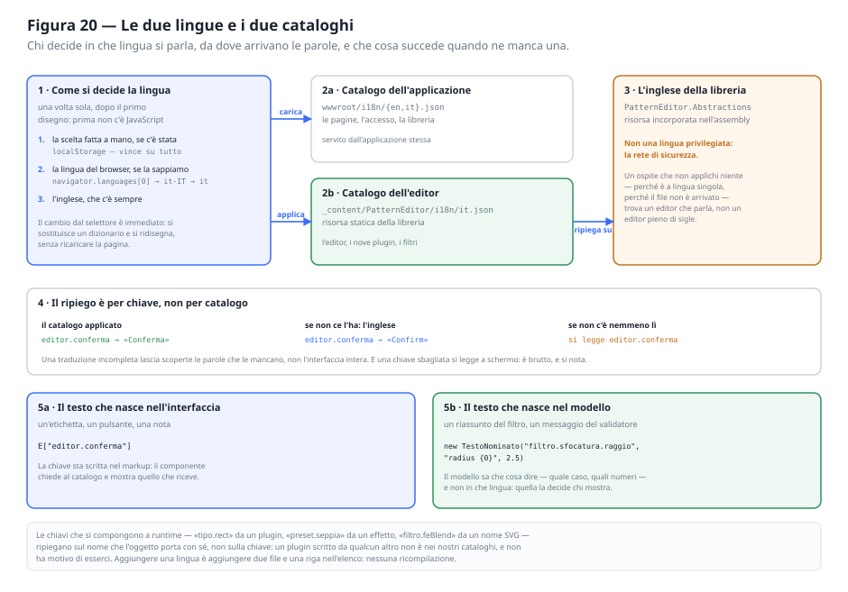

#### Come si decide, e quando

La lingua si sceglie **una volta sola, dopo il primo disegno**. Prima di allora non c'è il
runtime JavaScript, e senza di lui non si sa né che cosa abbia scelto chi torna né che lingua
parli il browser: si saprebbe soltanto che non si sa, e disegnare un'interfaccia intera per
tradurla un istante dopo si vede.

L'ordine rispetta la volontà espressa:

1. **la scelta fatta a mano**, se c'è stata. È l'unica dichiarazione esplicita e vince su
   qualunque indizio; sta in `localStorage`, quindi vale anche alla visita dopo;
2. **la lingua del browser**, se di quella lingua esiste un catalogo. Chi arriva per la prima
   volta merita la propria lingua senza doverla chiedere. `it-IT` si prova prima intero — un
   giorno potremmo distinguere il portoghese del Brasile da quello del Portogallo — e poi come
   sola lingua, altrimenti nessun browser italiano troverebbe mai il catalogo `it`;
3. **l'inglese**, che c'è sempre.

Il cambio dal selettore è **immediato**: si sostituisce un dizionario e si ridisegna, senza
ricaricare la pagina. Ricaricarla perderebbe quello che si stava facendo, e cambiare lingua non
è cambiare pagina.

Insieme alle parole cambia anche il modo di scrivere i numeri: la cultura si imposta sul thread,
ed è quella che `string.Format` consulta ovunque senza che nessuno debba passarla. Parole
tradotte e numeri all'italiana nella stessa riga si notano quanto una data scritta al contrario.
Restano fuori i formati **espliciti** — le date brevi delle schede sono scritte a mano come
`dd/MM` perché devono stare in una riga di tabella, ed è una scelta di impaginazione, non di
lingua.

#### Due cataloghi, e perché non uno

I testi stanno in file JSON, un file per lingua, e i file sono **due gruppi distinti**:

| | Dove | Che cosa contiene | Chi lo serve |
|---|---|---|---|
| Applicazione | `wwwroot/i18n/{en,it}.json` | le pagine, l'accesso, la libreria dei pattern, la presentazione | l'applicazione stessa |
| Editor | `_content/PatternEditor/i18n/it.json` | l'editor, i nove editor di elemento, i filtri, i messaggi dei validatori e quelli dell'importazione | la libreria, come risorsa statica |

Sono separati perché sono **due vocabolari separati**. Chi usa il componente in un'altra
applicazione si porta dietro le sue traduzioni senza doverle ricopiare, e chi traduce
l'applicazione non deve sapere che cosa dice l'editor. È la stessa linea che separa la libreria
dall'ospite in tutto il resto del progetto.

L'**inglese dell'editor non è un file**: è una risorsa incorporata nell'assembly di
`PatternEditor.Abstractions`. Non è una lingua privilegiata, è la rete di sicurezza, e un ripiego
che possa mancare non è un ripiego. Un ospite che non applichi niente — perché è a lingua
singola, perché il file delle traduzioni non è arrivato — deve trovare un editor che parla, non
un editor pieno di sigle.

Il servizio dei testi sta in **Abstractions** e non nella libreria dei componenti perché serve a
entrambe le parti che mostrano testo: il componente editor e i nove plugin di elemento. I plugin
non referenziano la libreria — è una regola dell'architettura, non una dimenticanza — e un
servizio dichiarato là sarebbe fuori dalla loro portata.

#### Il ripiego è per chiave, non per catalogo

Una voce che manca dal catalogo applicato **torna all'inglese da sola**, e tutto il resto resta
tradotto. Una traduzione incompleta lascia scoperte le parole che le mancano, non l'interfaccia
intera.

Una chiave che non esiste in nessun catalogo torna indietro **com'è**: a schermo si legge
`editor.conferma`. È brutto, e si nota — che è il punto. Uno spazio vuoto al posto di un pulsante
sarebbe un difetto scoperto molto più tardi e da molto più lontano.

#### Dove nasce il testo

Il testo nasce in due posti diversi, e i due posti chiedono due meccanismi.

**Nell'interfaccia.** Un'etichetta, un pulsante, una nota: la chiave sta scritta nel markup, il
componente la chiede al catalogo e mostra quello che riceve. I segnaposto sono numerati
(`{0}`, `{1}`) e non incollati per concatenazione: una frase cucita a pezzi non si lascia
riordinare, e ogni lingua mette le proprie parti in un ordine suo.

**Nel modello.** Il riassunto di un passaggio del filtro, il messaggio di un validatore: sono
frasi che il modello sa comporre — conosce il caso, conosce i numeri — ma che non può tradurre,
perché di lingue non sa niente e non deve saperne. Viaggiano come `TestoNominato`, che tiene
insieme tre cose: il **nome** con cui cercarle in un catalogo, il **modello** in inglese da usare
quando quel catalogo non ce l'ha, e i **valori** da sostituire. Si converte in stringa da sé, e
la stringa è l'inglese: chi la usa senza sapere che esistono le lingue — un test, un registro,
un'applicazione ospite che mostra gli errori com'è capitato — continua a funzionare come prima.

I testi composti si annidano. Il riassunto di una `feComponentTransfer` contiene i riassunti
delle sue curve, e il messaggio di un validatore contiene il nome del tipo di elemento: chi
traduce la frase traduce anche le frasi che porta dentro, altrimenti resterebbe metà riga in
inglese dentro una riga tradotta.

#### Le chiavi che si compongono da sole

Tre famiglie di chiavi non compaiono scritte da nessuna parte: nascono da un dato.

| Famiglia | Da che cosa | Esempio |
|---|---|---|
| `tipo.*` | dal `Type` dichiarato da un plugin | `tipo.rect` |
| `preset.*` | dalla chiave tecnica di un effetto pronto | `preset.seppia` |
| `filtro.fe*` | dal nome SVG di una primitiva | `filtro.feGaussianBlur` |

Per queste il ripiego **non è l'inglese incorporato ma l'oggetto stesso**. Un plugin scritto da
qualcun altro non compare nei nostri cataloghi, e non ha motivo di comparirci: il suo nome lo sa
lui. Farlo cadere sulla chiave — `tipo.stella` a schermo — lo punirebbe per essere arrivato dopo.
È anche il motivo per cui l'interfaccia dei plugin non è cambiata: `DisplayName` resta quello che
era, e adesso è in inglese perché l'inglese è ciò che la libreria dice senza un catalogo.

#### Che cosa resta fuori

I messaggi scritti dal **server** restano in italiano. Non sono per un utente: sono il corpo di
una risposta HTTP, li legge chi sviluppa, e tradurli significherebbe tradurre anche i registri.
Quando uno di quei messaggi arriva fino a schermo, però, vince comunque su ciò che avremmo
scritto noi: è già una frase, e tradurla qui vorrebbe dire indovinare da che cosa è nata.

Restano in italiano anche i testi che si vedono **prima che l'applicazione esista** — la riga di
caricamento nella pagina di partenza — con una differenza: quelli sono scritti in inglese, perché
in quel momento la lingua non è ancora stata scelta e l'inglese è il punto di partenza.

#### Aggiungere una lingua

Due file e una riga: il catalogo dell'applicazione in `wwwroot/i18n/xx.json`, quello dell'editor
in `wwwroot/i18n/xx.json` della libreria, e una voce nell'elenco `lingue.json` con il nome della
lingua **scritto nella lingua stessa** — «Italiano», non «Italian». Chi cerca la propria lingua
in un elenco la cerca come la chiama lui, e se sapesse riconoscerne il nome in inglese non
avrebbe bisogno di cambiarla.

Il catalogo dell'editor può anche mancare: quella lingua avrà l'applicazione tradotta e l'editor
in inglese. È brutto, ed è leggibile — che è esattamente ciò che deve fare un ripiego.

---

## 15. Strategia di verifica

| Livello | Oggetto | Approccio |
|---|---|---|
| Dominio | Modello, formattazione, UUIDv7 | Test puri |
| Contratti | Registro, serializzatore, round-trip, tipi sconosciuti | Test puri |
| Plugin | Un progetto di test per plugin: default, validazione, rendering, protezione del testo, indipendenza dalla cultura | Test puri |
| Componente | Macchina a stati, renderer, validatore, duplicazione | Test puri, senza rendering di componenti |
| Contratto dei plugin | Le promesse di `IVectorElementPlugin`, verificate su **tutti** i tipi registrati | Test parametrici, un caso per tipo |
| Plugin staccato | Un documento scritto con nove plugin, riletto da un'installazione che ne ha otto | Test parametrici, un caso per tipo staccato |
| Importazione | Geometria, ereditarietà, stile, colori, trasformazioni, ciò che resta fuori, andata e ritorno | Test puri su documenti scritti nel test |
| Applicazione | Endpoint HTTP con applicazione avviata in memoria | Test di integrazione |
| Visibilità | I modi di aggirare l'approvazione, uno per uno | Test di integrazione |
| Lingue | Parità delle chiavi, voci vuote, segnaposto, chiavi chieste e chiavi inutili | Test puri sui file, per entrambi i gruppi di cataloghi |

**La macchina a stati è separata da Blazor proprio per poter essere verificata così.** Se il
ciclo di vita vivesse dentro il componente, verificarlo richiederebbe di renderizzare
l'interfaccia.

**Le verifiche che valgono per tutti i tipi sono parametriche, non ripetute.** Il contratto dei
plugin e il comportamento a plugin staccato sono gli stessi per ogni elemento: scriverli nove
volte significherebbe averne otto aggiornati e uno dimenticato. L'elenco dei tipi sta in un
punto solo, condiviso fra i progetti di test come sorgente collegato — e il numero dei tipi è
verificato esplicitamente, così che un plugin aggiunto o tolto faccia fallire qualcosa invece
di ridurre in silenzio la copertura.

**Il caso «plugin staccato» merita una riga a sé** perché è l'unico che non si incontra usando
l'applicazione: per vederlo bisogna togliere una registrazione, riaprire un documento vecchio e
guardare bene. I test lo riproducono nove volte, una per tipo staccato, e verificano quattro
promesse che valgono insieme — il documento si apre, l'elemento orfano resta nell'elenco, il
salvataggio non lo tocca, e il giorno in cui il plugin torna l'elemento è di nuovo quello di
prima con tutti i suoi valori. Le prime tre senza la quarta non servirebbero: conservare un
elemento che poi non si riesce più a leggere equivale a perderlo.

**Le regole di visibilità si verificano dai tentativi di aggirarle, non dal caso normale.** Il
caso normale — chiedo, approvi, si vede — è una riga; quello che vale la pena fissare è il
resto: dichiararsi pubblici nel corpo della richiesta, farsi approvare una cosa e salvarne
un'altra, approvare senza essere moderatori, approvare una richiesta ritirata nel frattempo,
leggere per identificativo qualcosa che non si dovrebbe vedere. Senza quei casi il sistema
sembrerebbe funzionare pur non servendo a niente.

**I cataloghi si verificano dai due versi.** Che ogni lingua abbia esattamente le voci
dell'inglese è solo metà del lavoro: dice che i file sono allineati fra loro, non che siano
allineati al codice. L'altra metà confronta i cataloghi con i **sorgenti** — ogni chiave chiesta
dal codice esiste, ogni voce del catalogo è chiesta da qualcuno — e intercetta le due cose che
nessun compilatore vede: un nome scritto storto, che a schermo si legge come chiave, e una voce
rimasta dietro a una chiave rinominata, che si continua a tradurre a ogni lingua nuova senza che
nessuno la legga mai. Si verificano anche i **segnaposto**: una traduzione che perde un `{0}`
butta via un numero, una che ne inventa uno fa saltare `string.Format` a schermo, mentre
qualcuno sta lavorando.

**I test di integrazione devono redirigere l'archiviazione su una cartella temporanea** e
verificarlo esplicitamente: senza questa precauzione una suite di test cancella i dati reali
dell'applicazione. È il tipo di difetto che si scopre una volta sola.

> **Nota.** I test di integrazione degli endpoint sono il livello che intercetta i difetti di
> *composizione*, invisibili ai test unitari. Un controllo scritto correttamente ma collocato
> dopo l'istruzione che solleva l'eccezione è codice irraggiungibile: entrambe le parti sono
> giuste, sbagliato è il loro ordine, e solo un test che attraversi l'intero percorso lo rivela.

---

## 16. Estensioni previste

L'architettura le sostiene senza modifiche al componente principale.

- **Altri elementi**: `use`, `tspan`, gradienti come riempimento.
- **Proprietà aggiuntive dei tracciati**: `fill-rule`, `stroke-linecap`, `stroke-linejoin`.
- **Date sugli elementi**: ogni `VectorElement` ha già un Id UUIDv7, quindi la data di creazione
  del singolo elemento è ricavabile con lo stesso meccanismo usato per il pattern.
- **Manipolazione diretta sulla tela**: richiederebbe ai plugin di dichiarare le proprie
  maniglie, cioè un'estensione del contratto — non una sua rottura.

---

## Appendice A — Schema del documento JSON

```json
{
  "version": 1,
  "id": "01a08a43-f274-7e72-8c70-6f70376970bf",
  "name": "Mattoni",
  "createdAt": "2026-09-10T07:41:43.9240000+00:00",
  "modifiedAt": "2026-09-10T10:38:05.1120000+00:00",
  "authorId": "01a09ff5-f68c-759b-abc5-c45981e14513",
  "authorName": "mario",
  "visibility": "Pubblica",
  "definition": {
    "width": 50,
    "height": 50,
    "scale": 1,
    "rotation": 45,
    "translateX": 0,
    "translateY": 0,
    "filter": {
      "enabled": true,
      "colorSpace": "sRGB",
      "x": -10, "y": -10, "width": 120, "height": 120,
      "primitives": [
        {
          "type": "feColorMatrix",
          "id": "01a0b1c2-0000-7000-8000-000000000001",
          "enabled": true,
          "kind": "saturate",
          "value": 0
        }
      ]
    },
    "elements": [
      {
        "type": "rect",
        "id": "01a08a44-1123-7151-b97a-339602c6ca7f",
        "x": -25, "y": 0, "width": 50, "height": 25,
        "fill": "#dc1822", "fillOpacity": 1,
        "stroke": "#ffffff", "strokeWidth": 1, "strokeOpacity": 1,
        "opacity": 1
      }
    ]
  }
}
```

**Regole del formato.** `type` e `id` sono obbligatori per ogni elemento. Le date sono in
ISO 8601 UTC. I campi assenti assumono il valore predefinito documentato. Un elemento con
`type` sconosciuto viene conservato integralmente e riscritto identico.

I due campi dell'autore compaiono solo se ci sono: un ospite che di utenti non sa niente
scrive documenti che non li contengono affatto, e li rilegge senza accorgersene. Chi li scrive
è sempre il server (§11.10), mai il client.

Il campo `visibility` invece c'è **sempre**, ed è l'unica eccezione alla regola precedente:
qui è l'assenza a significare qualcosa. Un documento che non lo contiene è più vecchio del
concetto e si rilegge come `Pubblica`; un documento scritto da questa versione lo dichiara
anche quando vale il predefinito (§11.13). Lo stato lo assegna sempre il server.

Il campo `filter` compare solo quando c'è un filtro: un pattern che non ne ha scrive esattamente
il documento di prima. Il `type` di una primitiva è il **nome del nodo SVG** che verrà generato,
e le enumerazioni si scrivono per nome e mai per numero (§12.3). Una primitiva con `type`
sconosciuto viene conservata integralmente e riscritta identica, come un elemento ignoto.

---

## Appendice B — Procedura per un nuovo elemento

1. Nuovo progetto in `plugins/PatternEditor.Element.<Nome>`, con riferimento al solo
   progetto dei contratti.
2. Modello concreto derivato da `VectorElement`, con `TypeName` costante, le sole proprietà
   che quel tipo possiede e un metodo di creazione con valori predefiniti **validi**.
3. Plugin che implementa il contratto: identificativo tecnico, nome visualizzato, icona,
   tipo CLR, componente editor, creazione, validazione, rendering.
4. Componente Blazor di modifica, che usa le classi di stile della libreria e notifica ogni
   variazione al contenitore.
5. Progetto di test corrispondente: valori predefiniti validi, regole di validazione,
   attributi generati, protezione del testo, indipendenza dalla cultura.
6. Registrazione nelle applicazioni ospitanti: **una riga per applicazione**.

Nessun passo tocca il componente principale. Se durante l'implementazione emerge la necessità
di modificarlo, si è di fronte a un'estensione del contratto: va valutata come tale, non
aggirata con un caso speciale.

---

## Appendice C — Glossario

| Termine | Significato |
|---|---|
| **Pattern** | Entità persistibile: identità, nome, date e definizione grafica |
| **Cella** | Il rettangolo `Width × Height` che viene ripetuto a scacchiera |
| **Elemento vettoriale** | Una forma all'interno della cella |
| **Plugin** | Progetto che aggiunge un tipo di elemento |
| **Registro** | Associa il `type` tecnico al plugin che lo gestisce |
| **Elemento sconosciuto** | Elemento il cui `type` non corrisponde ad alcun plugin registrato |
| **patternTransform** | Attributo SVG che applica scala, rotazione e traslazione all'intera ripetizione |
| **UUIDv7** | Identificativo univoco ordinabile nel tempo, contenente il proprio istante di generazione |
| **Content root** | Cartella di riferimento dell'applicazione, stabile rispetto alla directory di lavoro |

---

## Appendice D — Provenienza dei dati di esempio

L'archivio dell'applicazione di riferimento contiene **395 pattern importati da
pattern.monster**, distribuiti con licenza MIT. Non sono parte del prodotto: servono a provare
l'interfaccia con dati veri e in quantità realistica — impaginazione, ordinamento, ricerca e
tempi di caricamento si giudicano male su tre esempi.

La conversione è stata possibile perché la struttura del sito coincide con quella prodotta dal
renderer: un nodo `<pattern>` con `patternUnits="userSpaceOnUse"` contenente un rettangolo di
fondo e i tracciati del motivo. Tutti i 395 usano **soltanto** `rect` e `path`, con gli
attributi `x y width height`, `d`, `fill`, `stroke`, `stroke-width`; nessuno usa
`patternTransform`.

Due punti hanno richiesto una conversione vera e propria:

- **i colori** non stanno nei dati del sito: la geometria è memorizzata senza, e la tavolozza
  viene applicata dal suo generatore al momento del disegno. La regola è stata ricavata
  confrontando le anteprime pubblicate con i dati grezzi e verificata elemento per elemento su
  tutte le schede disponibili;
- **il formato**: `hsla(240,6.7%,17.6%,1)` è stato convertito in `#rrggbb` portando l'alfa su
  `FillOpacity` / `StrokeOpacity`, che è il modo in cui il modello separa le due cose (§7.8).

I rettangoli di fondo scuri sono stati successivamente rimossi, così che i pattern prendano il
colore della superficie su cui vengono appoggiati.

> **Nota.** L'importazione è avvenuta chiamando `POST /api/patterns`, non scrivendo i file:
> identificativi, date e validazione sono così passati dal codice dell'applicazione anziché
> dallo strumento di importazione.

---

## Appendice E — Procedure di manutenzione

L'API, oltre a rispondere alle richieste, sa eseguire **due comandi**. Si lanciano sul server,
passando gli argomenti dopo `--`; l'applicazione li riconosce, li esegue e **termina senza
mettersi in ascolto**.

| Comando | A che serve | Quando si usa |
|---|---|---|
| `assegna-autore <nome>` | Dà un autore ai pattern che non ne hanno | Una volta sola, su un archivio nato prima degli account (§11.10) |
| `amministratore <nome> [revoca]` | Concede o toglie il permesso di moderare | Alla prima installazione, e ogni volta che cambia chi modera (§11.13) |

> **Requisito.** Entrambi i comandi si eseguono **solo dal server**, e nessuno dei due ha un
> endpoint corrispondente. Per l'assegnazione dell'autore è una questione di dominio — la
> paternità non è una proprietà che si modifica via rete; per il permesso di moderare è una
> questione di sicurezza: un permesso che si può chiedere via rete è un permesso che prima o
> poi qualcuno si prende, e il primo amministratore per definizione non può essere nominato da
> un amministratore.

### E.1 Nominare un amministratore

**Prerequisito.** L'account dev'essere **già registrato** dall'applicazione: il comando concede
un permesso, non crea utenti. Il nome si confronta senza distinzione fra maiuscole e minuscole,
come ovunque nel sistema (§11.4).

```bash
# concedere
dotnet run --project src/PatternEditor.Sample.Api -- amministratore <nome utente>

# togliere
dotnet run --project src/PatternEditor.Sample.Api -- amministratore <nome utente> revoca
```

**Che cosa fa.** Scrive `"isAdmin": true` (o `false`) nel file dell'account, e nient'altro:
password, domanda di recupero, avatar e date restano quelli che erano.

**Che cosa succede dopo.** Non serve riavviare l'API: l'account viene riletto dal disco a ogni
richiesta. Chi ha già la pagina aperta vede comparire la voce **Moderazione** **ricaricandola**
— il ripristino della sessione richiede `/api/auth/me`, che rilegge il permesso. Non serve
uscire e rientrare.

**Esiti possibili.**

| Situazione | Risposta del comando | Codice di uscita |
|---|---|---|
| Fatto | ««*nome*» può approvare le pubblicazioni…» | 0 |
| Il permesso c'era già (o già non c'era) | «era già amministratore» / «non era amministratore: niente da fare» | 0 |
| Nome inesistente | «Nessun utente si chiama «*nome*». Registralo prima dall'applicazione.» | 1 |

Il comando è **idempotente** e non fa nulla di silenzioso: l'esito è sempre una frase, e un
nome sbagliato è un errore dichiarato invece di un'esecuzione a vuoto.

### E.2 Assegnare un autore ai pattern che non ne hanno

```bash
dotnet run --project src/PatternEditor.Sample.Api -- assegna-autore <nome utente>
```

**Non tocca i pattern già assegnati**: riempie un vuoto, non riscrive una firma. E **non
altera le date di modifica** (§11.10), perché assegnare un autore è un intervento di servizio
e non una modifica al disegno.

### E.3 Due inciampi pratici

**Con l'API avviata la compilazione fallisce.** Il processo in esecuzione tiene bloccati i
propri file, e `dotnet run` prima compila: la risposta è `MSB3027`. Si aggiunge `--no-build`,
oppure si ferma l'API prima.

```bash
dotnet run --project src/PatternEditor.Sample.Api --no-build -- amministratore <nome utente>
```

**I comandi leggono e scrivono le cartelle dati configurate.** `Storage:Directory` e
`Auth:Directory` valgono anche qui, e i percorsi relativi si risolvono sulla content root
(§10.2). Lanciare un comando con una configurazione diversa da quella del servizio significa
lavorare su un archivio diverso da quello che il servizio sta servendo — ed è il modo più
rapido per credere che un comando non abbia funzionato.
