# Pattern Editor SVG — Manuale utente

| | |
|---|---|
| **Documento** | Guida all'uso del Pattern Editor |
| **Versione** | 3.5 |
| **Data** | 17 settembre 2026 |
| **A chi si rivolge** | Chiunque debba comporre un pattern, senza conoscenze di SVG |
| **Prerequisiti** | Nessuno |
| **Revisione 1.1** | Corretto il §5.2 e le ricette 9.2, 9.3 e 9.5: la traslazione non sfalsa le file. Nuovo §5.3 |
| **Revisione 1.2** | Aggiunto il comando di duplicazione al §3 |
| **Revisione 1.3** | §6.1: il riordino avviene per trascinamento, non più con le frecce |
| **Revisione 1.4** | §10: sul telefono la cella singola torna, in miniatura sopra la ripetizione |
| **Revisione 1.5** | Le figure delle schermate sono fotografie dell'applicazione in funzione. Nuove figure 9, 10, 11 e 12 |
| **Revisione 1.6** | §4: il riquadro della cella singola ha la forma della cella; corretta la nota sugli schermi stretti |
| **Revisione 1.7** | Nuovo §3.1: importare un disegno SVG. Nuova figura 13 |
| **Revisione 1.8** | §3.1: che cosa entra pur perdendo una rifinitura |
| **Revisione 1.9** | Ricerca e filtro nella pagina iniziale; filtro e scelta multipla nell'elenco degli elementi; nuovo §6.2 su rotazione e specchiature |
| **Revisione 2.0** | Annulla e ripeti (§4). Posizione e Generale diventano le due sezioni comuni, prima dell'opacità complessiva; nel testo la sezione omonima si chiama ora «Coordinate» |
| **Revisione 2.1** | §6.2: la nota sotto «Usa il centro della cella» dice quali numeri scriverà |
| **Revisione 3.0** | Nuovo capitolo 3: accesso, registrazione, recupero, profilo e proprietà dei pattern. I capitoli successivi scalano di uno |
| **Revisione 3.1** | §3.6: un pattern senza autore non si modifica più; i due pulsanti sulla miniatura, fra cui lo scarico diretto |
| **Revisione 3.2** | §3.5: foto e colore si aggiornano subito anche sulle miniature |
| **Revisione 3.3** | §3.6: il filtro per autore ha tre scelte |
| **Revisione 3.4** | §4: esiste una seconda pagina, di presentazione, all'indirizzo /prodotto |
| **Revisione 3.5** | Le due pagine si scambiano di posto: la presentazione accoglie chi arriva, la gestione si raggiunge da /gestione. Sul telefono l'impaginazione stretta entra finalmente in funzione |
| **Revisione 3.6** | Nuovo §6.4: il filtro, per cambiare aspetto e colore di tutto il disegno insieme |
| **Revisione 3.7** | §6.4: l'avviso su un passaggio che segue un generatore senza dichiarare l'ingresso |
| **Revisione 3.8** | §5: l'editor si apre a tutta pagina; la colonna di sinistra è divisa in due card e il filtro comincia chiuso |
| **Revisione 3.9** | §5: cinque card. I filtri passano sotto le anteprime, nella colonna larga; «SVG generato» prende il loro posto a sinistra. Entrambi cominciano aperti |
| **Revisione 3.10** | §5: le due anteprime diventano un corpo solo — la ripetizione fa da fondo, la cella singola le sta sopra incorniciata — con una legenda che dice quale è quale |
| **Revisione 3.11** | §6.4: ventiquattro effetti pronti raccolti in quattro famiglie. §5: come le card si spartiscono l'altezza, e che cosa non si stringe mai |
| **Revisione 3.12** | §5: annulla e ripeti diventano due pulsanti rotondi con la freccia blu |
| **Revisione 3.13** | Nuovi §3.7 e §3.8: ogni pattern è privato o pubblico, e diventa pubblico solo dopo l'approvazione di un amministratore. Aggiornati §3.1 e §3.6 |
| **Revisione 3.14** | Nuovo §3.9: come si nomina, e come si revoca, chi modera |
| **Revisione 3.15** | Ogni scheda, e l'editor, dicono quanto pesa il documento SVG |
| **Revisione 3.16** | §4: la presentazione alterna i pattern in scena, e li si può fermare |
| **Revisione 3.18** | Nuovo §4.2: convertire un'immagine in pattern. Nuova figura 14. Edizione inglese del manuale, scaricabile dalla barra in alto |
| **Revisione 3.17** | Nuovo §1.1: l'applicazione parla inglese o italiano, e la lingua si cambia dalla barra in alto |

---

## Come leggere questo manuale

Non serve leggerlo tutto. Se è la prima volta, i capitoli **1** e **2** bastano per creare
qualcosa che funziona: dieci minuti. Il capitolo **6** è la scheda di ogni singolo elemento, da
consultare quando serve. Il capitolo **9** raccoglie ricette complete da copiare.

Quando compare un riquadro come questo, contiene una nozione della specifica SVG che spiega
*perché* un comando si comporta in un certo modo. Si può saltare senza perdere niente di pratico.

> **Sotto il cofano.** Testo di questo tipo.

---

## Indice

1. [Che cos'è e a cosa serve](#1-che-cosè-e-a-cosa-serve)
   · [1.1 In che lingua parla](#11-in-che-lingua-parla)
2. [Il primo pattern in dieci minuti](#2-il-primo-pattern-in-dieci-minuti)
3. [Chi sei e che cosa puoi fare](#3-chi-sei-e-che-cosa-puoi-fare)
   · [3.7 Privato o pubblico](#37-privato-o-pubblico)
   · [3.8 Approvare le pubblicazioni](#38-approvare-le-pubblicazioni)
   · [3.9 Nominare chi modera](#39-nominare-chi-modera)
4. [La pagina di gestione](#4-la-pagina-di-gestione)
   · [4.1 Importare un disegno SVG](#41-importare-un-disegno-svg)
   · [4.2 Convertire un'immagine in pattern](#42-convertire-unimmagine-in-pattern)
5. [L'editor: le tre zone](#5-leditor-le-tre-zone)
6. [Le proprietà: cella, trasformazione e filtro](#6-le-proprietà-cella-trasformazione-e-filtro)
   · [6.3 Come si sfalsano davvero le file](#63-come-si-sfalsano-davvero-le-file)
   · [6.4 Il filtro: cambiare aspetto e colore di tutto insieme](#64-il-filtro-cambiare-aspetto-e-colore-di-tutto-insieme)
7. [Gli elementi, uno per uno](#7-gli-elementi-uno-per-uno)
8. [Colori, bordi e trasparenze](#8-colori-bordi-e-trasparenze)
9. [Il sorgente SVG: copiare, scaricare, usare](#9-il-sorgente-svg-copiare-scaricare-usare)
10. [Ricette: sei pattern passo passo](#10-ricette-sei-pattern-passo-passo)
11. [Sul telefono](#11-sul-telefono)
12. [Quando qualcosa non torna](#12-quando-qualcosa-non-torna)
13. [Piccolo glossario](#13-piccolo-glossario)

---

## 1. Che cos'è e a cosa serve

Un **pattern** è un disegno che si ripete all'infinito senza interruzioni: la carta da parati,
la trama di un tessuto, lo sfondo di una pagina web. Non si disegna tutto: si disegna **una
piastrella**, e il resto lo fa la ripetizione.

Questo strumento serve a disegnare quella piastrella e a vedere subito, mentre la si disegna,
che effetto fa ripetuta.

Il risultato è un file **SVG**. È un formato vettoriale: non contiene pixel ma istruzioni
geometriche («un cerchio di raggio 20 in questa posizione»), e per questo può essere ingrandito
quanto si vuole senza sgranare, pesa pochissimo, e si può aprire con un browser, con un
programma di grafica, o incollare dentro una pagina web.

**Cosa si può fare**

- comporre una cella con nove tipi di forme;
- ripeterla, ruotarla, ingrandirla, sfalsarla;
- vedere il risultato in tempo reale mentre si regola ogni valore;
- salvare il pattern per riprenderlo, o scaricare il file SVG.

**Cosa non si può fare** — è giusto saperlo prima: non si disegna con il mouse. Le forme si
inseriscono e se ne scrivono le misure. È uno strumento da geometra, non da pittore, e il motivo
è che un pattern deve incastrarsi al millesimo: a mano libera non verrebbe.

### 1.1 In che lingua parla

L'applicazione parla **inglese** o **italiano**. La prima volta che arrivi sceglie da sola: se il
tuo browser è impostato in italiano trovi tutto in italiano, altrimenti trovi l'inglese.

Per cambiarla, il pulsante con il **mappamondo** nella barra in alto, accanto a quello del tema
chiaro e scuro. Mostra il codice della lingua in uso — `IT` o `EN` — e si apre su un elenco dove
ogni lingua è scritta come la si chiama in casa propria: «Italiano», non «Italian».

Tre cose vale la pena sapere.

- **Il cambio è immediato.** La pagina non si ricarica: le parole cambiano sotto gli occhi e
  quello che stavi facendo resta dov'era. Puoi cambiare lingua anche con l'editor aperto.
- **La scelta viene ricordata.** Dalla volta dopo l'applicazione parte nella lingua che hai
  scelto, anche se il browser ne dichiara un'altra: una scelta esplicita vale più di un indizio.
- **Cambiano anche i numeri.** In italiano un peso si legge «1,3 kB», in inglese «1.3 kB». Le
  misure dentro il file SVG invece non cambiano mai — quelle sono dati, e vanno scritte in un
  modo solo perché chiunque apra il file le legga uguali.

I **tuoi pattern non c'entrano**: il nome che dai a un pattern è tuo e resta scritto come l'hai
scritto tu, in qualunque lingua stia l'interfaccia.

> **Se trovi una parola in inglese in mezzo all'italiano**, non è un guasto: è una voce che
> nella traduzione manca ancora, e il programma preferisce mostrartela in inglese piuttosto che
> lasciare un buco. Segnalala e finisce nella traduzione al giro dopo.

---

## 2. Il primo pattern in dieci minuti

Facciamo un pattern a pois. Ogni passo dice esattamente cosa toccare.

**Passo 1 — Crea.** Nella pagina di gestione, premi **+ Crea un pattern**. Si apre l'editor, con
una cella vuota di 50 × 50.

**Passo 2 — Dai un nome.** In alto a sinistra c'è il campo **Nome pattern**: scrivi `Pois`. Non
è obbligatorio, ma un pattern senza nome è difficile da ritrovare fra cento.

**Passo 3 — Ingrandisci la cella.** Nella colonna **Proprietà**, metti **Larghezza** e
**Altezza** a `100`. Guarda l'anteprima: non è cambiato niente, perché la cella è ancora vuota.

**Passo 4 — Inserisci un cerchio.** Nella colonna **Elementi**, premi **+ Aggiungi elemento** e
scegli **Cerchio**. Compaiono due cose insieme: un cerchio nell'anteprima, e la scheda del
cerchio al posto dell'elenco.

**Passo 5 — Mettilo al centro.** Nella scheda che si è aperta, imposta:

| Campo | Valore |
|---|---|
| Centro X | `50` |
| Centro Y | `50` |
| Raggio | `18` |

Il cerchio si sposta al centro della cella. Nell'anteprima di destra vedi già i pois in fila.

**Passo 6 — Scegli il colore.** Sempre nella scheda del cerchio, nella sezione
**Riempimento**, premi il quadratino colorato e scegli un colore; oppure scrivi il codice
esadecimale nella casella accanto, ad esempio `#3b6ef5`.

**Passo 7 — Sfalsa le file.** Torna all'elenco con **‹ Elenco** e duplica il cerchio con **⧉**.
Apri la copia e mettila in (`0`, `0`): finisce sull'angolo, e la parte che esce ricompare dagli
altri tre angoli. Duplicala altre tre volte, mettendo le copie in (`100`, `0`), (`0`, `100`) e
(`100`, `100`).

Guarda la seconda anteprima: i pois non sono più allineati in colonna, sono sfalsati come le
celle di un alveare. Ci sono voluti cinque cerchi invece di uno, e il perché è spiegato qui
sotto.

**Passo 8 — Salva.** In alto a destra, **Chiudi / Conferma**.

Fatto. Il pattern è nell'elenco, e con **↓ Scarica SVG** ne prendi il file quando ti serve.

> **Sotto il cofano.** Il file prodotto contiene un nodo `<pattern>` con dentro il tuo cerchio,
> e un rettangolo grande quanto tutta l'immagine che lo usa come riempimento. È il meccanismo
> standard della specifica SVG per le ripetizioni: nessun software ha bisogno di plugin o
> conversioni per leggerlo.

---

## 3. Chi sei e che cosa puoi fare

Fino a ieri l'applicazione non sapeva chi fossi, e tutti potevano toccare tutto. Adesso c'è
un accesso — leggero, ma sufficiente a due cose sole e importanti: **quello che hai fatto tu
lo modifichi e lo elimini solo tu**, e **quello che hai fatto tu lo vedi solo tu**, finché non
chiedi di pubblicarlo e qualcuno dice di sì (§3.7).

### 3.1 Senza accesso si fa quasi tutto

Chi arriva sulla pagina è un visitatore anonimo, e non è un ospite di serie B:

| Cosa | Senza accesso |
|---|---|
| Vedere l'elenco dei pattern **pubblici**, cercare, filtrare | Sì |
| Vedere i pattern privati o in attesa di approvazione | No |
| Aprire un pattern pubblico nell'editor | Sì |
| Modificarlo, provare, guardare l'anteprima | Sì |
| Copiare o **scaricare** l'SVG | Sì |
| Crearne uno nuovo e scaricarlo | Sì |
| **Salvare** | No |
| Duplicare ed eliminare | No |

Aperto senza accesso, l'editor funziona per intero: cambi quello che vuoi, l'anteprima
risponde, il sorgente si copia e si scarica. Cambiano solo i due pulsanti in alto a destra,
che diventano **un solo «Chiudi»** — non c'è niente da confermare e niente da annullare,
perché niente sarebbe stato salvato comunque. In basso lo dice anche a parole: *sola lettura,
le modifiche restano su questo schermo.*

È una scelta e non una dimenticanza: questo strumento serve anche solo a produrre un file
SVG, e per quello un account non c'entra niente.

### 3.2 Accedere

Il pulsante **Accedi** è in alto a destra. Chiede nome utente e password, e sotto ha due
scorciatoie: **Ricorda password** e **Registra nuovo utente**.

### 3.3 Registrarsi

**Registra nuovo utente** porta a una pagina che chiede quattro cose: un nome utente, una
password, una domanda di recupero con la sua risposta, e — facoltativa — una foto.

Prima dei campi c'è un riquadro che spiega come vengono trattati i dati. Vale la pena
leggerlo, perché descrive un vincolo con cui poi si convive:

- la **password non viene conservata**: il server ne tiene solo un'impronta che non si può
  ripercorrere all'indietro. Nemmeno chi amministra il servizio può rileggerla;
- lo stesso vale per la **risposta** alla domanda di recupero. La domanda invece resta in
  chiaro, perché deve poterti essere mostrata;
- **non c'è posta elettronica e non c'è nessun altro canale.** Se dimentichi la password,
  l'unica strada per rientrare è la risposta alla tua domanda.

**La password.** Il requisito è la lunghezza: almeno dodici caratteri. Non servono maiuscole,
numeri o simboli, e non è una semplificazione — è la regola giusta. «Password1!» soddisfa
tutte le vecchie regole ed è fra le prime che verrebbero provate; *stratigrafia del muro* non
ne soddisfa nessuna, è molto più difficile da indovinare e si ricorda. Sotto il campo una
barra dice quanti caratteri mancano: non è un misuratore di robustezza, è un conto esatto.

Restano tre rifiuti: le password più usate al mondo, quelle che contengono il tuo nome
utente, e quelle fatte di poche lettere ripetute.

**La domanda di recupero.** Puoi sceglierne una fra i suggerimenti o scriverne una tua — ed è
quasi sempre meglio scriverne una tua: le domande preconfezionate hanno risposte che spesso
si trovano altrove. Maiuscole e spazi non contano: «Via Garibaldi» e «via  garibaldi» valgono
la stessa risposta, perché fra sei mesi non la riscriveresti identica.

**La foto** è facoltativa: PNG, JPEG o WebP fino a 2 MB. Senza, resta un cerchio con le prime
due lettere del nome, su un colore che puoi scegliere lì e cambiare quando vuoi.

### 3.4 Se hai dimenticato la password

Dalla finestra di accesso, **Ricorda password**. Scrivi il nome utente e compare la domanda
che avevi scelto. Nella stessa schermata ci sono la casella per la risposta e quella per la
nuova password: se la risposta è giusta, la password viene cambiata e sei dentro.

Le due cose stanno insieme apposta. Se fossero in due schermate separate, una risposta giusta
seguita da una password troppo corta ti rimanderebbe indietro a rispondere di nuovo,
consumando un tentativo per un errore che con la risposta non c'entrava.

> **Da sapere.** Cambiando la password per questa via, tutte le altre sessioni aperte si
> chiudono. Se il recupero è servito perché qualcun altro era entrato, quello è il momento in
> cui esce.

### 3.5 Il tuo profilo

Fatto l'accesso, al posto di «Accedi» compare il tuo cerchio con il nome accanto. Cliccandolo
si apre un menù con due voci: **Modifica il profilo** ed **Esci**.

Nel profilo si cambiano tre cose e solo quelle:

| Cosa | Note |
|---|---|
| Colore delle iniziali | Vale quando non c'è una foto |
| Foto | Si aggiunge, si cambia, si toglie |
| Password | Richiede quella attuale |

La password attuale viene chiesta anche a chi è già dentro: protegge dal computer lasciato
aperto, che è il caso in cui serve davvero. Cambiandola, le altre sessioni si chiudono;
questa resta.

Foto e colore si vedono **subito** dappertutto: in alto, e sulle miniature dei pattern che hai
fatto. Non serve ricaricare la pagina né chiudere il profilo.

Il **nome utente non si cambia**. È la chiave con cui entri, compare accanto a ogni pattern
che hai fatto, ed è quello che gli altri riconoscono.

### 3.6 Chi ha fatto cosa

Sotto il nome di ogni pattern, nell'elenco, compare il suo autore: il cerchio e il nome. Sul
tuo c'è anche un'etichetta **tuo**.

Su un pattern che non puoi modificare compare un piccolo **lucchetto** al posto della casella
di selezione. Puoi comunque aprirlo, guardarlo, modificarlo per provare e scaricarne il
risultato: quello che non puoi fare è sovrascrivere l'originale.

Passando il puntatore su una miniatura compaiono due pulsanti nell'angolo in alto a destra:

| Pulsante | Che cosa fa |
|---|---|
| **⧉** | Duplica il pattern. Compare solo a chi ha fatto l'accesso, perché duplicare crea un documento nuovo — e la copia è tua, anche se il disegno viene da un altro |
| **↓** | Scarica l'SVG senza aprire l'editor. Vale per tutti: prendere un file non deve costringere a entrare in un editor |

Nella barra dei filtri, a chi ha fatto l'accesso, compare una tendina **Autore** con tre
scelte: tutti, solo i miei, solo degli altri.

> **I pattern più vecchi degli account.** Quelli che c'erano prima che l'accesso esistesse non
> hanno un autore, e proprio per questo **nessuno li può modificare**: se non risulta chi li ha
> scritti, non risulta nemmeno chi ha il diritto di riscriverli. Restano aperti a tutti in
> lettura e scaricabili, ma per riprenderli in mano vanno prima assegnati a un utente — e lo si
> fa una volta sola, dal server, con il comando
> `dotnet run --project src/PatternEditor.Sample.Api -- assegna-autore <nome utente>`.

> **Dove sta scritto l'autore.** Dentro il file del pattern, accanto al nome e alle date. Così
> esportando o copiando un pattern l'autore va con lui, invece di restare indietro in un
> elenco a parte.

> **Nota sulla sicurezza.** Il sistema è volutamente leggero: due tipi di utente — chi disegna
> e chi modera — nessun secondo fattore, il rientro affidato a una domanda. Serve a tenere
> separato il lavoro di persone che collaborano e a impedire che chiunque si registri possa
> pubblicare qualsiasi cosa, non a difendere un segreto da chi vuole davvero prenderlo.

### 3.7 Privato o pubblico

Ogni pattern ha uno **stato**, che dice chi lo vede. Gli stati sono tre, e si leggono su una
pastiglia colorata sotto il nome, nella scheda dell'elenco:

| Pastiglia | Che cosa significa | Chi lo vede |
|---|---|---|
| **Privato** (grigia) | È tuo e basta | Solo tu |
| **In attesa** (ambra) | Hai chiesto di pubblicarlo | Tu e chi modera |
| **Pubblico** (verde) | È stato approvato | Tutti, anche senza account |

**Un pattern nuovo nasce privato.** Quando premi *Chiudi / Conferma* su un disegno che non
avevi mai salvato, l'applicazione chiede una cosa sola — *Chi potrà vederlo?* — e offre due
risposte: **Tienilo privato** oppure **Chiedi la pubblicazione**. Non è una domanda che
ritorna a ogni salvataggio: si fa una volta, alla nascita, e poi lo stato si cambia dalla
scheda.

Sulla scheda dei tuoi pattern, accanto alla pastiglia, c'è il comando per cambiare idea:

| Se è | Il comando dice | E il pattern diventa |
|---|---|---|
| Privato | Chiedi la pubblicazione | In attesa |
| In attesa | Ritira la richiesta | Privato |
| Pubblico | Rendi privato | Privato |

Chiedere la pubblicazione **non pubblica niente**. Mette il pattern in coda: resta privato,
lo vedi solo tu, e diventa pubblico nel momento in cui un amministratore lo guarda e lo
approva. Se lo rifiuta, torna privato e resta tuo — nessuno lo cancella, e puoi correggerlo e
riproporlo.

Nella barra dei filtri, a chi ha fatto l'accesso, compare una tendina **Stato** per vedere
solo i privati, solo quelli in attesa o solo i pubblici.

> **Modificare un pattern già approvato lo rimette in coda.** È la regola meno comoda e la più
> necessaria: quello che era stato approvato è il **disegno**, non il nome del file. Senza
> questa regola basterebbe far approvare una cosa qualsiasi e poi salvarci sopra quello che si
> voleva pubblicare davvero. Quando succede, l'applicazione te lo dice subito dopo il
> salvataggio.

> **Una copia non eredita l'approvazione.** Duplicando un pattern pubblico ottieni un pattern
> **privato**, per la stessa ragione: sarebbe l'altra strada per aggirare il controllo.

> **I pattern che c'erano prima.** Quelli salvati prima che gli stati esistessero si leggono
> come **pubblici**, perché pubblici lo erano già: nessun archivio sparisce dal portale da un
> giorno all'altro. La prudenza vale sui pattern nuovi, che nascono privati.

### 3.8 Approvare le pubblicazioni

Questa parte riguarda poche persone: quelle che **moderano**. Chi ha il permesso vede in alto
una terza voce, **Moderazione**, e la pagina all'indirizzo **`/moderazione`**.

La pagina mostra le richieste in attesa, dalla più vecchia alla più recente — chi ha chiesto
prima aspetta da più tempo. Ogni scheda ha l'anteprima, il nome, l'autore, la data della
richiesta e due pulsanti:

| Pulsante | Che cosa fa |
|---|---|
| **Approva** | Da qui, e solo da qui, il pattern diventa visibile a tutti |
| **Rifiuta** | Il pattern torna privato e resta al suo autore. Non viene cancellato |

L'anteprima si può **ingrandire**: un clic la apre a tutta finestra, perché su una scheda
piccola un dettaglio inopportuno può non vedersi, e chi decide deve poter guardare bene.

> **Chi modera non vede i cassetti degli altri.** Nella coda compare quello che ti è stato
> **sottoposto**, non tutto l'archivio: i pattern privati altrui restano invisibili anche a un
> amministratore. Moderare significa giudicare quello che qualcuno ha chiesto di mostrare.

> **Chi modera può anche disegnare.** Non è un account a parte: è lo stesso di sempre, con un
> permesso in più. I tuoi pattern restano tuoi e seguono le stesse regole degli altri — e sì,
> puoi approvare i tuoi, perché il sistema serve a filtrare chi si registra, non a impedire
> a chi già amministra il portale di pubblicarci.

### 3.9 Nominare chi modera

Questo paragrafo serve a **una persona sola**, quella che gestisce il server. L'operazione
non si fa da dentro l'applicazione, ed è voluto: un permesso che si può chiedere via rete è
un permesso che prima o poi qualcuno si prende. Il primo amministratore, per giunta, non
potrebbe essere nominato da un amministratore — non ce n'è ancora uno.

**Prima.** L'utente dev'essere **già registrato** dall'applicazione: il comando concede un
permesso, non crea un account. Registralo normalmente da **Accedi → Registra nuovo utente**.

**Poi**, dalla cartella della soluzione, sul computer dove gira l'API:

```
dotnet run --project src/PatternEditor.Sample.Api -- amministratore <nome utente>
```

Per togliere il permesso, la stessa riga con `revoca` alla fine:

```
dotnet run --project src/PatternEditor.Sample.Api -- amministratore <nome utente> revoca
```

**Dopo.** Non c'è niente da riavviare. Chi ha già la pagina aperta vede comparire la voce
**Moderazione** semplicemente **ricaricandola**: non serve uscire e rientrare.

Il comando risponde sempre con una frase, e non fa niente di nascosto:

| Se… | Ti dice |
|---|---|
| È andata | *«tizio» può approvare le pubblicazioni…* |
| Lo era già | *«tizio» era già amministratore* |
| Il nome non esiste | *Nessun utente si chiama «tizio». Registralo prima dall'applicazione* |

> **Se compare un errore `MSB3027`.** L'API è avviata e tiene bloccati i propri file, mentre
> il comando prova a ricompilare. Aggiungi `--no-build` subito dopo il nome del progetto,
> oppure ferma l'API prima di lanciarlo:
> `dotnet run --project src/PatternEditor.Sample.Api --no-build -- amministratore <nome utente>`

> **Un'altra cosa che si fa da qui.** Con lo stesso meccanismo si assegna un autore ai pattern
> che non ne hanno (§3.6). I due comandi sono gli unici che l'applicazione accetta dalla riga
> di comando.

---

## 4. La pagina di gestione

> **Dove si trova.** Chi apre l'applicazione arriva sulla **presentazione**: lo scorrimento fa
> da regista, una cella si moltiplica sotto gli occhi, i nove tipi di elemento sfilano su un
> nastro con l'elenco di quello che si può regolare, subito dopo ci sono le due strade per non
> disegnare la cella da zero — importare un SVG e convertire un'immagine (§4.1 e §4.2) — e in
> fondo c'è l'archivio con ricerca, apertura e scarico. La pagina di gestione — quella descritta in questo capitolo, dove si
> lavora davvero — si raggiunge dalla voce **Gestione** in alto, o direttamente
> all'indirizzo **`/gestione`**.
>
> In alto a sinistra il nome dell'applicazione riporta sempre alla presentazione. Il vecchio
> indirizzo **`/prodotto`** continua a funzionare: i collegamenti già scritti non si rompono.
>
> **La presentazione non mostra sempre lo stesso disegno.** Nella sezione «Disegni una
> tessera» passano a turno sei pattern presi dal tuo archivio, uno ogni sette secondi, e sotto
> il riquadro una fila di puntini dice quanti sono e quale stai guardando: **si può cliccarli**
> per fermarsi su uno. Passando il puntatore sul riquadro l'alternanza si ferma da sola,
> così il disegno non cambia mentre lo si sta guardando da vicino. Se nel sistema hai chiesto
> **meno animazioni**, i pattern non si alternano da soli: restano i puntini per scorrerli a
> mano.

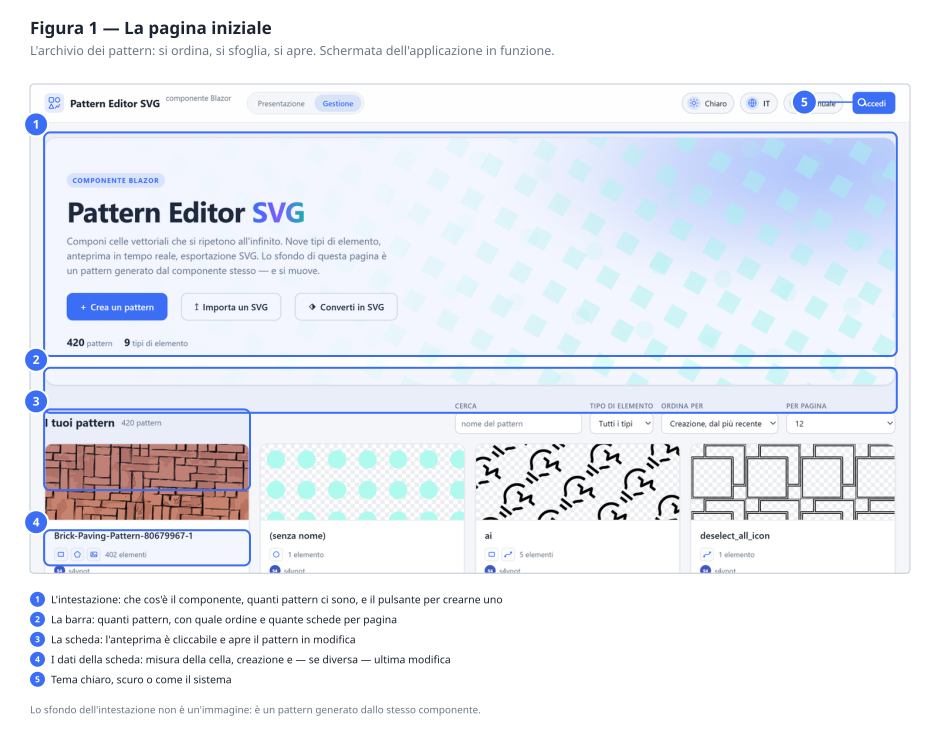

È l'elenco di tutto quello che hai creato. Ogni **scheda** mostra l'anteprima vera del pattern —
non un'icona generica — con sotto il nome, quanti elementi lo compongono, la dimensione della
cella e il **peso** del file.

> **Il peso è quello del documento SVG**, cioè del file che ottieni premendo ↓ o **Scarica SVG**:
> qualche centinaio di byte per una trama semplice, un paio di chilobyte per una ricca. È il
> numero che dice perché una trama calcolata conviene a un'immagine: copre una parete intera e
> pesa meno di una fotografia sfocata. Lo trovi sulle schede della gestione, su quelle
> dell'archivio nella presentazione, nella pagina di moderazione e, aggiornato mentre disegni,
> accanto al titolo della card **SVG generato** dentro l'editor.
>
> Un pattern che contiene un'**immagine** incorporata fa eccezione e può pesare molto: l'immagine
> viaggia dentro il documento, ed è il suo peso che si vede.

| Comando | A cosa serve |
|---|---|
| Clic su una scheda | Apre il pattern nell'editor |
| **↥ Importa un SVG** | Ricava un pattern da un file SVG esistente (§4.1) |
| **⧉** in alto a destra sull'anteprima | Duplica il pattern |
| **+ Crea un pattern** | Ne crea uno nuovo, vuoto |
| **Accedi** (in alto a destra) | Apre la finestra di accesso. Senza, si può fare quasi tutto tranne salvare (§3) |
| **Cerca** | Filtra per nome mentre scrivi |
| **Tipo di elemento** | Mostra solo i pattern che contengono quel tipo — utile per ritrovare «quello con il testo» |
| **Ordina per** | Cambia l'ordine: per data di creazione, di modifica, o per nome |
| **Per pagina** | Quante schede mostrare insieme: 4, 8, 12, 24 o 48 |
| **Chiaro / Scuro** | Cambia il tema. Vale anche per l'editor, e viene ricordato |

**Duplicare.** Il comando **⧉** compare sull'anteprima quando ci passi sopra il puntatore, in
alto a destra. Crea subito una copia completa chiamata «Copia di *nome originale*», che finisce
in cima all'elenco. La copia è indipendente: modificarla non tocca l'originale.

Serve quando si vuole provare una variante senza rischiare il pattern che funziona — un altro
colore, una cella più grande, un elemento in più.

**Eliminare.** Su ogni scheda, il comando di eliminazione chiede conferma una volta sola. Non
esiste un cestino: quello che si elimina è eliminato.

### 4.1 Importare un disegno SVG

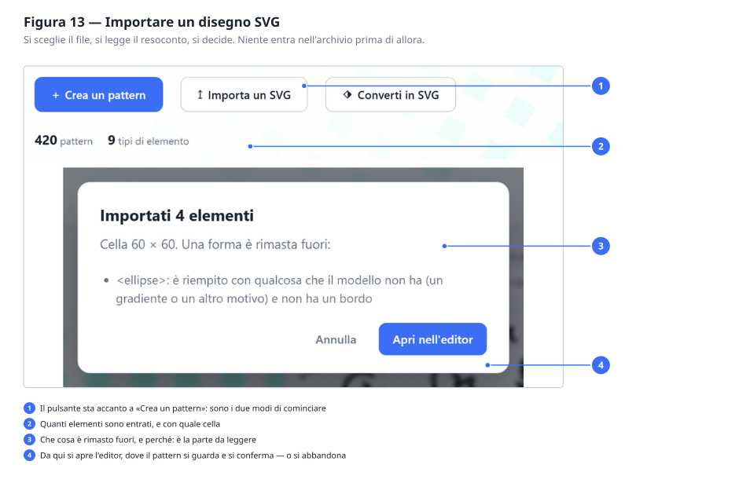

Accanto a **Crea un pattern** c'è **Importa un SVG**: apre un file già disegnato — con
Illustrator, Inkscape, Figma o quello che usi — e ne ricava un pattern.

Prima di aprirsi, l'editor ti dice **che cosa è entrato e che cosa no**. Quella finestra va
letta: SVG è un formato molto più ampio di questo strumento, e un disegno qualsiasi contiene
quasi sempre qualcosa che qui non si può rappresentare.

**Che cosa entra.**

- le nove forme che conosci: rettangoli, cerchi, ellissi, linee, tracciati, poligoni,
  spezzate, testi e immagini;
- i loro colori, anche scritti come `red` o `rgb(255,128,0)`, e le trasparenze;
- quello che dichiara il gruppo che le contiene, che in SVG si eredita;
- gli spostamenti e gli ingrandimenti dei gruppi, applicati direttamente alla geometria,
  perché qui i gruppi non esistono;
- la **cella**, presa dal `viewBox` del documento.

**Che cosa resta fuori, e perché.**

| Cosa | Perché |
|---|---|
| Forme ruotate o inclinate | Cambierebbero forma: un rettangolo ruotato non è più un rettangolo |
| Gradienti, motivi, ritagli, maschere, filtri | Il modello non li ha; una forma che aveva solo quello resterebbe invisibile |
| Colori dichiarati con `class` e un foglio di stile | Servirebbe interpretare il CSS del documento |
| `<use>`, `<symbol>`, e i tag di altri formati | Sono riferimenti ad altro, e qui l'elenco degli elementi è piatto |
| Angoli arrotondati dei rettangoli | Il rettangolo di questo modello ha gli spigoli vivi |

Le ultime due voci non fanno sparire la forma: **entra lo stesso**, senza quella rifinitura. La
finestra te lo dice comunque, perché è il genere di differenza che altrimenti si scambia per un
errore del disegno.

Niente viene salvato finché non premi **Chiudi / Conferma** nell'editor: l'importazione ti
mette il pattern davanti, la decisione resta tua. Il nome del file diventa il nome del
pattern, e si cambia lì.

> **Sotto il cofano.** Anche l'SVG che scarichi da qui si può riaprire: il disegno sta dentro
> `<defs><pattern>`, e l'importazione lo riconosce, ritrovando cella e trasformazione. Andata
> e ritorno restituiscono lo stesso pattern — comodo per spostare un pattern da un'installazione
> a un'altra senza passare dall'archivio.

### 4.2 Convertire un'immagine in pattern

Accanto a **Importa un SVG** c'è **Converti in SVG**: prende una fotografia o un disegno a
punti — PNG, JPEG, WebP, GIF, BMP — e prova a ricostruirlo come pattern vettoriale.

La differenza con l'importazione è tutta qui: là il disegno vettoriale **c'è già** e va solo
tradotto, qui va **ricostruito**. È un lavoro di interpretazione, e come ogni interpretazione
riesce bene su certe cose e male su altre. Il manuale te lo dice prima, così non lo scopri
dopo.

**A che serve.** Hai una foto di un pavimento, un ritaglio di un retino da un catalogo, una
texture scaricata: da lì esce una cella vettoriale che poi puoi modificare — ricolorare,
raddrizzare, togliere quello che non ti serve. Il risultato non è una copia: è una **proposta
su cui lavorare**.

#### Che cosa succede quando scegli il file

Quattro passaggi, in quest'ordine.

**Si cerca la ripetizione.** Prima di tutto lo strumento cerca ogni quanto il disegno torna su
se stesso. Non lungo i due assi separatamente, ma come **reticolo**: due direzioni di
traslazione, che possono anche essere oblique. È la differenza che conta su una muratura a
corsi sfalsati — lì il motivo non si ripete a ogni corso, perché il corso dopo è spostato di
mezzo mattone, e si ripete ogni **due**. Cercando un passo verticale da solo si troverebbe
l'altezza di un corso, e il muro tornerebbe indietro con tutte le fughe incolonnate.

Se la ripetizione si vede, si lavora sulla sola tessera. Se non si vede, viene presa come cella
l'immagine intera e la finestra te lo dice: succede con le texture che non si ripetono più
corto di così, e non è un errore.

**L'immagine si riduce a poche bande di colore.** Non a intervalli fissi ma scelte
sull'immagine, così le bande si stringono dove i colori sono fitti. Quante bande lo decidi tu,
e più avanti si vede come.

**Ogni banda si divide in zone.** Una banda è sparsa per tutta l'immagine — il rosso dei
mattoni tocca ogni mattone — ma i mattoni sono oggetti distinti: le zone si separano per
contiguità. Ogni zona diventa una forma: un **rettangolo** se ne riempie quasi tutto
l'ingombro, altrimenti una **poligonale** che ne segue il bordo.

**Poi si corregge.** Qui sta la parte che fa la differenza. Il disegno ottenuto viene
ridipinto, confrontato **punto per punto** con l'immagine di partenza, e dove non corrisponde
si ricomincia: quei punti tornano a essere disegno da riconoscere, con il colore che hanno
nell'originale. Tre giri, o finché quello che resta fuori non diventa trascurabile.

È il motivo per cui conviene **scendere** con i colori invece di salire: con poche bande il
primo passaggio sbaglia parecchio, ma sbaglia in modo visibile, e le correzioni spendono gli
elementi dove il disegno sbaglia invece che dove è grande.

#### La finestra di anteprima

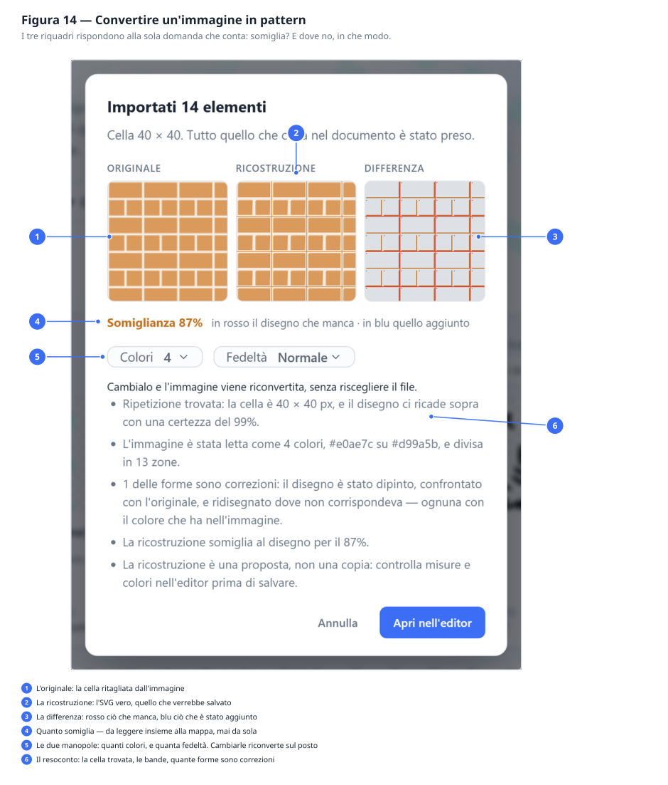

Prima che l'editor si apra vedi tre riquadri affiancati e un numero.

| Riquadro | Che cos'è |
|---|---|
| **Originale** | La cella ritagliata dall'immagine, così com'era |
| **Ricostruzione** | L'SVG vero, quello che verrebbe salvato — non una copia disegnata per l'occasione |
| **Differenza** | Dove i due non coincidono, e in che modo |

La mappa delle differenze ha **quattro colori**, e distinguerli è tutto il suo valore:

| Colore | Vuol dire |
|---|---|
| Grigio chiaro | Coincide |
| Rosso | Disegno **mancante**: lì c'era qualcosa e non è stato ricostruito |
| Blu | Disegno **aggiunto**: lì non c'era niente ed è stato dipinto qualcosa |
| Arancione | Forma giusta, **colore sbagliato** |

Il numero — «somiglia al 93%» — è la quota di punti che coincidono.

> **Come si legge quella percentuale, e come non si legge.** È dominata dallo sfondo. Su una
> cella di 40×40 con dentro un quadretto di 12×12, una ricostruzione **completamente vuota**
> somiglia già al 91%: il fondo è indovinato per costruzione. Una percentuale alta quindi non
> garantisce niente da sola, e serve guardare la mappa delle differenze accanto. Se è quasi
> tutta grigia sei a posto; se ha larghe zone rosse, quel 90% è fondo azzeccato e disegno
> perso.

#### Le due manopole

Stanno **dentro l'anteprima**, sotto la percentuale, e non prima di scegliere il file: dove
sia il punto giusto non si indovina guardando l'immagine di partenza, si trova provando e
guardando che cosa ne esce. Cambiando una delle due l'immagine viene riconvertita sul posto,
senza riscegliere il file.

**Colori** — da 3 a 16, di solito **4**. Poche bande danno un disegno netto e poche forme da
modificare; molte seguono l'immagine da vicino e danno un pattern che non si tocca più. Su un
disegno piatto conviene quasi sempre restare in basso.

**Fedeltà** — tre modi, e scegliere è una faccenda di che cosa ti serve, non di qualità.

| Modo | Che cosa fa | Quando |
|---|---|---|
| **Normale** | Si ferma a qualche centinaio di forme | Vuoi un pattern da modificare a mano |
| **Massima** | Le correzioni vanno avanti finché resta fuori poco: migliaia di elementi, **tutto vettoriale** | Vuoi fedeltà e ti basta guardarlo, o modificarlo poco |
| **Ricalco** | Il vettoriale leggero, e **sopra un'immagine** con tutto quello che non è riuscito a rendere | Ti serve un riferimento fedele su cui ricalcare a mano |

Su una foto di pavimento, la stessa immagine: *Normale* 401 elementi e 84%, *Massima* 3025
elementi e 93%, *Ricalco* 402 elementi più una toppa di 51 kB.

> **Il Ricalco non è un disegno, ed è giusto sapere perché.** L'immagine che porta sopra torna
> a dipendere dalla risoluzione: ingrandendo, quella parte sgrana mentre il vettoriale resta
> nitido. Non si modifica — dentro non ricolori una fuga né sposti un mattone. E pesa, perché i
> punti viaggiano dentro il documento del pattern. In cambio somiglia all'originale quasi alla
> perfezione. Si chiama così perché è quello che è: la copia da cui ricalcare.
>
> Nota che in questo modo la **percentuale non sale**: continua a giudicare il solo disegno e
> non la toppa. Non è una svista — contando anche l'immagine segnerebbe cento per cento per
> costruzione, e non ti direbbe più niente. Quel numero è quanto di quella tessera potrai
> davvero modificare.

#### Dove riesce bene e dove no

**Riesce bene** sui disegni piatti: retini tecnici, texture vettoriali, pavimenti disegnati,
tutto ciò che è fatto di tinte piene con bordi netti. Su un pavimento a spina di pesce
vettoriale si arriva al 97% con tre colori e meno di cento elementi.

**Riesce a metà** sulle fotografie. Il problema non è il riconoscimento delle forme ma
l'**ombreggiatura**: in una foto ogni mattone ha una sfumatura continua da un capo all'altro, e
nessun riempimento piatto la può rendere. Si può solo spezzarla in tante tinte leggermente
diverse, che costa elementi senza far scendere davvero l'errore. È il motivo per cui la
*Massima* guadagna molto meno su una foto che su un disegno.

**Non riesce** sulle scansioni sporche, sulle fotografie in prospettiva e su tutto ciò che ha
sfumature come soggetto e non come disturbo.

#### Consigli pratici

- **Ritaglia prima.** Se l'immagine contiene qualche tessera e nient'altro, la ripetizione si
  trova meglio. Bordi, cornici e pezzi di altro confondono la ricerca.
- **Parti da 4 colori e guarda la mappa delle differenze**, non la percentuale.
- Se la mappa è **rossa a chiazze larghe**, prova *Massima* prima di alzare i colori.
- Se la mappa è **arancione diffuso**, sono i colori a essere troppo pochi: sali a 6 o 8.
- **Niente viene salvato** finché non premi Chiudi/Conferma nell'editor. *Annulla* non lascia
  traccia.

> **Sotto il cofano.** La conversione non scrive elementi: scrive un **documento SVG** e lo
> passa alla stessa importazione del paragrafo precedente. Per questo il resoconto che leggi
> mescola le sue frasi con quelle dell'importazione, e per questo tutto ciò che vale là — cella
> dal `viewBox`, forme che entrano, avvisi su ciò che resta fuori — vale identico qui.

---

## 5. L'editor: le tre zone

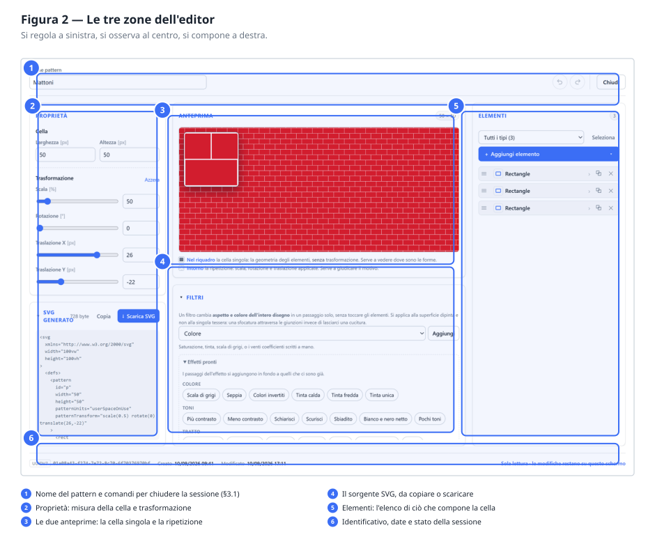

L'editor si apre **a tutta pagina**, su qualunque schermo: non è una finestra dentro
l'elenco, è la schermata in cui si lavora. Lo spazio serve tutto.

È diviso in **cinque riquadri** disposti su tre colonne:

|  | in alto | in basso |
|---|---|---|
| **a sinistra** | **Proprietà** — cella e trasformazione | **SVG generato** — il documento, da copiare o scaricare |
| **al centro** | **Anteprima** — le due viste | **Filtri** — aspetto e colore di tutto il disegno |
| **a destra** | ← **Elementi**, su tutta l'altezza | |

In alto ci sono il nome e le due decisioni sulla sessione; in fondo, in piccolo,
l'identificativo, le date e l'avviso «Modifiche non salvate».

La disposizione segue quello che si fa: **in alto ciò che si guarda mentre si disegna**, in
basso ciò che si apre quando serve. I filtri stanno nella colonna larga perché sono la parte
con più comandi di tutto l'editor.

### I due riquadri richiudibili

**Filtri** comincia **aperto**: sta in una colonna larga e non toglie spazio a nient'altro.
Chiudendolo, la sua testata dice comunque quanti passaggi contiene, o se il filtro c'è ma non
è applicato — non serve riaprirlo per sapere se c'è qualcosa da guardare.

**SVG generato** comincia **aperto** e mostra il documento per esteso: è esattamente quello
che i suoi due pulsanti producono. Chiudendolo restano visibili *Copia* e *Scarica SVG* — il
secondo nello stesso blu di *Chiudi / Conferma*, perché è l'unico comando dell'editor che
produce qualcosa da portarsi via.

Chiusi, i due riquadri sono alti uguali e chiudono sulla stessa linea.

### Chi si prende lo spazio

Ogni colonna ha due card e se ne spartiscono l'altezza secondo una regola sola: **lo spazio
va a chi lo sta usando**.

- **Chiudendo** la card in basso, quella in alto si prende tutto e la spinge in fondo: chiuso
  il riquadro dei filtri, l'anteprima raddoppia.
- **Aprendola**, quella in alto si ferma alla propria altezza e il resto è suo.

Due cose non cedono mai, nemmeno su una finestra bassa: le **Proprietà** si leggono per intero
senza una barra di scorrimento interna, e l'**Anteprima** resta un riquadro vero e non una
striscia. A cedere sono i filtri e il sorgente, che sono elenchi e una barra se la portano
bene. Se la finestra è davvero troppo bassa per tutto questo, a scorrere è l'intera fascia
delle tre colonne.

Ogni riquadro scorre comunque per conto proprio: toccare un cursore della cella non sposta
l'elenco dei passaggi del filtro.

### Le due anteprime

Sono due, mostrano cose diverse, e stanno in **un riquadro solo**: la ripetizione fa da fondo e
riempie tutto lo spazio, la cella singola le sta sopra, incorniciata in alto a sinistra. Sotto
il riquadro, una legenda di due righe dice quale è quale.

Affiancate com'erano prima non riuscivano a riempire lo spazio che avevano — ciascuna ha una
forma propria, e quello che avanzava restava bianco sopra, sotto e in mezzo — e sotto una certa
larghezza la cella singola spariva del tutto. Sovrapposte, tutto lo spazio va alla ripetizione,
e la cella singola c'è sempre.

**Cella singola** — la piastrella da sola, nel riquadro incorniciato, **senza** trasformazione.
Serve mentre si posizionano gli elementi: è qui che si vede se un rettangolo è dove lo si
voleva.

Il riquadro ha la **forma della cella**: se la cella è 48 × 24 si vede largo il doppio di quanto
è alto, e cambiando le misure cambia subito anche lui. La cornice chiara con il filo scuro
all'esterno serve a farlo staccare da qualunque disegno gli finisca sotto, chiaro o scuro che
sia.

**Ripetizione** — il pattern vero, tutt'intorno, con scala, rotazione e traslazione applicate.
Serve a giudicare il motivo: se le file si allineano, se si vedono corridoi indesiderati, se la
densità è giusta. Si prende **tutto il riquadro**, e ogni pixel in più è una tessera in più da
guardare.

Il fondo a scacchiera grigia non fa parte del disegno: indica le zone **trasparenti**. Senza,
non si distinguerebbe una zona vuota da una bianca.

> Su schermi stretti le due anteprime non stanno affiancate: la **Ripetizione** occupa la
> fascia e la **cella singola** le sta sopra, in un riquadro incorniciato in alto a sinistra —
> anche lui della forma della cella. Vedi il §11.

### Tornare sui propri passi

In alto, appena prima di **Annulla**, ci sono due pulsanti rotondi con una freccia blu: il
primo disfa l’ultima modifica, il secondo la rifà. Spenti restano al loro posto e perdono il
colore, così i comandi accanto non ballano ogni volta che la cronologia si svuota o si riempie. Dalla tastiera sono **Ctrl+Z** e **Ctrl+Y** (va bene anche Ctrl+Shift+Z).

Funzionano su tutto quello che si può cambiare qui dentro: un colore, una coordinata, il nome
del pattern, un elemento eliminato per sbaglio, l'ordine dell'elenco. Sono spente quando non
c'è niente da disfare o niente da rifare.

Tre cose da sapere, perché rendono il comando più comodo di quanto sembri:

- **Trascinare un cursore è un passo solo.** Mentre lo muovi il valore cambia decine di volte,
  ma le modifiche che si susseguono rapidamente contano come una: non ti servono quaranta
  «Annulla» per disfare una regolazione.
- **Si torna indietro fino all'apertura**, non oltre. Aprire un altro pattern azzera la
  cronologia: annullare dentro la sessione precedente rimetterebbe a schermo un disegno che
  non è quello che hai davanti.
- **Se dopo aver annullato ricominci a modificare**, quello che avevi annullato non si può più
  rifare. Da quel momento la storia è un'altra, e la freccia **↷** si spegne.

> **Attenzione.** Nel campo del **nome**, Ctrl+Z resta l'annullamento della scrittura, quello
> del browser: lì stai scrivendo, e disfare una lettera è più utile che disfare l'ultima
> modifica al disegno. Negli altri campi — numeri, cursori, colori — la scorciatoia è quella
> dell'editor.

### Annullare e confermare

**Chiudi / Conferma** salva e chiude. **Annulla** chiude buttando via tutto quello che hai fatto
da quando hai aperto: il pattern torna esattamente com'era, comprese le date.

Le due frecce e questo **Annulla** sono cose diverse, e il filo verticale fra loro lo ricorda:
la freccia torna indietro di **un passo** e ti lascia dove sei, **Annulla** butta via **tutto**
e chiude.

Se premi **Chiudi / Conferma** e qualcosa non va, l'editor **non si chiude**: compare un riquadro
rosso con l'elenco di cosa correggere. Vedi il [capitolo 12](#12-quando-qualcosa-non-torna).

---

## 6. Le proprietà: cella, trasformazione e filtro

### 6.1 La cella

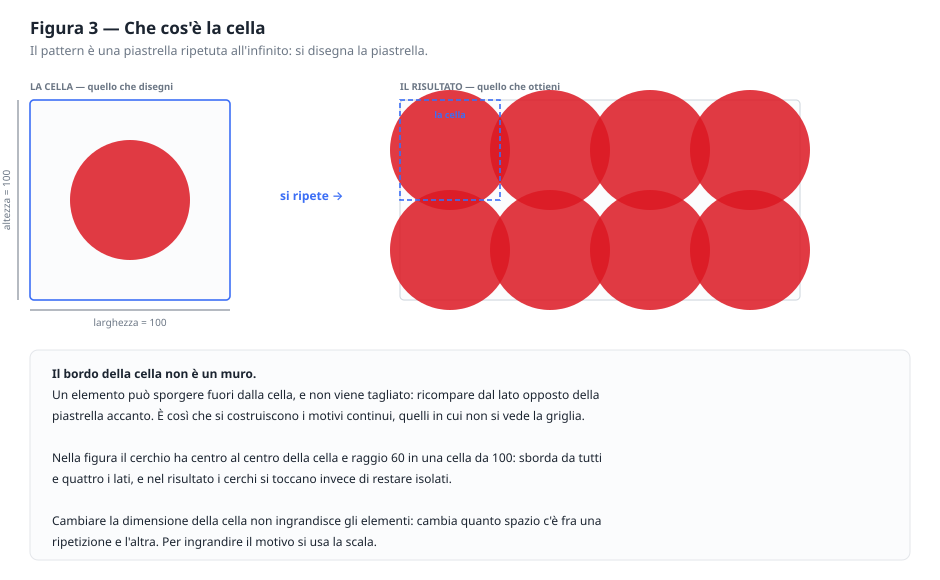

**Larghezza** e **Altezza** sono le dimensioni della piastrella. Tutte le coordinate degli
elementi si riferiscono a questo riquadro: in una cella da 100, un elemento a x = 50 sta a metà.

Due cose da tenere a mente, perché sono la fonte di quasi tutti gli equivoci iniziali:

**Il bordo della cella non taglia niente.** Un elemento può sporgere, e quello che esce da un
lato rientra dal lato opposto della piastrella accanto. È così che si ottengono i motivi
continui — anzi, è l'unico modo.

**Ingrandire la cella non ingrandisce il disegno.** Aumenta lo spazio *fra* una ripetizione e
l'altra: il motivo si dirada. Per ingrandire il motivo si usa la **scala**.

### 6.2 La trasformazione

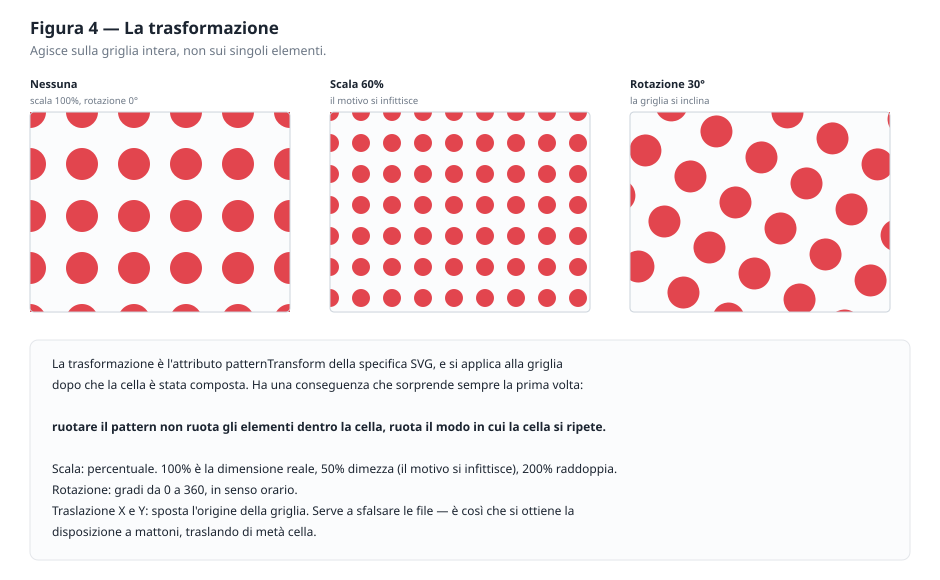

Agisce sulla **griglia intera**, dopo che la cella è stata composta.

| Comando | Unità | Cosa fa |
|---|---|---|
| **Scala** | % | 100 è la dimensione reale. 50 dimezza e infittisce, 200 raddoppia e dirada |
| **Rotazione** | ° | Da 0 a 360, in senso orario. Inclina tutta la griglia |
| **Traslazione X** | px | Sposta l'origine della griglia in orizzontale |
| **Traslazione Y** | px | La stessa cosa in verticale |

Ogni valore ha un cursore e una casella numerica: il cursore per cercare, la casella per essere
precisi. Il pulsante **Azzera** riporta la trasformazione a neutra.

**Ruotare il pattern non ruota gli elementi dentro la cella.** Ruota il modo in cui la cella si
ripete. Se vuoi un rettangolo inclinato *dentro* una cella dritta, la rotazione del pattern non
è lo strumento: serve un tracciato con i vertici già inclinati.

**La traslazione sposta tutto insieme, non sfalsa le file.** Vale la pena insistere, perché è
l'equivoco più comune: `Traslazione X = 25` fa scorrere di 25 la griglia intera, e le file
restano allineate esattamente come prima. Serve a decidere *dove cade* la griglia rispetto al
disegno, non a scalare una fila rispetto all'altra.

### 6.3 Come si sfalsano davvero le file

Se la traslazione non serve, come si ottiene la disposizione a mattoni? **Mettendo due file
dentro la stessa cella.** La cella diventa alta il doppio e contiene due file di elementi, la
seconda spostata di mezza larghezza: ripetendola, le file risultano alternate.

Gli elementi della seconda fila che escono dal bordo non sono un problema — rientrano dal lato
opposto — ma vanno messi **due volte**, uno per lato, altrimenti mezza figura sparisce:

| | Sbagliato | Giusto |
|---|---|---|
| Cella | 50 × 25, un mattone, Traslazione X 25 | 50 × 50, tre mattoni |
| Risultato | File allineate | File sfalsate |

> **Sotto il cofano.** Il contenuto di una cella viene **ritagliato** ai bordi della cella:
> `patternTransform` agisce sulla griglia, non sulle singole file, e non esiste un attributo
> della specifica SVG che sfalsi le ripetizioni. Chi disegna pattern chiama questa tecnica
> *half-drop*, ed è la stessa da quando si stampavano le carte da parati con i rulli.

> **Sotto il cofano.** Questi quattro valori diventano l'attributo `patternTransform` del nodo
> `<pattern>`: ad esempio `scale(1.35) rotate(45) translate(25,0)`. Le trasformazioni si
> applicano da destra verso sinistra, ma il risultato lo vedi nell'anteprima e non c'è bisogno
> di calcolarlo a mente.

### 6.4 Il filtro: cambiare aspetto e colore di tutto insieme

Il riquadro **Filtri** sta sotto le anteprime, ed è l'unico comando che agisce su tutto il disegno in
una volta sola. Non tocca gli elementi: li lascia dove sono, con i colori che hanno, e cambia
il modo in cui il risultato appare. Serve quando la modifica che vuoi — «tutto più chiaro»,
«in scala di grigi», «con le linee più marcate» — riguarderebbe altrimenti trecento elementi
uno per uno.

**Si parte da un effetto.** Il blocco *Effetti pronti* raccoglie ventiquattro pastiglie in
quattro famiglie. Cliccandone una il filtro nasce già regolato e l'anteprima cambia subito.

| Famiglia | Effetti |
|---|---|
| **Colore** | Scala di grigi, Seppia, Colori invertiti, Tinta calda, Tinta fredda, Tinta unica |
| **Toni** | Più contrasto, Meno contrasto, Schiarisci, Scurisci, Sbiadito, Bianco e nero netto, Pochi toni |
| **Tratto** | Tratto marcato, Tratto sottile, Nitidezza, Contorni, Rilievo, Ombra morbida, Alone |
| **Superficie** | Sfocato, Tratto a mano, Vetro smerigliato, Carta invecchiata |

Qualcuno merita una parola, perché dal nome non si indovina:

- **Bianco e nero netto** toglie i grigi e lascia due soli toni: regge la fotocopia e la
  stampa in bianco e nero;
- **Sbiadito** schiarisce e appiattisce — serve a un retino che deve stare *sotto* a
  qualcos'altro senza rubargli la scena;
- **Pochi toni** riduce a cinque gradini per canale: l'aspetto della serigrafia;
- **Contorni** spegne le campiture e tiene solo i bordi, cioè riduce il disegno a un profilo;
- **Rilievo** illumina da un lato e ombreggia dall'altro: la trama sembra incisa;
- **Alone** mette un bagliore colorato attorno alle forme lasciando il disegno intatto sopra;
- **Tinta calda** e **Tinta fredda** spostano tutto verso il cotto o verso il cemento.

Il blocco sta **aperto finché l'elenco dei passaggi è vuoto** — è il modo più rapido di
cominciare — e si richiude da solo appena compare il primo passaggio, quando quello che serve
vedere sono i passaggi.

> **Un effetto non è una scatola chiusa.** Scrive dei *passaggi* normali nell'elenco, e da
> quel momento li apri e li modifichi come qualunque altra cosa. Sceglierne un secondo
> aggiunge i suoi passaggi in fondo, invece di cancellare i primi: grigio più contrasto è una
> combinazione normale, e sostituire farebbe perdere il lavoro precedente senza dirlo.

**L'elenco è una catena.** Ogni riga è un passaggio, numerato, e si applica al risultato di
quello sopra. Da sinistra a destra trovi: la casella per **spegnerlo** senza cancellarlo (è
il modo per capire che cosa faccia davvero), il **nome** con accanto come è regolato, e le
**frecce** per spostarlo insieme alla ics per eliminarlo. Cliccando sul nome il passaggio si
apre; se ne apre uno per volta.

**Aggiungerne uno a mano.** Sopra gli effetti pronti c'è un menu con i tredici passaggi
disponibili e il pulsante *Aggiungi*; sotto al menu, una riga spiega a che cosa serve quello
scelto. Il menu c'è sempre, anche prima che esista un filtro: aggiungere un passaggio lo crea.
In breve:

| Passaggio | A che cosa serve |
|---|---|
| **Colore** | Saturazione, rotazione della tinta, scala di grigi, o i venti coefficienti a mano |
| **Livelli** | Luminosità, contrasto, gamma, inversione: una curva per ciascun canale |
| **Sfocatura** | Sfuma |
| **Ombra** | Ombra portata, con direzione, sfumatura e colore |
| **Spessore** | Ispessisce o assottiglia i tratti |
| **Spostamento** | Sposta e basta: serve dentro una catena, non da solo |
| **Tinta piena** | Riempie di un colore; va composta con qualcos'altro |
| **Rumore** | Genera venature o nuvole: è materia prima, non un effetto |
| **Distorsione** | Sposta i pixel seguendo una seconda immagine |
| **Convoluzione** | Nitidezza, rilievo, contorni |
| **Fusione** | Fonde due immagini con i modi del fotoritocco |
| **Composizione** | Combina due immagini: sopra, dentro, fuori, o dosate |
| **Sovrapposizione** | Impila più risultati, il primo in fondo |

**I collegamenti.** Dentro ogni passaggio, in fondo e chiuso, c'è un blocco *Collegamenti*
con due campi: *Ingresso* e *Risultato*. Lasciati vuoti — ed è il caso quasi sempre — i
passaggi si incatenano nell'ordine in cui li vedi. Dare un nome a un risultato serve solo per
richiamarlo più avanti: è quello che fa l'effetto *Tratto a mano*, dove il rumore si chiama
«rumore» e la distorsione lo va a prendere per nome.

> **Se un effetto sparisce**, guarda gli avvisi in cima all'editor. Due casi ricorrono. Il
> primo: un ingresso che rimanda a un nome che nessun passaggio precedente produce — non dà
> errore, semplicemente non fa niente, e capita riordinando i passaggi dopo averli collegati.
> Il secondo: un passaggio messo subito dopo un **Rumore** o una **Tinta piena** senza
> dichiarare da dove prende l'immagine. Quei due non trasformano niente, *producono*: chi viene
> dopo, se non dice altro, si ritrova in mano l'immagine prodotta invece del disegno, e a
> schermo resta solo quella. La cura è sempre la stessa — dare un nome al risultato che ti
> serve e richiamarlo.

**Area del filtro e spazio colore** stanno in fondo, chiusi. L'area si allarga quando un
effetto risulta **tagliato**: un'ombra spostata di venti pixel su una superficie di duecento
esce dal 110% predefinito e viene troncata di netto. Lo spazio colore cambia il modo in cui i
conti vengono fatti — *sRGB* è quello che ti aspetti guardando lo schermo, *lineare* è
fisicamente corretto e fa sembrare che le sfocature schiariscano.

> **Dove si applica.** Il filtro agisce sulla **superficie dipinta**, non sulla singola
> tessera. È la differenza fra una sfocatura che attraversa le giunzioni e una che si ferma
> al bordo di ogni piastrella lasciando una griglia di cuciture. Nell'anteprima **Cella
> singola**, che è larga quanto la cella, gli effetti che sconfinano si vedono tagliati ai
> lati: è un limite di quel riquadro, non del pattern — guarda la **Ripetizione** per il
> risultato vero.

> **Sotto il cofano.** Il filtro diventa un nodo `<filter>` accanto al `<pattern>` nei
> `<defs>`, e il rettangolo riempito lo richiama con `filter="url(#…)"`. Nella scheda **SVG**
> lo vedi scritto per esteso. Un pattern senza filtro produce esattamente il documento di
> prima: nulla cambia per chi non lo usa.

---

## 7. Gli elementi, uno per uno

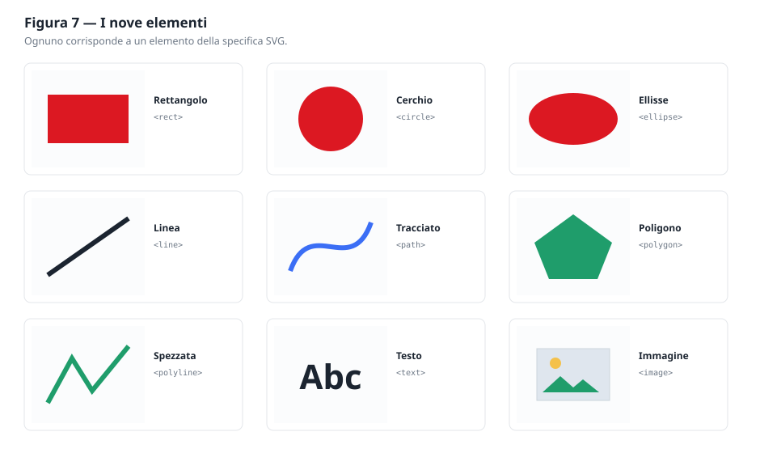

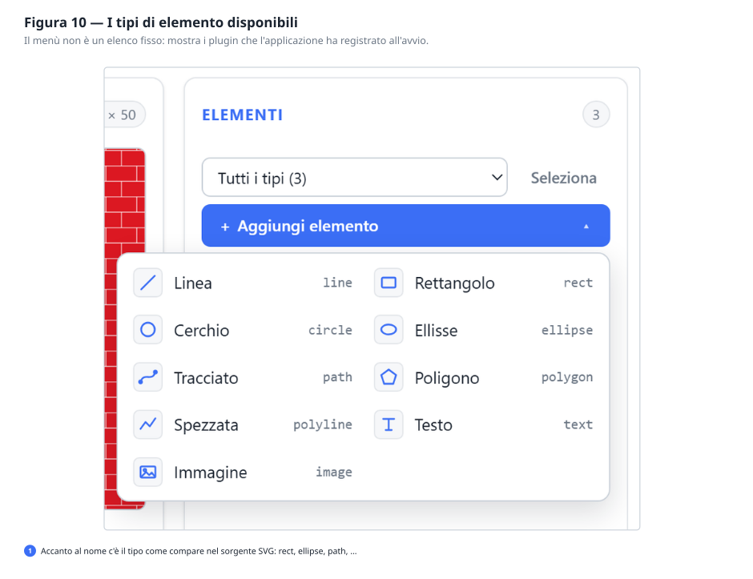

### 7.1 Come si lavora con l'elenco

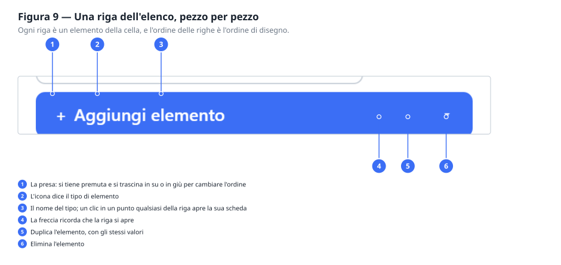

Gli elementi sono **in ordine di disegno**: il primo della lista viene disegnato per primo,
quindi finisce **sotto** tutti gli altri. Chi sta in fondo alla lista sta davanti nel disegno.

| Comando | Effetto |
|---|---|
| **+ Aggiungi elemento** | Apre il menu dei nove tipi. Scegliere il tipo *è* l'inserimento |
| Clic sulla riga | Apre la scheda dell'elemento, al posto dell'elenco |
| **≡** a sinistra | Si trascina per cambiare l'ordine di disegno |
| **⧉** | Duplica l'elemento: copia identica, subito sotto |
| **✕** | Elimina l'elemento |
| **‹ Elenco** | Dalla scheda, torna all'elenco |

**Quando gli elementi sono tanti.** Sopra l'elenco compare una tendina che filtra per tipo e
mostra quanti ce ne sono di ciascuno — «Ellisse (102), Tracciato (40), Rettangolo (1)» dice in
una riga com'è fatto il disegno. Accanto, **Seleziona** trasforma le prese in caselle di spunta:
scegli quello che vuoi, anche tutto in un colpo, e li elimini insieme.

Mentre un filtro è attivo il trascinamento è spento, e la presa si vede in grigio: l'ordine che
hai davanti non è quello vero — mancano le righe nascoste — e spostare una riga darebbe un
risultato imprevedibile. Togli il filtro e torna disponibile.

**Riordinare.** Prendi la riga per le tre lineette a sinistra e trascinala dove serve: le
altre si spostano sotto le dita, e l'anteprima si aggiorna mentre trascini, così vedi subito
se l'ordine nuovo funziona. Funziona col mouse e col dito allo stesso modo.

Senza mouse si fa lo stesso: raggiungi le lineette con il tabulatore e usa le frecce **↑** e
**↓** della tastiera.

Dopo un inserimento la scheda del nuovo elemento si apre da sola: chi aggiunge qualcosa vuole
configurarla. Dopo una duplicazione no: si duplica spesso più volte di seguito.

### 7.2 Ruotare e specchiare un elemento

Verso la fine della scheda di ogni elemento — di **qualunque** tipo — c'è la sezione
**Posizione**, seguita da **Generale**. Sono le due sezioni uguali per tutti i tipi, separate
dalle altre dalla solita riga tratteggiata: sopra ci sono le proprietà che dipendono dalla
forma, sotto quelle che valgono per qualsiasi disegno.

**Posizione** contiene:

- **Rotazione**, in gradi, con il cursore per cercarla a occhio e la casella per scriverla esatta;
- **Specchia in orizzontale** e **in verticale**, due interruttori indipendenti;
- **Centro X** e **Centro Y**: il punto attorno a cui l'elemento ruota e si specchia.

Il centro è un punto che scegli tu, e non il centro della forma. Nei retini serve quasi sempre
così: ruotare attorno al centro della cella, o a un angolo. Il pulsante **Usa il centro della
cella** riempie i due campi con la metà di larghezza e altezza, che è il caso più frequente —
la nota sotto il pulsante ti dice quali due numeri scriverà, senza doverlo premere per
scoprirlo. Per un centro diverso, come un angolo della cella, scrivi i valori a mano.

Un esempio pratico: una famiglia di linee orizzontali diventa un tratteggio a 45° impostando la
rotazione a 45 su ciascuna linea — senza ricalcolare una sola coordinata.

> **Sotto il cofano.** Nel file SVG la rotazione diventa un gruppo `<g transform="…">` attorno
> alla forma. Un elemento senza rotazione né specchiature non produce nessun gruppo: il
> documento resta pulito.

Sotto, **Generale** contiene l'**opacità complessiva**: l'ultima cosa che si regola, quando
forma, colore e posizione sono già decise. Sta in fondo perché è lì che serve, e le tre
trasparenze sono spiegate insieme nel [capitolo 8](#8-colori-bordi-e-trasparenze).

### 7.3 Il sistema di coordinate

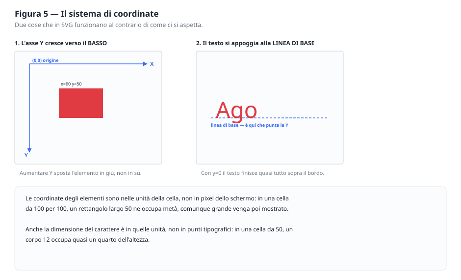

Prima delle schede, la regola che vale per tutti gli elementi: **l'asse Y cresce verso il
basso**. L'origine (0, 0) è l'angolo in alto a sinistra della cella, e aumentare Y sposta verso
il basso. È il contrario del piano cartesiano della scuola, ed è la convenzione di tutti i
formati grafici.

---

### 7.4 Rettangolo

Il mattone di base: un rettangolo con i lati paralleli agli assi.

| Campo | Significato |
|---|---|
| **X**, **Y** | Angolo **superiore sinistro** — non il centro |
| **Larghezza**, **Altezza** | Dimensioni, verso destra e verso il basso |

*Esempio.* In una cella da 50 × 50, un rettangolo con X = 0, Y = 0, Larghezza = 50, Altezza = 25
riempie esattamente la metà superiore della cella. Ripetuto, dà le righe orizzontali.

> **Sotto il cofano.** Corrisponde a `<rect>`. La specifica prevede anche `rx` e `ry` per gli
> angoli arrotondati: non sono esposti, ma un angolo arrotondato si ottiene con un tracciato.

---

### 7.5 Cerchio

| Campo | Significato |
|---|---|
| **Centro X**, **Centro Y** | Il centro — non l'angolo |
| **Raggio** | Metà del diametro |

*Esempio.* Cella 100 × 100, centro (50, 50), raggio 18: il pois del capitolo 2. Con raggio 50 il
cerchio tocca esattamente i quattro lati; oltre, comincia a sporgere e i cerchi delle piastrelle
vicine si intersecano.

> **Sotto il cofano.** Corrisponde a `<circle>`. Il raggio deve essere maggiore di zero: la
> specifica prevede che un raggio nullo disabiliti il disegno, e qui viene segnalato come
> errore perché una riga che non disegna niente è quasi sempre una svista.

---

### 7.6 Ellisse

Il cerchio schiacciato: due raggi invece di uno.

| Campo | Significato |
|---|---|
| **Centro X**, **Centro Y** | Il centro |
| **Raggio X** | Semiasse orizzontale |
| **Raggio Y** | Semiasse verticale |

Con i due raggi uguali si ottiene un cerchio: se ti serve un cerchio, però, usa il Cerchio — ha
un campo in meno da tenere allineato.

> **Sotto il cofano.** Corrisponde a `<ellipse>`. Non si può inclinare con i suoi attributi: per
> un'ellisse obliqua serve un arco in un tracciato, oppure si ruota l'intero pattern.

---

### 7.7 Linea

Un segmento fra due punti. È l'unico elemento **senza riempimento**: ha solo il tratto.

| Campo | Significato |
|---|---|
| **X1**, **Y1** | Primo estremo |
| **X2**, **Y2** | Secondo estremo |
| **Spessore** | Se è zero, la linea è invisibile |

*Esempio.* Cella 20 × 20, da (0, 20) a (20, 0), spessore 2: la classica trama diagonale. Perché
le diagonali si saldino da una piastrella all'altra, gli estremi devono cadere esattamente sugli
angoli della cella.

---

### 7.8 Tracciato

La forma libera: curve, archi, spezzate, qualunque cosa. Tutta la geometria sta in un unico
campo di testo, il **comando** — l'attributo `d` della specifica.

Si scrive con una sequenza di lettere e numeri. Le principali:

| Comando | Significa | Esempio |
|---|---|---|
| `M x y` | Sposta la penna **senza disegnare** | `M 10 10` |
| `L x y` | Traccia una linea fino a (x, y) | `L 40 10` |
| `H x` / `V y` | Linea orizzontale / verticale | `H 40` |
| `C x1 y1 x2 y2 x y` | Curva morbida (Bézier cubica) | `C 20 0 30 20 40 10` |
| `Q x1 y1 x y` | Curva più semplice (Bézier quadratica) | `Q 25 0 40 10` |
| `A rx ry rot arco verso x y` | Arco di ellisse | `A 15 15 0 0 1 40 10` |
| `Z` | Chiude la figura tornando al punto di partenza | `Z` |

**Maiuscole e minuscole non sono la stessa cosa**: `L 40 10` va al punto assoluto (40, 10);
`l 40 10` si sposta di 40 a destra e 10 in basso **rispetto a dov'era**. Le minuscole sono comode
per ripetere uno stesso passo.

*Esempio — un triangolo:* `M 25 5 L 45 40 L 5 40 Z`

*Esempio — un'onda:* `M 0 25 Q 12 5 25 25 T 50 25`

Il tracciato viene conservato **esattamente come lo scrivi**: se lo incolli da un altro
programma, torna indietro identico.

---

### 7.9 Poligono e 7.10 Spezzata

Sono la stessa cosa con una differenza sola, e vale la pena impararla una volta:

- il **Poligono** viene **chiuso automaticamente**: l'ultimo vertice si ricongiunge al primo, e
  la figura ha un dentro da riempire;
- la **Spezzata** **non** viene chiusa: il disegno finisce sull'ultimo punto.

Entrambi si definiscono con un solo campo, i **punti**, scritti come coppie:

```
20,10 40,30 30,50 10,50 0,30
```

Le coppie si separano con spazi, i due numeri di una coppia con una virgola. Vanno bene anche
solo spazi (`20 10 40 30`): la specifica accetta entrambe le forme.

Al poligono servono almeno **tre** punti perché ci sia una superficie; alla spezzata ne bastano
**due**. Nel poligono non ripetere il primo punto alla fine: ci pensa la specifica.

---

### 7.11 Testo

L'unico elemento che contiene delle parole.

| Campo | Significato |
|---|---|
| **X**, **Y** | Punto di partenza della **linea di base** (vedi la figura 5) |
| **Contenuto** | Le lettere da disegnare |
| **Carattere** | Il nome del font, ad esempio `Georgia` |
| **Dimensione** | Nelle unità della cella, **non** in punti tipografici |
| **Peso** | Normale o grassetto |
| **Allineamento** | Da che parte cresce il testo rispetto al punto: inizio, centro, fine |

Due sorprese frequenti. La prima: con **Y = 0** il testo sparisce quasi tutto sopra il bordo,
perché quel punto è la linea di base, non il tetto delle lettere. In una cella da 50, prova con
Y = 35. La seconda: la **dimensione** è nelle unità del disegno; in una cella da 50, un corpo 12
occupa un quarto dell'altezza.

> **Attenzione al carattere.** Il file SVG registra il *nome* del carattere, non il carattere.
> Chi aprirà il file lo vedrà come lo vedi tu solo se ha quel font installato; altrimenti il suo
> programma ne sostituirà un altro e le proporzioni cambieranno. L'editor te lo ricorda con un
> avviso ambra. Se il pattern deve essere identico ovunque, converti il testo in tracciato con un
> programma di grafica, oppure resta sui font di sistema.

---

### 7.12 Immagine

Inserisce una fotografia o un logo dentro il disegno vettoriale.

| Campo | Significato |
|---|---|
| **Sorgente** | Un indirizzo `https://…` oppure un'immagine incorporata `data:image/png;base64,…` |
| **X**, **Y**, **Larghezza**, **Altezza** | Il riquadro che ospita l'immagine |
| **Adattamento** | Come l'immagine si dispone nel riquadro |

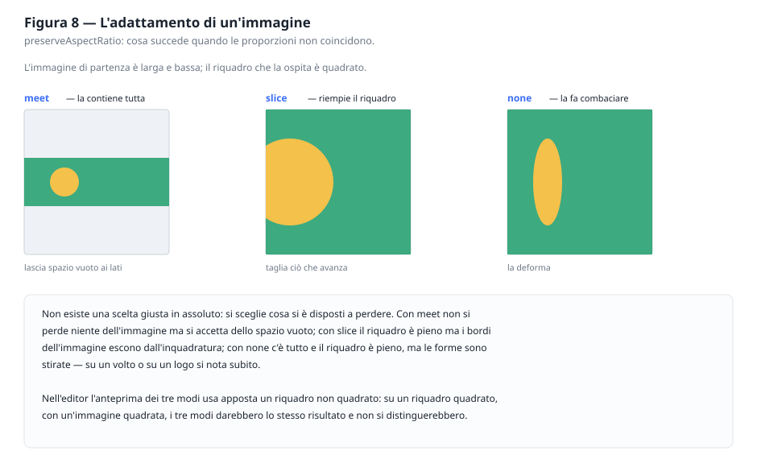

**Indirizzo o immagine incorporata?** È un compromesso senza risposta giusta:

| | Indirizzo esterno | Immagine incorporata |
|---|---|---|
| Peso del file | Minimo | Grande: cresce di circa un terzo rispetto all'originale |
| Funziona senza rete | No | Sì |
| Se il server sparisce | L'immagine sparisce | Nessun problema |
| Adatto a | Uso interno, prototipi | File da consegnare o archiviare |

L'editor segnala con un avviso ambra entrambe le conseguenze. Sono avvisi, non errori: non
impediscono nulla.

---

## 8. Colori, bordi e trasparenze

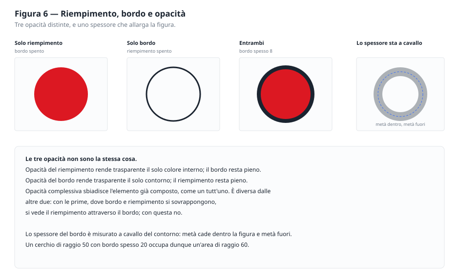

Quasi tutti gli elementi hanno due colori indipendenti: il **riempimento** (l'interno) e il
**bordo** (il contorno). Ciascuno si accende e si spegne con il suo interruttore **Attivo**: un
elemento con il solo bordo è un contorno vuoto, uno con il solo riempimento è una sagoma piena.

### Scegliere un colore

Ogni colore si può indicare in due modi, sempre allineati fra loro:

- con il **selettore**, il quadratino colorato, per cercarlo a occhio;
- scrivendo il **codice esadecimale** nella casella accanto, quando lo conosci già.

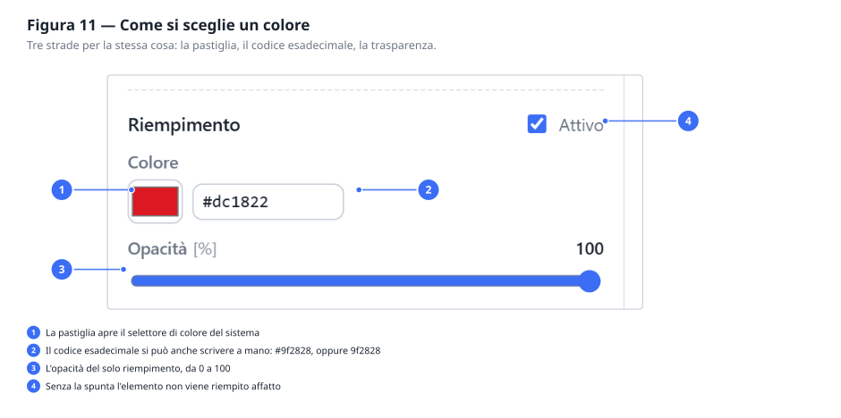

Nella casella puoi scrivere `#3b6ef5`, oppure `3b6ef5` senza cancelletto, oppure la forma
abbreviata `#3bf`. Mentre scrivi, un codice incompleto viene segnalato in rosso e **non viene
applicato**; quando esci dalla casella, il valore torna quello vero se quello che hai scritto non
era un colore.

### Le tre trasparenze

Non sono tre gradi della stessa cosa, sono tre cose diverse:

| Comando | Su cosa agisce |
|---|---|
| **Opacità del riempimento** | Solo il colore interno. Il bordo resta pieno |
| **Opacità del bordo** | Solo il contorno. Il riempimento resta pieno |
| **Opacità complessiva** | Sull'elemento già composto, come un tutt'uno |

La differenza si vede dove bordo e riempimento si sovrappongono: con le prime due il
riempimento traspare attraverso il bordo, con la terza no.

### Lo spessore del bordo

Lo spessore è misurato **a cavallo** del contorno: metà cade dentro la figura, metà fuori. Un
cerchio di raggio 50 con bordo spesso 20 occupa quindi un'area di raggio 60. Se un elemento
sembra più grande di quanto lo hai fatto, quasi sempre è il bordo.

---

## 9. Il sorgente SVG: copiare, scaricare, usare

Sotto le anteprime c'è il riquadro **SVG generato**: è il file vero, aggiornato a ogni modifica.
Si può chiudere con il triangolino se dà fastidio, ma i due comandi restano raggiungibili:

- **Copia** mette il sorgente negli appunti;
- **↓ Scarica SVG** salva il file, chiamato come il pattern.

Non serve salvare prima: il file scaricato è quello che vedi in quel momento.

### Come usarlo

**In una pagina web, come sfondo:**

```css
.mia-sezione {
    background-image: url("pois.svg");
}
```

**In un documento di grafica:** Illustrator, Inkscape, Figma e Affinity aprono gli SVG
direttamente. Il pattern arriva come oggetto vettoriale, ridimensionabile senza perdite.

**Per stampa:** essendo vettoriale, non ha risoluzione: la stessa immagine va bene per un
biglietto da visita e per un manifesto.

> **Sotto il cofano.** Il file contiene un nodo `<pattern>` dentro `<defs>`, e un `<rect>` grande
> quanto l'immagine che lo richiama con `fill="url(#p)"`. Se incolli più di un pattern nella
> stessa pagina HTML, controlla che gli identificativi siano diversi: `url(#p)` cerca in tutto
> il documento, e due nodi con lo stesso nome si oscurano a vicenda.

---

## 10. Ricette: sei pattern passo passo

Ogni ricetta è completa: i valori sono quelli da scrivere.

### 10.1 Righe orizzontali

Cella `50 × 50` · un **Rettangolo**

| Campo | Valore |
|---|---|
| X, Y | 0, 0 |
| Larghezza, Altezza | 50, 25 |
| Riempimento | a scelta |

Metà cella piena e metà vuota: ripetuta, dà le righe. Per righe più fitte, riduci l'altezza
della cella; per righe verticali, scambia larghezza e altezza del rettangolo.

### 10.2 Mattoni

Cella `50 × 30` · tre **Rettangoli**, tutti alti 13 e larghi 48, riempimento terracotta `#c1502e`

| Rettangolo | X | Y | A cosa serve |
|---|---|---|---|
| 1 | 1 | 1 | La fila intera, in alto |
| 2 | −24 | 16 | Mezzo mattone della fila sotto, a sinistra |
| 3 | 26 | 16 | L'altra metà, a destra |

Due file nella stessa cella, la seconda spostata di mezzo mattone: ecco la sfalsatura. I mattoni
larghi 48 in una cella da 50 lasciano la fuga.

Il secondo e il terzo rettangolo sono **lo stesso mattone**, tagliato in due dal bordo della
cella: quello che esce da destra rientra da sinistra, ma va disegnato in entrambe le posizioni.

### 10.3 Pois sfalsati

Cella `100 × 100` · due **Cerchi** di raggio `18`

| Cerchio | Centro X | Centro Y |
|---|---|---|
| 1 | 25 | 25 |
| 2 | 75 | 75 |

Due pois sulla diagonale: ripetuti, danno file sfalsate a distanza di mezza cella. È la stessa
disposizione dei cinque cerchi del capitolo 2, ottenuta con la metà degli elementi.

Per pois più fitti riduci la cella lasciando il raggio; per pois più radi fai il contrario.

### 10.4 Trama a diagonali

Cella `20 × 20` · una **Linea**

| Campo | Valore |
|---|---|
| X1, Y1 | 0, 20 |
| X2, Y2 | 20, 0 |
| Spessore | 2 |

Gli estremi cadono esattamente sugli angoli: è la condizione perché le diagonali si saldino da
una piastrella all'altra senza gradini. Aggiungendo una seconda linea da (0,0) a (20,20) si
ottiene il quadrettato incrociato.

### 10.5 Squame

Cella `40 × 40` · tre **Tracciati**, riempimento spento, bordo attivo spesso `2`

| Tracciato | Comando |
|---|---|
| 1 | `M 0 20 A 20 20 0 0 1 40 20` |
| 2 | `M -20 40 A 20 20 0 0 1 20 40` |
| 3 | `M 20 40 A 20 20 0 0 1 60 40` |

Anche qui due file nella stessa cella: l'arco in alto e i due mezzi archi in basso, che sono lo
stesso arco tagliato dal bordo.

Per un tetto di tegole vere, riempi gli archi invece di lasciarli vuoti, dai loro un'altezza
maggiore del passo fra le file — così si sovrappongono — e aggiungi sotto ciascun bordo un arco
scuro semitrasparente: è l'ombra portata, ed è quella che dà il rilievo.

### 10.6 Stelle

Cella `60 × 60` · un **Poligono**

| Campo | Valore |
|---|---|
| Punti | `30,5 36,22 54,22 40,33 45,50 30,40 15,50 20,33 6,22 24,22` |
| Riempimento | giallo, es. `#ecc94b` |

Dieci vertici alternati, cinque esterni e cinque interni: è così che si costruisce una stella a
cinque punte. Cambiando i vertici interni si ottiene una stella più magra o più cicciotta.

---

## 11. Sul telefono

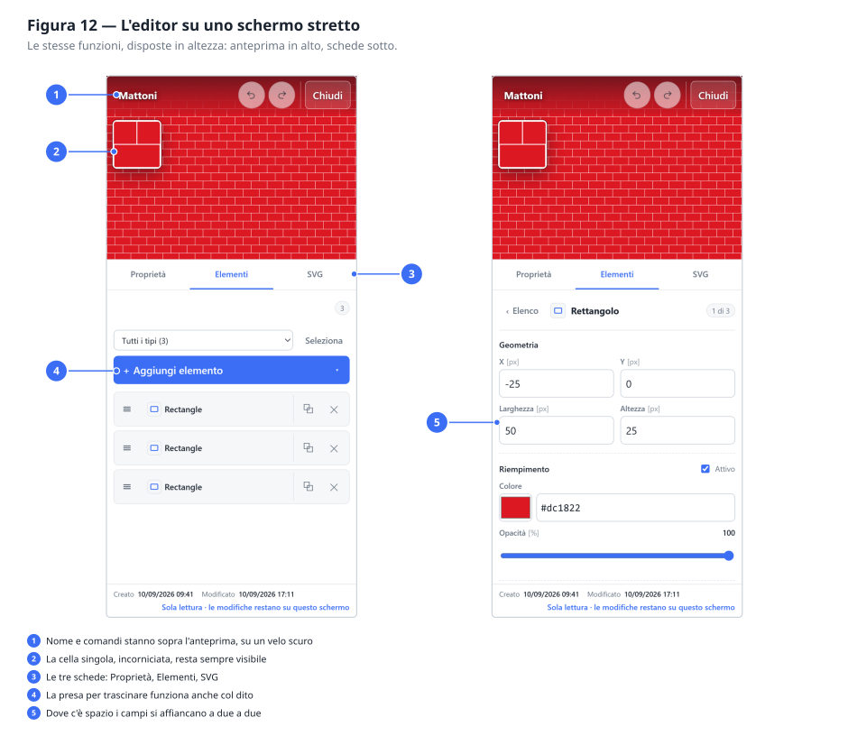

Su schermi stretti la disposizione cambia, le funzioni no.

Trovi tre fasce fisse e un foglio che scorre:

1. **In alto** il nome e i comandi Annulla e Conferma;
2. **sotto**, l'anteprima della ripetizione, che **non scorre mai via** mentre regoli i valori;
3. **poi** tre schede — **Proprietà**, **Elementi**, **SVG** — che prendono il posto delle tre
   colonne;
4. **in fondo** scorre solo il contenuto della scheda scelta.

Le due anteprime ci sono entrambe, ma non affiancate: su 390 punti di larghezza le
ridurrebbe a due francobolli. La **ripetizione** occupa la fascia, e la **cella singola** le
sta sopra in un riquadro incorniciato in alto a sinistra — piccolo, ma è quanto basta per
vedere dove stanno gli elementi mentre li si sposta. Anche lei si aggiorna in tempo reale.

La scheda **SVG** contiene il sorgente, i comandi Copia e Scarica, e le informazioni di
servizio.

Nell'elenco degli elementi la riga si accorcia: restano la presa per trascinare, l'icona e il
nome — si tocca in un punto qualsiasi per aprire la scheda — e a destra i due comandi che
contano, duplica ed elimina. Anche i campi delle schede si affiancano a due a due dove lo
schermo lo consente, invece di impilarsi uno per riga.

---

## 12. Quando qualcosa non torna

### Errori e avvisi

| | Riquadro **rosso** | Riquadro **ambra** |
|---|---|---|
| Dice | «Correggi i seguenti errori» | «Da tenere presente» |
| Significa | Il dato è sbagliato | La scelta è valida, ma ha una conseguenza |
| Impedisce di salvare | Sì | No |

Ogni messaggio è preceduto dal nome dell'elemento, così sai a quale dei dodici si riferisce.

### Problemi frequenti

**Non vedo niente nell'anteprima.**
Nell'ordine: l'elemento ha un colore di riempimento attivo? Se ha solo il bordo, lo spessore è
maggiore di zero? Le coordinate cadono dentro la cella, o l'hai spinto fuori vista? Un cerchio di
raggio 0 non disegna nulla.

**Il motivo si vede, ma con delle righe bianche fra le ripetizioni.**
Gli elementi non arrivano fino ai bordi della cella. O li allarghi, o rimpicciolisci la cella.

**Le forme si toccano dove non dovrebbero.**
Il contrario: gli elementi sporgono. Ricorda che il bordo aggiunge metà del suo spessore su
ciascun lato.

**Ho scritto un numero e il campo si è svuotato.**
Il separatore decimale è il **punto**, non la virgola: scrivi `1.5`.

**Il testo non si vede.**
Con Y = 0 il testo finisce sopra il bordo della cella: quel punto è la linea di base. Prova con
un valore vicino a due terzi dell'altezza della cella.

**L'immagine non compare.**
Se è un indirizzo esterno, controlla che sia raggiungibile e che il server ne consenta l'uso da
altri siti. In caso di dubbio, incorpora l'immagine come `data:`.

**Ho chiuso senza salvare.**
Le modifiche sono perse: **Annulla** non lascia tracce. Non esiste un ripristino.

**Ho convertito un'immagine e il risultato è brutto.**
Guarda la mappa delle differenze, non la percentuale: se è rossa a chiazze larghe, prova la
fedeltà *Massima* prima di alzare i colori; se è arancione diffuso, alza i colori. E controlla
che la cella trovata sia quella giusta — una cella sbagliata rende sbagliato tutto quello che
viene dopo (§4.2).

**Ho salvato un pattern ma un collega non lo vede.**
Nasce privato: lo vedi solo tu. Sulla sua scheda premi **Chiedi la pubblicazione** e aspetta che
un amministratore la approvi (§3.7).

**Un mio pattern era pubblico e adesso dice «in attesa».**
L'hai modificato e salvato. L'approvazione vale per il disegno approvato, non per il nome del
file: dopo una modifica va data di nuovo (§3.7).

**Ho ricaricato la pagina e i miei pattern privati non c'erano.**
Non dovrebbe più succedere: l'elenco si richiede da solo appena la sessione viene ripresa. Se
capita, l'accesso è scaduto — in alto a destra comparirà di nuovo **Accedi**.

**Ho aperto un pattern e vedo l'avviso «non gestito da alcun plugin».**
Il pattern è stato creato da una versione con più tipi di elemento di questa. L'elemento non si
può modificare qui, ma **non viene perso**: resta nel file e continua a essere disegnato.

---

## 13. Piccolo glossario

**Cella** — la piastrella che si ripete. La si disegna una volta sola.

**SVG** — il formato vettoriale in cui il pattern viene salvato. Descrive forme, non pixel.

**Vettoriale** — un'immagine fatta di istruzioni geometriche: ingrandibile all'infinito senza
perdere qualità.

**Esadecimale** — il modo di scrivere un colore con sei cifre, `#rrggbb`: due per il rosso, due
per il verde, due per il blu. `#000000` è nero, `#ffffff` bianco.

**Opacità** — quanto un colore lascia passare quello che sta dietro. 100% coprente, 0%
invisibile.

**Linea di base** — la riga immaginaria su cui si appoggiano le lettere. La Y del testo punta lì.

**Tracciato** — una forma libera descritta da una sequenza di comandi.

**Trasformazione** — scala, rotazione e traslazione applicate alla griglia della ripetizione, non
ai singoli elementi.

**Reticolo** — le due direzioni lungo cui un motivo si ripete. Lo usa la conversione da
immagine per trovare la tessera; può essere obliquo, come in una muratura a corsi sfalsati
(§4.2).

**UUIDv7** — l'identificativo di ogni pattern. Contiene al suo interno l'istante in cui è stato
creato: è per questo che i pattern hanno una data anche se non gliel'ha mai data nessuno.
