# Pattern Editor SVG — User manual

| | |
|---|---|
| **Document** | Guide to using the Pattern Editor |
| **Version** | 3.5 |
| **Date** | 18 September 2026 |
| **Written for** | Anyone who has to compose a pattern, with no knowledge of SVG |
| **Prerequisites** | None |
| **Note** | This is the English edition of *Manuale utente — Pattern Editor SVG*. The two are kept in step; where they differ, the Italian one is the original. The figures are its own: the screenshots are of the application running in English, and the drawn ones carry English text |

---

## How to read this manual

You do not need to read all of it. If this is your first time, chapters **1** and **2** are
enough to make something that works: ten minutes. Chapter **7** is the reference sheet for each
kind of element, to look up when you need it. Chapter **10** collects complete recipes to copy.

When a box like the one below appears, it holds a piece of the SVG specification that explains
*why* a command behaves the way it does. You can skip it without losing anything practical.

> **Under the bonnet.** Text like this.

---

## Contents

1. [What it is and what it is for](#1-what-it-is-and-what-it-is-for)
   · [1.1 What language it speaks](#11-what-language-it-speaks)
2. [Your first pattern in ten minutes](#2-your-first-pattern-in-ten-minutes)
3. [Who you are and what you may do](#3-who-you-are-and-what-you-may-do)
   · [3.7 Private or public](#37-private-or-public)
   · [3.8 Approving publications](#38-approving-publications)
   · [3.9 Appointing moderators](#39-appointing-moderators)
4. [The management page](#4-the-management-page)
   · [4.1 Importing an SVG drawing](#41-importing-an-svg-drawing)
   · [4.2 Converting an image into a pattern](#42-converting-an-image-into-a-pattern)
5. [The editor: the three areas](#5-the-editor-the-three-areas)
6. [Properties: cell, transformation and filter](#6-properties-cell-transformation-and-filter)
   · [6.3 How rows are really offset](#63-how-rows-are-really-offset)
   · [6.4 The filter: changing the look and colour of everything at once](#64-the-filter-changing-the-look-and-colour-of-everything-at-once)
7. [The elements, one by one](#7-the-elements-one-by-one)
8. [Colours, strokes and transparency](#8-colours-strokes-and-transparency)
9. [The SVG source: copy, download, use](#9-the-svg-source-copy-download-use)
10. [Recipes: six patterns step by step](#10-recipes-six-patterns-step-by-step)
11. [On a phone](#11-on-a-phone)
12. [When something does not add up](#12-when-something-does-not-add-up)
13. [A small glossary](#13-a-small-glossary)

---

## 1. What it is and what it is for

A **pattern** is a drawing that repeats endlessly without a seam: wallpaper, the weave of a
fabric, the background of a web page. You do not draw all of it: you draw **one tile**, and
repetition does the rest.

This tool exists to draw that tile and to show you at once, while you are drawing it, what it
looks like repeated.

The result is an **SVG** file. It is a vector format: it holds no pixels but geometric
instructions ("a circle of radius 20 at this position"), and for that reason it can be enlarged
as much as you like without going blocky, it weighs almost nothing, and it opens in a browser,
in a graphics program, or pasted straight into a web page.

**What you can do**

- compose a cell from nine kinds of shape;
- repeat it, rotate it, scale it, offset it;
- see the result in real time as you adjust each value;
- save the pattern to come back to it, or download the SVG file.

**What you cannot do** — worth knowing up front: you do not draw with the mouse. You insert
shapes and write their measurements. It is a surveyor's tool, not a painter's, and the reason is
that a pattern has to interlock to the thousandth: freehand would not do it.

### 1.1 What language it speaks

The application speaks **English** or **Italian**. The first time you arrive it chooses on its
own: if your browser is set to Italian you find everything in Italian, otherwise you find
English.

To change it, use the **globe** button in the top bar, next to the light/dark theme one. It
shows the code of the language in use — `IT` or `EN` — and opens on a list where each language
is written the way it is written at home: "Italiano", not "Italian".

Three things are worth knowing.

- **The change is immediate.** The page does not reload: the words change under your eyes and
  whatever you were doing stays where it was. You can change language with the editor open.
- **The choice is remembered.** From the next time the application starts in the language you
  chose, even if the browser declares another one: an explicit choice counts for more than a
  hint.
- **Numbers change too.** In English a size reads "1.3 kB", in Italian "1,3 kB". The
  measurements inside the SVG file never change — those are data, and they have to be written
  one way only so that anyone who opens the file reads them the same.

**Your patterns are not affected**: the name you give a pattern is yours and stays written the
way you wrote it, whatever language the interface is in.

> **If you find an English word in the middle of the Italian**, it is not a fault: it is an
> entry the translation is still missing, and the program would rather show it to you in English
> than leave a hole. Report it and it goes into the translation next time round.

---

## 2. Your first pattern in ten minutes

Let us make a polka-dot pattern. Each step says exactly what to touch.

**Step 1 — Create.** On the management page, press **+ Create a pattern**. The editor opens,
with an empty cell of 50 × 50.

**Step 2 — Give it a name.** Top left there is the **Pattern name** field: write `Dots`. It is
not compulsory, but a pattern with no name is hard to find again among a hundred.

**Step 3 — Enlarge the cell.** In the **Properties** column, set **Width** and **Height** to
`100`. Look at the preview: nothing has changed, because the cell is still empty.

**Step 4 — Insert a circle.** In the **Elements** column, press **+ Add element** and choose
**Circle**. Two things appear together: a circle in the preview, and the circle's card in place
of the list.

**Step 5 — Put it in the middle.** In the card that has opened, set:

| Field | Value |
|---|---|
| Centre X | `50` |
| Centre Y | `50` |
| Radius | `18` |

The circle moves to the centre of the cell. In the preview on the right you can already see the
dots in rows.

**Step 6 — Choose the colour.** Still in the circle's card, in the **Fill** section, press the
coloured square and pick a colour; or write the hex code in the box next to it, for example
`#3b6ef5`.

**Step 7 — Offset the rows.** Go back to the list with **‹ List** and duplicate the circle with
**⧉**. Open the copy and put it at (`0`, `0`): it lands on the corner, and the part that goes
out reappears from the other three corners. Duplicate it three more times, putting the copies at
(`100`, `0`), (`0`, `100`) and (`100`, `100`).

Look at the second preview: the dots are no longer lined up in columns, they are offset like the
cells of a honeycomb. It took five circles instead of one, and why is explained below.

**Step 8 — Save.** Top right, **Close / Confirm**.

Done. The pattern is in the list, and with **↓ Download SVG** you take the file whenever you
need it.

> **Under the bonnet.** The file produced holds a `<pattern>` node with your circle inside, and
> a rectangle as big as the whole image that uses it as a fill. It is the standard mechanism of
> the SVG specification for repetition: no software needs a plugin or a conversion to read it.

---

## 3. Who you are and what you may do

Until recently the application did not know who you were, and anyone could touch anything. Now
there is a sign-in — light, but enough for two things only, and important ones: **what you made,
only you change and delete**, and **what you made, only you see**, until you ask to publish it
and someone says yes (§3.7).

### 3.1 Without signing in you can do almost everything

Whoever arrives on the page is an anonymous visitor, and not a second-class guest:

| What | Without signing in |
|---|---|
| See the list of **public** patterns, search, filter | Yes |
| See private patterns or ones awaiting approval | No |
| Open a public pattern in the editor | Yes |
| Change it, experiment, watch the preview | Yes |
| Copy or **download** the SVG | Yes |
| Create a new one and download it | Yes |
| **Save** | No |
| Duplicate and delete | No |

Opened without signing in, the editor works in full: you change what you like, the preview
responds, the source can be copied and downloaded. Only the two buttons at the top right change,
becoming **a single "Close"** — there is nothing to confirm and nothing to cancel, because
nothing would have been saved anyway. At the bottom it says so in words too: *read-only, changes
stay on this screen.*

It is a choice and not an oversight: this tool is also there just to produce an SVG file, and for
that an account has nothing to do with it.

### 3.2 Signing in

The **Sign in** button is at the top right. It asks for a username and password, and below it has
two shortcuts: **Forgotten password** and **Register a new user**.

### 3.3 Registering

**Register a new user** leads to a page that asks for four things: a username, a password, a
recovery question with its answer, and — optional — a photo.

Before the fields there is a box explaining how the data is handled. It is worth reading, because
it describes a constraint you then live with:

- the **password is not kept**: the server holds only a fingerprint of it that cannot be walked
  backwards. Not even whoever administers the service can read it back;
- the same goes for the **answer** to the recovery question. The question itself stays in the
  clear, because it has to be shown to you;
- **there is no email and no other channel.** If you forget the password, the only way back in is
  the answer to your question.

**The password.** The requirement is length: at least twelve characters. Capitals, digits or
symbols are not needed, and that is not a simplification — it is the right rule. "Password1!"
satisfies all the old rules and is among the first that would be tried; *wall stratigraphy notes*
satisfies none of them, is far harder to guess, and is memorable. Under the field a bar says how
many characters are missing: it is not a strength meter, it is an exact count.

Three refusals remain: the most used passwords in the world, those containing your username, and
those made of a few repeated letters.

**The recovery question.** You can pick one from the suggestions or write your own — and writing
your own is almost always better: ready-made questions have answers that can often be found
elsewhere. Capitals and spaces do not count: "Garibaldi Street" and "garibaldi  street" are the
same answer, because in six months you would not retype it identically.

**The photo** is optional: PNG, JPEG or WebP up to 2 MB. Without one, you get a circle with the
first two letters of your name, on a colour you can choose there and change whenever you like.

### 3.4 If you have forgotten the password

From the sign-in window, **Forgotten password**. Write the username and the question you chose
appears. On the same screen there are the box for the answer and the one for the new password: if
the answer is right, the password is changed and you are in.

The two things are together on purpose. If they were on two separate screens, a right answer
followed by a too-short password would send you back to answer again, using up an attempt for a
mistake that had nothing to do with the answer.

> **Worth knowing.** Changing the password this way closes all other open sessions. If the
> recovery was needed because someone else had got in, that is the moment they get out.

### 3.5 Your profile

Once signed in, in place of "Sign in" your circle appears with your name next to it. Clicking it
opens a menu with two entries: **Edit profile** and **Sign out**.

In the profile you change three things and only those:

| What | Notes |
|---|---|
| Colour of the initials | Applies when there is no photo |
| Photo | Add, change, remove |
| Password | Requires the current one |

The current password is asked even of someone already signed in: it protects against the computer
left open, which is the case where it really matters. Changing it closes the other sessions; this
one stays.

Photo and colour show up **immediately** everywhere: at the top, and on the thumbnails of the
patterns you made. No need to reload the page or close the profile.

The **username cannot be changed**. It is the key you sign in with, it appears next to every
pattern you made, and it is what others recognise.

### 3.6 Who made what

Under the name of each pattern, in the list, its author appears: the circle and the name. On yours
there is also a **yours** label.

On a pattern you cannot change, a small **padlock** appears in place of the selection box. You can
still open it, look at it, change it to experiment and download the result: what you cannot do is
overwrite the original.

Hovering over a thumbnail brings up two buttons in the top right corner:

| Button | What it does |
|---|---|
| **⧉** | Duplicates the pattern. It appears only to someone signed in, because duplicating creates a new document — and the copy is yours, even if the drawing comes from someone else |
| **↓** | Downloads the SVG without opening the editor. For everyone: taking a file should not force you into an editor |

In the filter bar, for someone signed in, an **Author** dropdown appears with three choices: all,
only mine, only other people's.

> **Patterns older than the accounts.** The ones that were there before sign-in existed have no
> author, and precisely for that reason **nobody can change them**: if there is no record of who
> wrote them, there is no record of who has the right to rewrite them. They stay open to everyone
> to read and download, but to take them up again they must first be assigned to a user — and that
> is done once, from the server, with the command
> `dotnet run --project src/PatternEditor.Sample.Api -- assegna-autore <username>`.

> **Where the author is written.** Inside the pattern's file, next to the name and the dates. That
> way, exporting or copying a pattern takes the author along, instead of leaving it behind in a
> separate list.

> **A note on security.** The system is deliberately light: two kinds of user — those who draw and
> those who moderate — no second factor, getting back in entrusted to a question. It exists to keep
> the work of collaborating people separate and to stop anyone who registers from publishing
> anything at all, not to defend a secret from someone determined to take it.

### 3.7 Private or public

Every pattern has a **state**, which says who sees it. There are three states, read off a coloured
pill under the name, on the list card:

| Pill | What it means | Who sees it |
|---|---|---|
| **Private** (grey) | It is yours and that is that | Only you |
| **Pending** (amber) | You have asked to publish it | You and the moderators |
| **Public** (green) | It has been approved | Everyone, even without an account |

**A new pattern is born private.** When you press *Close / Confirm* on a drawing you had never
saved, the application asks one thing only — *Who will be able to see it?* — and offers two
answers: **Keep it private** or **Ask for publication**. It is not a question that comes back at
every save: it is asked once, at birth, and after that the state is changed from the card.

On the card of your patterns, next to the pill, there is the command for changing your mind:

| If it is | The command says | And the pattern becomes |
|---|---|---|
| Private | Ask for publication | Pending |
| Pending | Withdraw the request | Private |
| Public | Make private | Private |

Asking for publication **publishes nothing**. It puts the pattern in a queue: it stays private,
only you see it, and it becomes public the moment an administrator looks at it and approves it. If
they refuse, it goes back to private and stays yours — nobody deletes it, and you can correct it
and propose it again.

In the filter bar, for someone signed in, a **State** dropdown appears to show only the private
ones, only the pending ones or only the public ones.

> **Changing an already approved pattern puts it back in the queue.** It is the least convenient
> rule and the most necessary: what was approved is the **drawing**, not the file name. Without
> this rule it would be enough to get anything approved and then save over it whatever you really
> wanted to publish. When it happens, the application tells you right after saving.

> **A copy does not inherit the approval.** Duplicating a public pattern gives you a **private**
> pattern, for the same reason: it would be the other way round the check.

> **The patterns that were already there.** Those saved before the states existed read as
> **public**, because public they already were: no archive vanishes from the portal overnight. The
> caution applies to new patterns, which are born private.

### 3.8 Approving publications

This part concerns few people: those who **moderate**. Whoever has the permission sees a third
entry at the top, **Moderation**, and the page at **`/moderazione`**.

The page shows the pending requests, from the oldest to the most recent — whoever asked first has
been waiting longest. Each card has the preview, the name, the author, the date of the request and
two buttons:

| Button | What it does |
|---|---|
| **Approve** | From here, and only from here, the pattern becomes visible to everyone |
| **Refuse** | The pattern goes back to private and stays with its author. It is not deleted |

The preview can be **enlarged**: a click opens it full-window, because on a small card an
inappropriate detail may not show, and whoever decides must be able to look properly.

> **Moderators do not see other people's drawers.** In the queue appears what has been
> **submitted** to you, not the whole archive: other people's private patterns stay invisible even
> to an administrator. Moderating means judging what someone has asked to show.

> **A moderator can draw too.** It is not a separate account: it is the same one as always, with
> one more permission. Your patterns stay yours and follow the same rules as everyone's — and yes,
> you can approve your own, because the system exists to filter who registers, not to stop whoever
> already administers the portal from publishing on it.

### 3.9 Appointing moderators

This paragraph is for **one person only**, the one who runs the server. The operation is not done
from inside the application, and that is deliberate: a permission that can be asked for over the
network is a permission somebody eventually takes. The first administrator, besides, could not be
appointed by an administrator — there is not one yet.

**First.** The user must be **already registered** from the application: the command grants a
permission, it does not create an account. Register them normally from **Sign in → Register a new
user**.

**Then**, from the solution folder, on the computer where the API runs:

```
dotnet run --project src/PatternEditor.Sample.Api -- amministratore <username>
```

To remove the permission, the same line with `revoca` at the end:

```
dotnet run --project src/PatternEditor.Sample.Api -- amministratore <username> revoca
```

**Afterwards.** There is nothing to restart. Whoever already has the page open sees the
**Moderation** entry appear simply by **reloading it**: no need to sign out and back in.

The command always answers with a sentence, and does nothing behind your back:

| If… | It tells you |
|---|---|
| It worked | *"so-and-so" can approve publications…* |
| They already were | *"so-and-so" was already an administrator* |
| The name does not exist | *No user is called "so-and-so". Register them from the application first* |

> **If an `MSB3027` error appears.** The API is running and holding its own files locked, while the
> command tries to recompile. Add `--no-build` right after the project name, or stop the API before
> launching it:
> `dotnet run --project src/PatternEditor.Sample.Api --no-build -- amministratore <username>`

> **One other thing done from here.** The same mechanism assigns an author to patterns that have
> none (§3.6). Those two are the only commands the application accepts from the command line.

---

## 4. The management page

> **Where it is.** Whoever opens the application arrives at the **showcase**: scrolling directs the
> show, a cell multiplies before your eyes, the nine element types file past on a ribbon with the
> list of what can be adjusted, straight after come the two ways of not drawing the cell from
> scratch — importing an SVG and converting an image (§4.1 and §4.2) — and at the bottom
> there is the archive with search, opening and download. The management page — the one described in this chapter, where the work actually
> happens — is reached from the **Management** entry at the top, or directly at the address
> **`/gestione`**.
>
> Top left, the name of the application always leads back to the showcase. The old address
> **`/prodotto`** keeps working: links already written do not break.
>
> **The showcase does not always show the same drawing.** In the "You draw one tile" section six
> patterns taken from your archive take turns, one every seven seconds, and under the frame a row
> of dots says how many there are and which one you are looking at: **they can be clicked** to stop
> on one. Hovering over the frame stops the rotation by itself, so the drawing does not change
> while you are looking at it closely. If you have asked the system for **fewer animations**, the
> patterns do not rotate on their own: the dots remain, to step through them by hand.

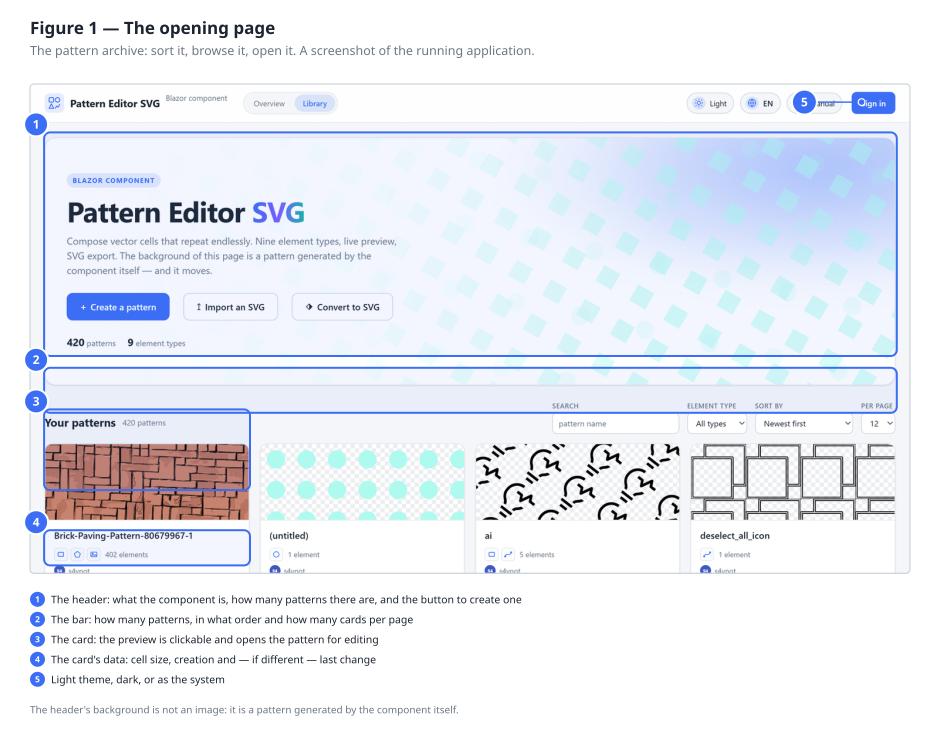

It is the list of everything you have created. Each **card** shows the pattern's real preview — not
a generic icon — with the name below it, how many elements make it up, the size of the cell and the
**weight** of the file.

> **The weight is that of the SVG document**, that is, of the file you get by pressing ↓ or
> **Download SVG**: a few hundred bytes for a simple weave, a couple of kilobytes for a rich one. It
> is the number that says why a computed weave beats an image: it covers a whole wall and weighs
> less than a blurred photograph. You find it on the management cards, on the archive cards in the
> showcase, on the moderation page and, updated as you draw, next to the title of the **Generated
> SVG** card inside the editor.
>
> A pattern containing an embedded **image** is the exception and can weigh a lot: the image travels
> inside the document, and it is its weight you see.

| Command | What it is for |
|---|---|
| Click on a card | Opens the pattern in the editor |
| **↥ Import an SVG** | Derives a pattern from an existing SVG file (§4.1) |
| **⬗ Convert to SVG** | Rebuilds a pattern from a raster image (§4.2) |
| **⧉** top right on the preview | Duplicates the pattern |
| **+ Create a pattern** | Creates a new, empty one |
| **Sign in** (top right) | Opens the sign-in window. Without it you can do almost everything except save (§3) |
| **Search** | Filters by name as you type |
| **Element type** | Shows only the patterns containing that type — useful for finding "the one with the text" |
| **Sort by** | Changes the order: by creation date, by modification date, or by name |
| **Per page** | How many cards to show together: 4, 8, 12, 24 or 48 |
| **Light / Dark** | Changes the theme. It applies to the editor too, and is remembered |

**Duplicating.** The **⧉** command appears on the preview when you hover over it, at the top right.
It immediately creates a complete copy called "Copy of *original name*", which ends up at the top of
the list. The copy is independent: changing it does not touch the original.

It is useful when you want to try a variant without risking the pattern that works — another
colour, a bigger cell, one more element.

**Deleting.** On every card, the delete command asks for confirmation once. There is no bin: what
you delete is deleted.

### 4.1 Importing an SVG drawing

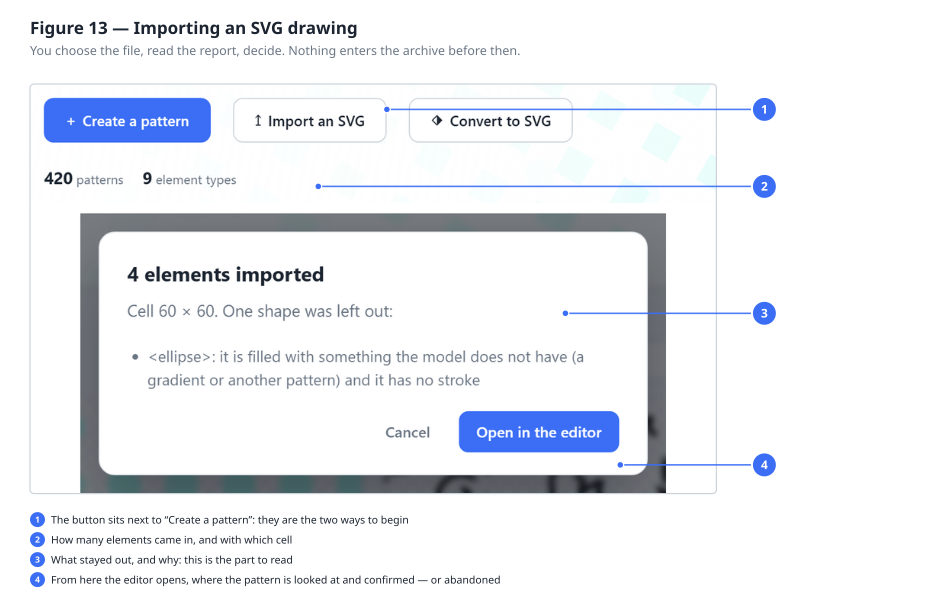

Next to **Create a pattern** there is **Import an SVG**: it opens a file already drawn — with
Illustrator, Inkscape, Figma or whatever you use — and derives a pattern from it.

Before opening, the editor tells you **what came in and what did not**. That window is to be
read: SVG is a far wider format than this tool, and any drawing almost always contains something
that cannot be represented here.

**What comes in.**

- the nine shapes you know: rectangles, circles, ellipses, lines, paths, polygons, polylines,
  texts and images;
- their colours, even written as `red` or `rgb(255,128,0)`, and their transparency;
- what the group containing them declares, which in SVG is inherited;
- translations and scalings of the groups, applied directly to the geometry, because here groups
  do not exist;
- the **cell**, taken from the document's `viewBox`.

**What stays out, and why.**

| What | Why |
|---|---|
| Rotated or skewed shapes | They would change shape: a rotated rectangle is no longer a rectangle |
| Gradients, patterns, clips, masks, filters | The model does not have them; a shape that had only that would stay invisible |
| Colours declared with `class` and a stylesheet | It would mean interpreting the document's CSS |
| `<use>`, `<symbol>`, and tags from other formats | They are references to something else, and here the element list is flat |
| Rounded corners on rectangles | The rectangle of this model has sharp ones |

The last two entries do not make the shape disappear: **it comes in anyway**, without that
refinement. The window tells you all the same, because it is the kind of difference that is
otherwise mistaken for a fault in the drawing.

Nothing is saved until you press **Close / Confirm** in the editor: the import puts the pattern in
front of you, the decision stays yours. The file name becomes the pattern name, and is changed
there.

> **Under the bonnet.** The SVG you download from here can be reopened too: the drawing sits
> inside `<defs><pattern>`, and the import recognises it, finding the cell and the transformation
> again. There and back returns the same pattern — handy for moving a pattern from one
> installation to another without going through the archive.

### 4.2 Converting an image into a pattern

Next to **Import an SVG** there is **Convert to SVG**: it takes a photograph or a raster drawing —
PNG, JPEG, WebP, GIF, BMP — and tries to rebuild it as a vector pattern.

The difference from importing is all here: there the vector drawing **already exists** and only
has to be translated, here it has to be **rebuilt**. It is a work of interpretation, and like any
interpretation it does well on some things and badly on others. The manual tells you beforehand,
so you do not find out afterwards.

**What it is for.** You have a photo of a floor, a clipping of a hatch from a catalogue, a texture
you downloaded: out of it comes a vector cell that you can then modify — recolour, straighten,
strip of what you do not need. The result is not a copy: it is a **proposal to work on**.

#### What happens when you choose the file

Four steps, in this order.

**The repeat is looked for.** First of all the tool looks for how often the drawing comes back
onto itself. Not along the two axes separately, but as a **lattice**: two directions of
translation, which may also be oblique. It is the difference that counts on a wall of staggered
courses — there the motif does not repeat at every course, because the next course is offset by
half a brick, and it repeats every **two**. Looking for a vertical period on its own would find
the height of one course, and the wall would come back with all the joints in line.

If the repeat is visible, the work is done on the tile alone. If it is not, the whole image is
taken as the cell and the window says so: it happens with textures that do not repeat any shorter
than that, and it is not an error.

**The image is reduced to a few colour bands.** Not at fixed intervals but chosen on the image, so
the bands narrow where the colours are dense. How many bands is up to you, and further down you
can see how.

**Each band is divided into areas.** A band is scattered across the whole image — the red of the
bricks touches every brick — but the bricks are distinct objects: areas are separated by
adjacency. Each area becomes a shape: a **rectangle** if it fills almost all of its bounding box,
otherwise a **polygon** following its outline.

**Then it corrects itself.** Here is the part that makes the difference. The drawing obtained is
repainted, compared **point by point** with the starting image, and where it does not match it
starts again: those points become drawing to be recognised once more, with the colour they have in
the original. Three rounds, or until what is left over becomes negligible.

It is the reason why it pays to go **down** with the colours rather than up: with few bands the
first pass gets a lot wrong, but it gets it wrong visibly, and the corrections spend elements
where the drawing is wrong instead of where it is large.

#### The preview window

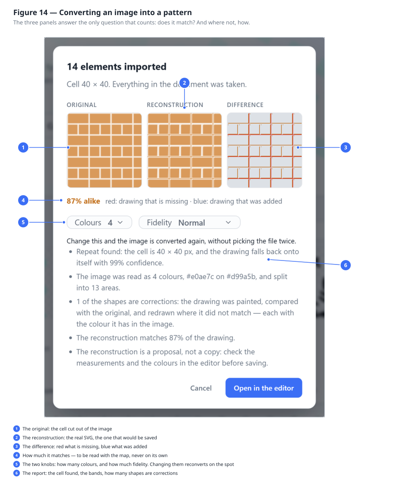

Before the editor opens you see three panels side by side and a number.

| Panel | What it is |
|---|---|
| **Original** | The cell cut out of the image, as it was |
| **Reconstruction** | The real SVG, the one that would be saved — not a copy drawn for the occasion |
| **Difference** | Where the two do not coincide, and in what way |

The difference map has **four colours**, and telling them apart is all of its value:

| Colour | Means |
|---|---|
| Light grey | Coincides |
| Red | Drawing **missing**: there was something there and it was not rebuilt |
| Blue | Drawing **added**: there was nothing there and something was painted |
| Orange | Right shape, **wrong colour** |

The number — "matches 93%" — is the share of points that coincide.

> **How to read that percentage, and how not to.** It is dominated by the background. On a cell of
> 40×40 with a 12×12 square inside it, a **completely empty** reconstruction already matches 91%:
> the background is right by construction. So a high percentage on its own guarantees nothing, and
> you need to look at the difference map next to it. If it is almost all grey you are fine; if it
> has broad red areas, that 90% is background guessed right and drawing lost.

#### The two knobs

They sit **inside the preview**, under the percentage, and not before choosing the file: where the
right point is cannot be guessed by looking at the starting image, it is found by trying and
looking at what comes out. Changing either of them reconverts the image on the spot, without
choosing the file again.

**Colours** — from 3 to 16, usually **4**. Few bands give a clean drawing and few shapes to edit;
many follow the image closely and give a pattern you can no longer touch. On a flat drawing it
almost always pays to stay low.

**Fidelity** — three modes, and choosing is a matter of what you need, not of quality.

| Mode | What it does | When |
|---|---|---|
| **Normal** | Stops at a few hundred shapes | You want a pattern to edit by hand |
| **Maximum** | Corrections carry on until little is left over: thousands of elements, **all vector** | You want fidelity and are happy to look at it, or edit it little |
| **Tracing copy** | The light vector drawing, and **an image on top** carrying everything it could not render | You need a faithful reference to trace over by hand |

On a photo of a floor, the same image: *Normal* 401 elements and 84%, *Maximum* 3025 elements and
93%, *Tracing copy* 402 elements plus a 51 kB patch.

> **The tracing copy is not a drawing, and it is fair to know why.** The image it carries on top
> goes back to depending on resolution: enlarge, and that part goes blocky while the vector stays
> sharp. It cannot be edited — inside it you neither recolour a joint nor move a brick. And it
> weighs, because the points travel inside the pattern's document. In exchange it matches the
> original almost exactly. It is called that because that is what it is: the copy you trace over.
>
> Note that in this mode the **percentage does not go up**: it keeps judging the drawing alone and
> not the patch. That is not an oversight — counting the image too would read one hundred per cent
> by construction, and would tell you nothing any more. That number is how much of that tile you
> will really be able to edit.

#### Where it does well and where it does not

**It does well** on flat drawings: technical hatches, vector textures, drawn floors, anything made
of solid tints with sharp edges. On a vector herringbone floor it reaches 97% with three colours
and fewer than a hundred elements.

**It half succeeds** on photographs. The problem is not shape recognition but **shading**: in a
photo every brick has a continuous gradation from one end to the other, and no flat fill can
render it. It can only be broken into many slightly different tints, which costs elements without
really bringing the error down. It is the reason *Maximum* gains far less on a photo than on a
drawing.

**It does not succeed** on dirty scans, on photographs in perspective, and on anything that has
gradients as its subject rather than as a disturbance.

#### Practical advice

- **Crop first.** If the image contains a few tiles and nothing else, the repeat is found better.
  Borders, frames and pieces of something else confuse the search.
- **Start at 4 colours and look at the difference map**, not at the percentage.
- If the map is **red in broad patches**, try *Maximum* before raising the colours.
- If the map is **diffusely orange**, it is the colours that are too few: go up to 6 or 8.
- **Nothing is saved** until you press Close/Confirm in the editor. *Cancel* leaves no trace.

> **Under the bonnet.** The conversion does not write elements: it writes an **SVG document** and
> hands it to the same import as the previous paragraph. That is why the report you read mixes its
> own sentences with those of the import, and why everything that holds there — cell from the
> `viewBox`, shapes that come in, warnings about what stays out — holds identically here.

---

## 5. The editor: the three areas

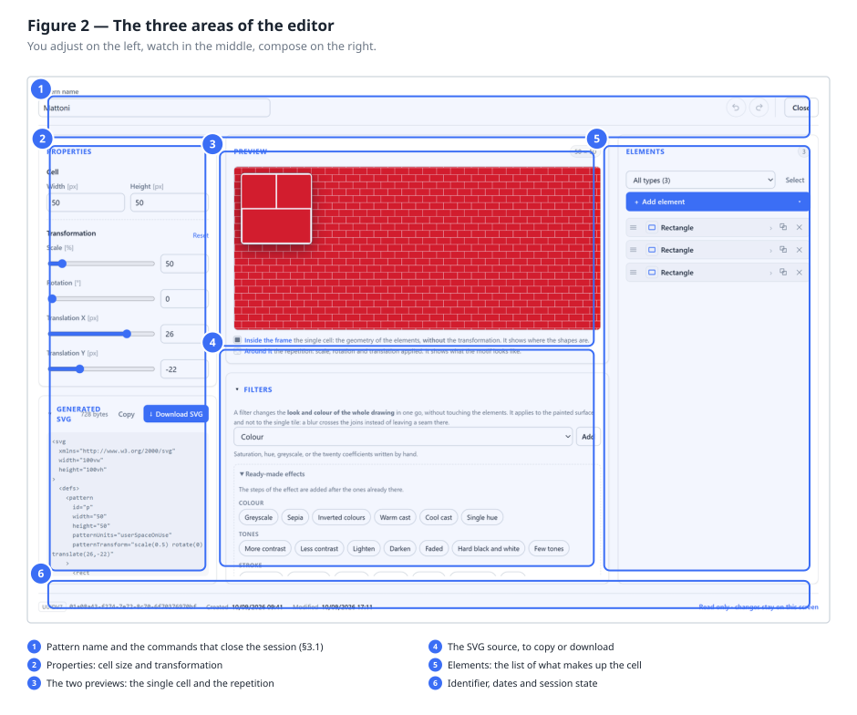

The editor opens **full page**, on any screen: it is not a window inside the list, it is the
screen you work on. All the space is needed.

It is divided into **five panels** laid out in three columns:

|  | top | bottom |
|---|---|---|
| **left** | **Properties** — cell and transformation | **Generated SVG** — the document, to copy or download |
| **centre** | **Preview** — the two views | **Filters** — look and colour of the whole drawing |
| **right** | ← **Elements**, full height | |

At the top are the name and the two decisions about the session; at the bottom, in small print,
the identifier, the dates and the "Unsaved changes" warning.

The layout follows what you do: **at the top what you look at while drawing**, at the bottom what
you open when you need it. The filters sit in the wide column because they are the part with the
most commands in the whole editor.

### The two collapsible panels

**Filters** starts **open**: it sits in a wide column and takes space from nothing else. Closing
it, its header still says how many steps it holds, or whether the filter exists but is not
applied — you do not have to reopen it to know whether there is anything to look at.

**Generated SVG** starts **open** and shows the document in full: it is exactly what its two
buttons produce. Closed, *Copy* and *Download SVG* stay visible — the second in the same blue as
*Close / Confirm*, because it is the only command in the editor that produces something to take
away.

Closed, the two panels are the same height and close on the same line.

### Who takes the space

Each column has two cards and they share the height by one rule only: **the space goes to
whoever is using it**.

- **Closing** the bottom card, the top one takes everything and pushes it down: with the filters
  panel closed, the preview doubles.
- **Opening** it, the top one stops at its own height and the rest is its.

Two things never give way, not even on a short window: **Properties** reads in full without an
internal scrollbar, and the **Preview** stays a real panel and not a strip. What gives way are
the filters and the source, which are lists and carry a scrollbar well. If the window really is
too short for all this, the whole band of three columns scrolls.

Each panel scrolls on its own anyway: touching a cell slider does not move the filter's list of
steps.

### The two previews

There are two, they show different things, and they sit in **a single panel**: the repetition
acts as the ground and fills all the space, the single cell sits on top of it, framed at the top
left. Under the panel, a two-line legend says which is which.

Side by side as they were before, they could not fill the space they had — each has its own
shape, and what was left over stayed white above, below and in between — and below a certain
width the single cell disappeared altogether. Overlaid, all the space goes to the repetition, and
the single cell is always there.

**Single cell** — the tile on its own, in the framed panel, **without** the transformation. It is
needed while positioning elements: this is where you see whether a rectangle is where you wanted
it.

The panel has the **shape of the cell**: if the cell is 48 × 24 it shows twice as wide as it is
tall, and changing the measurements changes it at once. The light frame with the dark thread
outside it is there to make it stand off any drawing that ends up underneath, light or dark.

**Repetition** — the real pattern, all around, with scale, rotation and translation applied. It
is needed to judge the motif: whether the rows line up, whether unwanted corridors appear,
whether the density is right. It takes **the whole panel**, and every extra pixel is one more
tile to look at.

The grey chequerboard ground is not part of the drawing: it marks the **transparent** areas.
Without it, an empty area could not be told from a white one.

> On narrow screens the two previews do not sit side by side: the **Repetition** takes the band
> and the **single cell** sits on top of it, in a framed panel at the top left — also the shape of
> the cell. See §11.

### Retracing your steps

At the top, just before **Cancel**, there are two round buttons with a blue arrow: the first
undoes the last change, the second redoes it. Switched off they stay where they are and lose
their colour, so the commands beside them do not dance every time the history empties or fills.
From the keyboard they are **Ctrl+Z** and **Ctrl+Y** (Ctrl+Shift+Z works too).

They work on everything that can be changed in here: a colour, a coordinate, the pattern name, an
element deleted by mistake, the order of the list. They are off when there is nothing to undo or
nothing to redo.

Three things to know, because they make the command handier than it looks:

- **Dragging a slider is one step.** While you move it the value changes dozens of times, but
  changes that follow one another quickly count as one: you do not need forty "Undo" to undo one
  adjustment.
- **You go back as far as the opening**, not beyond. Opening another pattern clears the history:
  undoing inside the previous session would put back on screen a drawing that is not the one in
  front of you.
- **If after undoing you start changing again**, what you had undone can no longer be redone.
  From that moment the story is another one, and the **↷** arrow switches off.

> **Careful.** In the **name** field, Ctrl+Z stays the browser's undo for typing: there you are
> writing, and undoing a letter is more useful than undoing the last change to the drawing. In
> the other fields — numbers, sliders, colours — the shortcut is the editor's.

### Cancelling and confirming

**Close / Confirm** saves and closes. **Cancel** closes throwing away everything you have done
since you opened it: the pattern goes back exactly as it was, dates included.

The two arrows and this **Cancel** are different things, and the vertical thread between them is
the reminder: the arrow goes back **one step** and leaves you where you are, **Cancel** throws
away **everything** and closes.

If you press **Close / Confirm** and something is wrong, the editor **does not close**: a red
panel appears with the list of what to correct. See [chapter 12](#12-when-something-does-not-add-up).

---

## 6. Properties: cell, transformation and filter

### 6.1 The cell

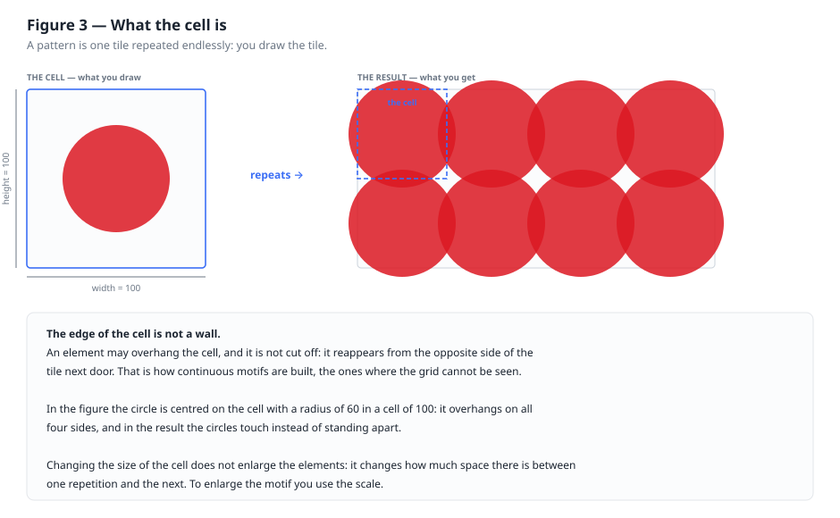

**Width** and **Height** are the dimensions of the tile. All the coordinates of the elements
refer to this frame: in a cell of 100, an element at x = 50 is halfway.

Two things to bear in mind, because they are the source of almost every early misunderstanding:

**The edge of the cell cuts nothing.** An element may overhang, and what goes out of one side
comes back in from the opposite side of the tile next door. That is how continuous motifs are
obtained — indeed, it is the only way.

**Enlarging the cell does not enlarge the drawing.** It increases the space *between* one
repetition and the next: the motif thins out. To enlarge the motif you use the **scale**.

### 6.2 The transformation

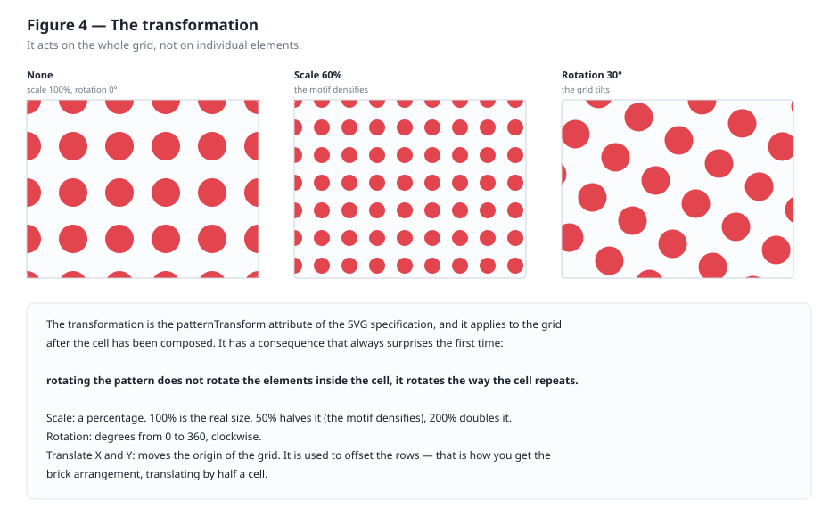

It acts on the **whole grid**, after the cell has been composed.

| Command | Unit | What it does |
|---|---|---|
| **Scale** | % | 100 is the real size. 50 halves and densifies, 200 doubles and thins out |
| **Rotation** | ° | From 0 to 360, clockwise. Tilts the whole grid |
| **Translate X** | px | Moves the origin of the grid horizontally |
| **Translate Y** | px | The same thing vertically |

Each value has a slider and a number box: the slider to search, the box to be precise. The
**Reset** button returns the transformation to neutral.

**Rotating the pattern does not rotate the elements inside the cell.** It rotates the way the
cell repeats. If you want a tilted rectangle *inside* a straight cell, rotating the pattern is not
the tool: you need a path with the vertices already tilted.

**Translation moves everything together, it does not offset the rows.** It is worth insisting,
because it is the commonest misunderstanding: `Translate X = 25` slides the whole grid by 25, and
the rows stay aligned exactly as before. It decides *where the grid falls* with respect to the
drawing, not how one row is staggered against another.

### 6.3 How rows are really offset

If translation is not the answer, how do you get the brick arrangement? **By putting two rows
inside the same cell.** The cell becomes twice as tall and holds two rows of elements, the second
moved by half a width: repeated, the rows come out alternating.

The elements of the second row that go out of the edge are not a problem — they come back in from
the opposite side — but they have to be placed **twice**, one per side, otherwise half a figure
disappears:

| | Wrong | Right |
|---|---|---|
| Cell | 50 × 25, one brick, Translate X 25 | 50 × 50, three bricks |
| Result | Rows aligned | Rows offset |

> **Under the bonnet.** The content of a cell is **clipped** at the edges of the cell:
> `patternTransform` acts on the grid, not on individual rows, and there is no attribute in the
> SVG specification that offsets repetitions. People who draw patterns call this technique
> *half-drop*, and it is the same one used since wallpapers were printed with rollers.

> **Under the bonnet.** These four values become the `patternTransform` attribute of the
> `<pattern>` node: for example `scale(1.35) rotate(45) translate(25,0)`. Transformations apply
> from right to left, but you see the result in the preview and there is no need to work it out
> in your head.

### 6.4 The filter: changing the look and colour of everything at once

The **Filters** panel sits under the previews, and it is the only command that acts on the whole
drawing in one go. It does not touch the elements: it leaves them where they are, with the
colours they have, and changes the way the result appears. It is needed when the change you want
— "everything lighter", "in greyscale", "with heavier lines" — would otherwise concern three
hundred elements one by one.

**You start from an effect.** The *Ready-made effects* block gathers twenty-four pills in four
families. Clicking one, the filter is born already set and the preview changes at once.

| Family | Effects |
|---|---|
| **Colour** | Greyscale, Sepia, Inverted colours, Warm tint, Cool tint, Single tint |
| **Tones** | More contrast, Less contrast, Lighten, Darken, Faded, Hard black and white, Few tones |
| **Stroke** | Heavy stroke, Thin stroke, Sharpen, Outlines, Relief, Soft shadow, Halo |
| **Surface** | Blur, Hand-drawn stroke, Frosted glass, Aged paper |

A few deserve a word, because the name does not give them away:

- **Hard black and white** removes the greys and leaves two tones only: it survives the
  photocopier and black-and-white printing;
- **Faded** lightens and flattens — for a hatch that has to sit *under* something else without
  stealing the show;
- **Few tones** reduces to five steps per channel: the look of screen printing;
- **Outlines** switches off the fills and keeps only the edges, reducing the drawing to a profile;
- **Relief** lights from one side and shades from the other: the weave looks engraved;
- **Halo** puts a coloured glow around the shapes leaving the drawing intact on top;
- **Warm tint** and **Cool tint** shift everything towards terracotta or towards concrete.

The block stays **open as long as the list of steps is empty** — it is the quickest way to begin —
and closes by itself as soon as the first step appears, when what you need to see is the steps.

> **An effect is not a closed box.** It writes ordinary *steps* into the list, and from then on
> you open them and change them like anything else. Choosing a second one adds its steps at the
> end, instead of deleting the first: grey plus more contrast is a normal combination, and
> replacing would lose the previous work without saying so.

**The list is a chain.** Each row is a step, numbered, and applies to the result of the one above.
From left to right you find: the box to **switch it off** without deleting it (it is the way to
understand what it actually does), the **name** with how it is set beside it, and the **arrows**
to move it together with the cross to delete it. Clicking the name opens the step; one opens at a
time.

**Adding one by hand.** Above the ready-made effects there is a menu with the thirteen available
steps and the *Add* button; under the menu, a line explains what the chosen one is for. The menu
is always there, even before a filter exists: adding a step creates it. In brief:

| Step | What it is for |
|---|---|
| **Colour** | Saturation, hue rotation, greyscale, or the twenty coefficients by hand |
| **Levels** | Brightness, contrast, gamma, inversion: one curve per channel |
| **Blur** | Softens |
| **Shadow** | Drop shadow, with direction, softness and colour |
| **Thickness** | Thickens or thins the strokes |
| **Offset** | Moves and nothing else: it is for use inside a chain, not on its own |
| **Flood** | Fills with a colour; it has to be composed with something else |
| **Noise** | Generates veins or clouds: it is raw material, not an effect |
| **Displacement** | Moves the pixels following a second image |
| **Convolution** | Sharpening, relief, outlines |
| **Blend** | Blends two images with the modes of photo editing |
| **Composite** | Combines two images: over, in, out, or dosed |
| **Merge** | Stacks several results, the first at the bottom |

**The links.** Inside each step, at the bottom and closed, there is a *Links* block with two
fields: *Input* and *Result*. Left empty — and that is almost always the case — the steps chain in
the order you see them. Naming a result is only for calling it up later: that is what the
*Hand-drawn stroke* effect does, where the noise is called "noise" and the displacement fetches it
by name.

> **If an effect disappears**, look at the warnings at the top of the editor. Two cases recur. The
> first: an input pointing to a name that no earlier step produces — it does not give an error, it
> simply does nothing, and it happens when reordering steps after linking them. The second: a step
> put straight after a **Noise** or a **Flood** without declaring where it takes the image from.
> Those two transform nothing, they *produce*: whoever comes after, if they say nothing else, ends
> up holding the produced image instead of the drawing, and only that is left on screen. The cure
> is always the same — name the result you need and call it up.

**Filter area and colour space** are at the bottom, closed. The area is widened when an effect
comes out **clipped**: a shadow moved twenty pixels on a surface of two hundred goes past the
default 110% and is cut clean off. The colour space changes the way the sums are done — *sRGB* is
what you expect looking at the screen, *linear* is physically correct and makes blurs seem to
lighten.

> **Where it applies.** The filter acts on the **painted surface**, not on the single tile. It is
> the difference between a blur that crosses the joins and one that stops at the edge of each tile
> leaving a grid of seams. In the **Single cell** preview, which is as wide as the cell, effects
> that overflow show clipped at the sides: it is a limit of that panel, not of the pattern — look
> at the **Repetition** for the real result.

> **Under the bonnet.** The filter becomes a `<filter>` node next to the `<pattern>` in the
> `<defs>`, and the filled rectangle calls it with `filter="url(#…)"`. In the **SVG** card you see
> it written out in full. A pattern without a filter produces exactly the document it did before:
> nothing changes for those who do not use it.

---

## 7. The elements, one by one

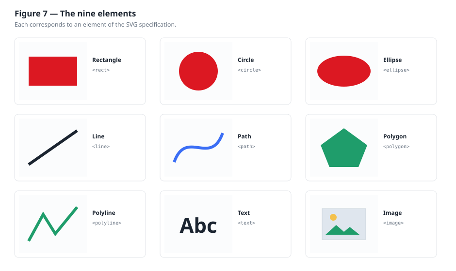

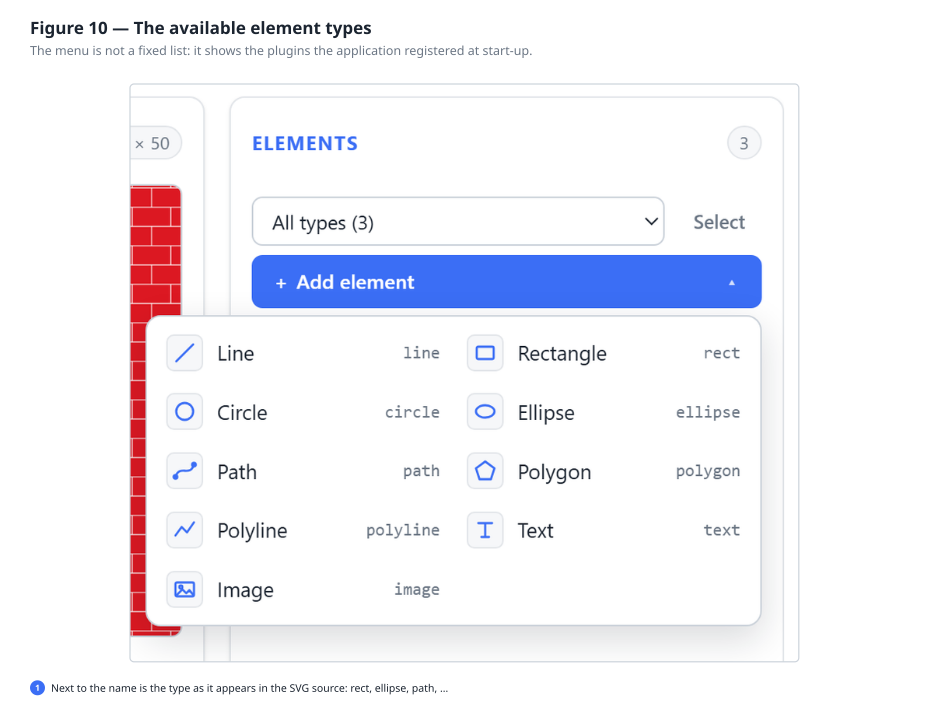

### 7.1 Working with the list

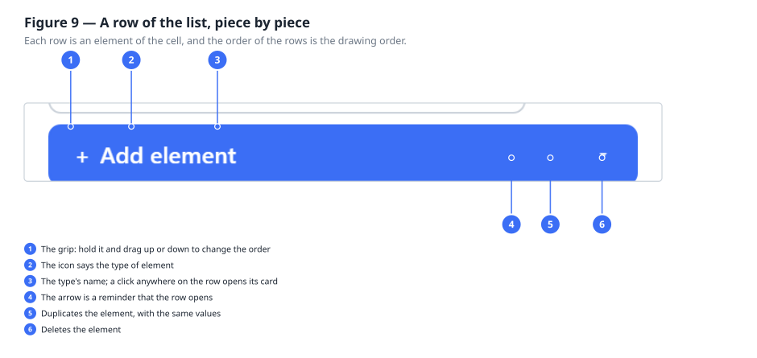

The elements are **in drawing order**: the first in the list is drawn first, so it ends up
**under** all the others. Whoever is last in the list is in front in the drawing.

| Command | Effect |
|---|---|
| **+ Add element** | Opens the menu of the nine types. Choosing the type *is* the insertion |
| Click on the row | Opens the element's card, in place of the list |
| **≡** on the left | Drag it to change the drawing order |
| **⧉** | Duplicates the element: an identical copy, right below |
| **✕** | Deletes the element |
| **‹ List** | From the card, goes back to the list |

**When there are many elements.** Above the list a dropdown appears that filters by type and shows
how many there are of each — "Ellipse (102), Path (40), Rectangle (1)" says in one line how the
drawing is made. Next to it, **Select** turns the grips into checkboxes: choose what you want,
even everything at once, and delete them together.

While a filter is active dragging is off, and the grip shows grey: the order in front of you is
not the real one — the hidden rows are missing — and moving a row would give an unpredictable
result. Remove the filter and it becomes available again.

**Reordering.** Take the row by the three lines on the left and drag it where you need: the others
move under your fingers, and the preview updates while you drag, so you see at once whether the
new order works. It works with mouse and finger alike.

Without a mouse it is the same: reach the lines with the tab key and use the **↑** and **↓** arrow
keys.

After an insertion the new element's card opens by itself: whoever adds something wants to
configure it. After a duplication it does not: duplicating is often done several times in a row.

### 7.2 Rotating and mirroring an element

Towards the end of the card of every element — of **any** type — there is the **Position** section,
followed by **General**. They are the two sections that are the same for every type, separated from
the others by the usual dashed line: above are the properties that depend on the shape, below the
ones that hold for any drawing.

**Position** contains:

- **Rotation**, in degrees, with the slider to find it by eye and the box to write it exactly;
- **Mirror horizontally** and **vertically**, two independent switches;
- **Centre X** and **Centre Y**: the point the element rotates and mirrors about.

The centre is a point you choose, and not the centre of the shape. In hatches it is almost always
needed that way: rotating about the centre of the cell, or about a corner. The **Use the centre of
the cell** button fills the two fields with half the width and height, which is the commonest case
— the note under the button tells you which two numbers it will write, without having to press it
to find out. For a different centre, such as a corner of the cell, write the values by hand.

A practical example: a family of horizontal lines becomes a 45° hatch by setting the rotation to 45
on each line — without recalculating a single coordinate.

> **Under the bonnet.** In the SVG file the rotation becomes a `<g transform="…">` group around the
> shape. An element with neither rotation nor mirroring produces no group: the document stays
> clean.

Below, **General** holds the **overall opacity**: the last thing you adjust, when shape, colour and
position are already decided. It is at the bottom because that is where it is needed, and the three
transparencies are explained together in [chapter 8](#8-colours-strokes-and-transparency).

### 7.3 The coordinate system

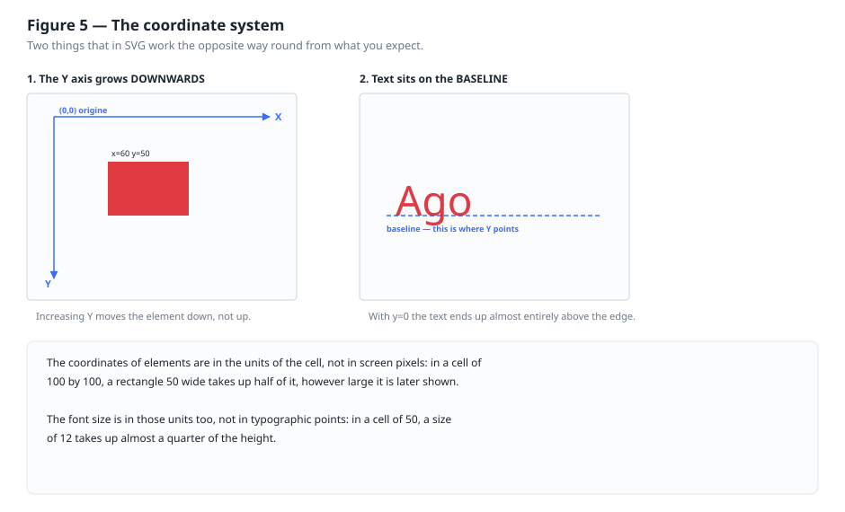

Before the cards, the rule that holds for every element: **the Y axis grows downwards**. The origin
(0, 0) is the top left corner of the cell, and increasing Y moves down. It is the opposite of the
Cartesian plane from school, and it is the convention of every graphics format.

---

### 7.4 Rectangle

The basic brick: a rectangle with sides parallel to the axes.

| Field | Meaning |
|---|---|
| **X**, **Y** | **Top left** corner — not the centre |
| **Width**, **Height** | Dimensions, to the right and downwards |

*Example.* In a cell of 50 × 50, a rectangle with X = 0, Y = 0, Width = 50, Height = 25 fills
exactly the upper half of the cell. Repeated, it gives horizontal stripes.

> **Under the bonnet.** It corresponds to `<rect>`. The specification also provides `rx` and `ry`
> for rounded corners: they are not exposed, but a rounded corner is obtained with a path.

---

### 7.5 Circle

| Field | Meaning |
|---|---|
| **Centre X**, **Centre Y** | The centre — not the corner |
| **Radius** | Half the diameter |

*Example.* Cell 100 × 100, centre (50, 50), radius 18: the dot from chapter 2. With radius 50 the
circle touches the four sides exactly; beyond that it starts to overhang and the circles of
neighbouring tiles intersect.

> **Under the bonnet.** It corresponds to `<circle>`. The radius must be greater than zero: the
> specification says a null radius disables drawing, and here it is reported as an error because a
> row that draws nothing is almost always an oversight.

---

### 7.6 Ellipse

The squashed circle: two radii instead of one.

| Field | Meaning |
|---|---|
| **Centre X**, **Centre Y** | The centre |
| **Radius X** | Horizontal semi-axis |
| **Radius Y** | Vertical semi-axis |

With the two radii equal you get a circle: if you need a circle, though, use the Circle — it has
one field fewer to keep aligned.

> **Under the bonnet.** It corresponds to `<ellipse>`. It cannot be tilted with its own attributes:
> for an oblique ellipse you need an arc in a path, or you rotate the whole pattern.

---

### 7.7 Line

A segment between two points. It is the only element **without a fill**: it has only the stroke.

| Field | Meaning |
|---|---|
| **X1**, **Y1** | First end |
| **X2**, **Y2** | Second end |
| **Thickness** | If it is zero, the line is invisible |

*Example.* Cell 20 × 20, from (0, 20) to (20, 0), thickness 2: the classic diagonal weave. For the
diagonals to weld from one tile to the next, the ends must fall exactly on the corners of the cell.

---

### 7.8 Path

The free shape: curves, arcs, polylines, anything at all. All the geometry sits in a single text
field, the **command** — the `d` attribute of the specification.

It is written with a sequence of letters and numbers. The main ones:

| Command | Means | Example |
|---|---|---|
| `M x y` | Moves the pen **without drawing** | `M 10 10` |
| `L x y` | Draws a line to (x, y) | `L 40 10` |
| `H x` / `V y` | Horizontal / vertical line | `H 40` |
| `C x1 y1 x2 y2 x y` | Smooth curve (cubic Bézier) | `C 20 0 30 20 40 10` |
| `Q x1 y1 x y` | Simpler curve (quadratic Bézier) | `Q 25 0 40 10` |
| `A rx ry rot arc sweep x y` | Elliptical arc | `A 15 15 0 0 1 40 10` |
| `Z` | Closes the figure, returning to the start | `Z` |

**Upper and lower case are not the same thing**: `L 40 10` goes to the absolute point (40, 10);
`l 40 10` moves 40 right and 10 down **from where it was**. Lower case is handy for repeating the
same step.

*Example — a triangle:* `M 25 5 L 45 40 L 5 40 Z`

*Example — a wave:* `M 0 25 Q 12 5 25 25 T 50 25`

The path is kept **exactly as you write it**: if you paste it from another program, it comes back
identical.

---

### 7.9 Polygon and 7.10 Polyline

They are the same thing with one difference only, and it is worth learning once:

- the **Polygon** is **closed automatically**: the last vertex joins back to the first, and the
  figure has an inside to fill;
- the **Polyline** is **not** closed: the drawing ends at the last point.

Both are defined with a single field, the **points**, written as pairs:

```
20,10 40,30 30,50 10,50 0,30
```

Pairs are separated by spaces, the two numbers of a pair by a comma. Spaces alone are fine too
(`20 10 40 30`): the specification accepts both forms.

The polygon needs at least **three** points for there to be a surface; the polyline needs **two**.
In the polygon do not repeat the first point at the end: the specification takes care of it.

---

### 7.11 Text

The only element that holds words.

| Field | Meaning |
|---|---|
| **X**, **Y** | Starting point of the **baseline** (see figure 5) |
| **Content** | The letters to draw |
| **Font** | The name of the font, for example `Georgia` |
| **Size** | In the units of the cell, **not** in typographic points |
| **Weight** | Normal or bold |
| **Alignment** | Which way the text grows from the point: start, middle, end |

Two frequent surprises. The first: with **Y = 0** the text almost entirely disappears above the
edge, because that point is the baseline, not the top of the letters. In a cell of 50, try Y = 35.
The second: the **size** is in the units of the drawing; in a cell of 50, a size of 12 takes a
quarter of the height.

> **Careful with the font.** The SVG file records the *name* of the font, not the font. Whoever
> opens the file will see it as you see it only if they have that font installed; otherwise their
> program will substitute another and the proportions will change. The editor reminds you with an
> amber warning. If the pattern has to be identical everywhere, convert the text to a path with a
> graphics program, or stick to system fonts.

---

### 7.12 Image

Inserts a photograph or a logo inside the vector drawing.

| Field | Meaning |
|---|---|
| **Source** | An `https://…` address or an embedded image `data:image/png;base64,…` |
| **X**, **Y**, **Width**, **Height** | The frame that holds the image |
| **Fitting** | How the image arranges itself in the frame |

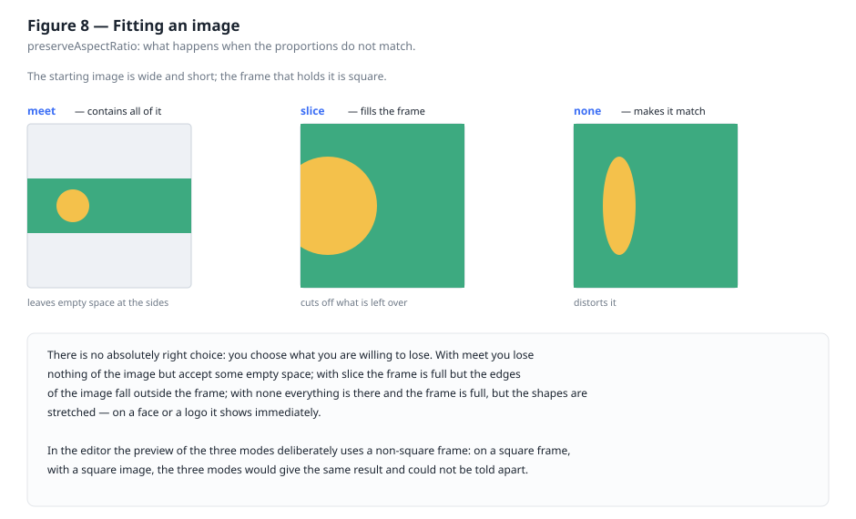

**Address or embedded image?** It is a trade-off with no right answer:

| | External address | Embedded image |
|---|---|---|
| File weight | Minimal | Large: it grows by about a third over the original |
| Works without a network | No | Yes |
| If the server disappears | The image disappears | No problem |
| Suited to | Internal use, prototypes | Files to deliver or archive |

The editor reports both consequences with an amber warning. They are warnings, not errors: they
prevent nothing.

---

## 8. Colours, strokes and transparency

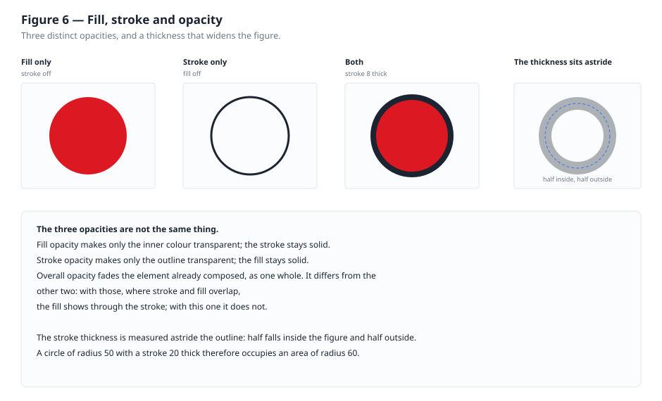

Almost every element has two independent colours: the **fill** (the inside) and the **stroke** (the
outline). Each is switched on and off with its own **Active** toggle: an element with only the
stroke is an empty outline, one with only the fill is a solid silhouette.

### Choosing a colour

Every colour can be given in two ways, always kept in step with each other:

- with the **picker**, the coloured square, to find it by eye;
- by writing the **hex code** in the box beside it, when you already know it.

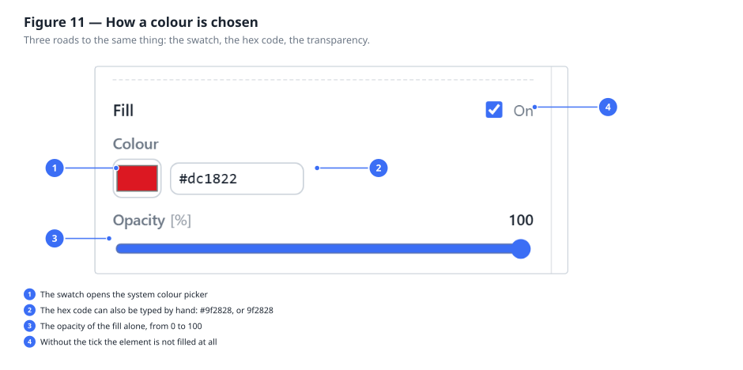

In the box you can write `#3b6ef5`, or `3b6ef5` without the hash, or the short form `#3bf`. While
you type, an incomplete code is flagged in red and **is not applied**; when you leave the box, the
value goes back to the real one if what you wrote was not a colour.

### The three transparencies

They are not three degrees of the same thing, they are three different things:

| Command | What it acts on |
|---|---|
| **Fill opacity** | Only the inner colour. The stroke stays solid |
| **Stroke opacity** | Only the outline. The fill stays solid |
| **Overall opacity** | On the element already composed, as one whole |

The difference shows where stroke and fill overlap: with the first two the fill shows through the
stroke, with the third it does not.

### The thickness of the stroke

The thickness is measured **astride** the outline: half falls inside the figure, half outside. A
circle of radius 50 with a stroke 20 thick therefore occupies an area of radius 60. If an element
looks bigger than you made it, almost always it is the stroke.

---

## 9. The SVG source: copy, download, use

Under the previews there is the **Generated SVG** panel: it is the real file, updated at every
change. It can be closed with the little triangle if it is in the way, but the two commands stay
reachable:

- **Copy** puts the source on the clipboard;
- **↓ Download SVG** saves the file, named after the pattern.

There is no need to save first: the downloaded file is the one you see at that moment.

### How to use it

**In a web page, as a background:**

```css
.my-section {
    background-image: url("dots.svg");
}
```

**In a graphics document:** Illustrator, Inkscape, Figma and Affinity open SVGs directly. The
pattern arrives as a vector object, resizable without loss.

**For print:** being vector, it has no resolution: the same image is right for a business card and
for a poster.

> **Under the bonnet.** The file holds a `<pattern>` node inside `<defs>`, and a `<rect>` as big as
> the image that calls it with `fill="url(#p)"`. If you paste more than one pattern into the same
> HTML page, check that the identifiers differ: `url(#p)` searches the whole document, and two
> nodes with the same name shadow each other.

---

## 10. Recipes: six patterns step by step

Every recipe is complete: the values are the ones to write.

### 10.1 Horizontal stripes

Cell `50 × 50` · one **Rectangle**

| Field | Value |
|---|---|
| X, Y | 0, 0 |
| Width, Height | 50, 25 |
| Fill | your choice |

Half the cell full and half empty: repeated, it gives stripes. For denser stripes, reduce the
height of the cell; for vertical stripes, swap the rectangle's width and height.

### 10.2 Bricks

Cell `50 × 30` · three **Rectangles**, all 13 tall and 48 wide, terracotta fill `#c1502e`

| Rectangle | X | Y | What it is for |
|---|---|---|---|
| 1 | 1 | 1 | The whole row, at the top |
| 2 | −24 | 16 | Half a brick of the row below, on the left |
| 3 | 26 | 16 | The other half, on the right |

Two rows in the same cell, the second moved by half a brick: there is the offset. Bricks 48 wide
in a cell of 50 leave the joint.

The second and third rectangles are **the same brick**, cut in two by the edge of the cell: what
goes out to the right comes back in from the left, but it has to be drawn in both positions.

### 10.3 Offset dots

Cell `100 × 100` · two **Circles** of radius `18`

| Circle | Centre X | Centre Y |
|---|---|---|
| 1 | 25 | 25 |
| 2 | 75 | 75 |

Two dots on the diagonal: repeated, they give rows offset by half a cell. It is the same
arrangement as the five circles of chapter 2, obtained with half the elements.

For denser dots reduce the cell and leave the radius; for sparser dots do the opposite.

### 10.4 Diagonal weave

Cell `20 × 20` · one **Line**

| Field | Value |
|---|---|
| X1, Y1 | 0, 20 |
| X2, Y2 | 20, 0 |
| Thickness | 2 |

The ends fall exactly on the corners: that is the condition for the diagonals to weld from one tile
to the next without steps. Adding a second line from (0,0) to (20,20) gives the crossed weave.

### 10.5 Scales

Cell `40 × 40` · three **Paths**, fill off, stroke active and `2` thick

| Path | Command |
|---|---|
| 1 | `M 0 20 A 20 20 0 0 1 40 20` |
| 2 | `M -20 40 A 20 20 0 0 1 20 40` |
| 3 | `M 20 40 A 20 20 0 0 1 60 40` |

Here too, two rows in the same cell: the arc at the top and the two half arcs at the bottom, which
are the same arc cut by the edge.

For a roof of real tiles, fill the arcs instead of leaving them empty, give them a height greater
than the spacing between rows — so they overlap — and add a dark semi-transparent arc under each
edge: that is the drop shadow, and it is what gives the relief.

### 10.6 Stars

Cell `60 × 60` · one **Polygon**

| Field | Value |
|---|---|
| Points | `30,5 36,22 54,22 40,33 45,50 30,40 15,50 20,33 6,22 24,22` |
| Fill | yellow, e.g. `#ecc94b` |

Ten alternating vertices, five outer and five inner: that is how a five-pointed star is built.
Changing the inner vertices gives a thinner or a chubbier star.

---

## 11. On a phone

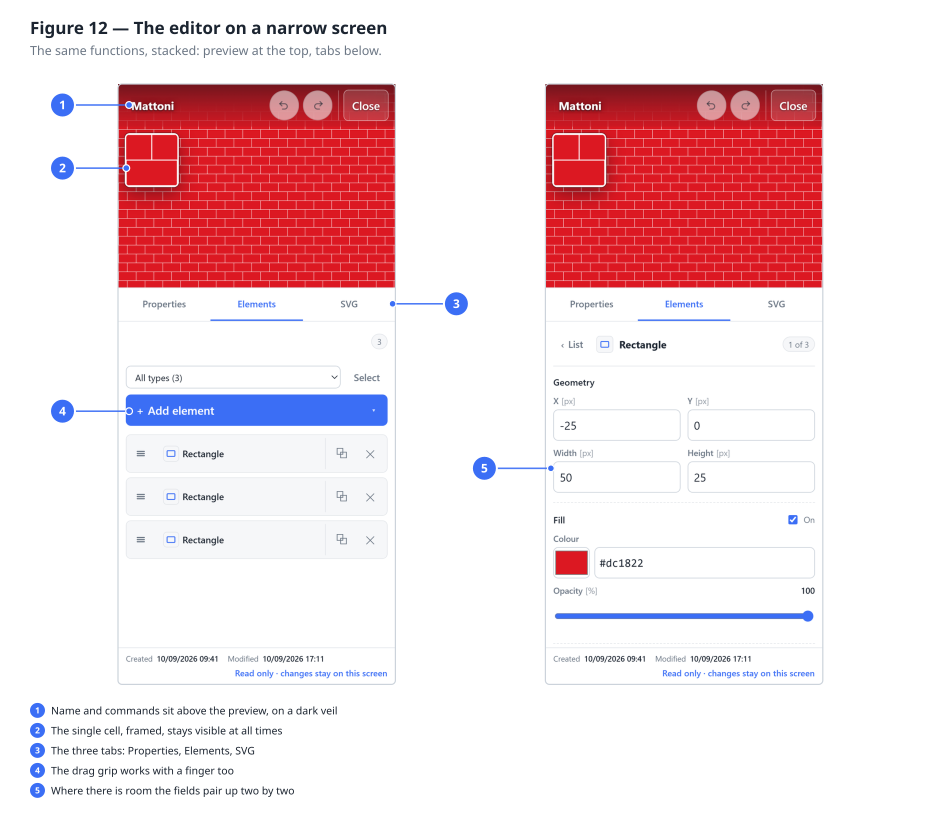

On narrow screens the layout changes, the functions do not.

You find three fixed bands and a sheet that scrolls:

1. **At the top** the name and the Cancel and Confirm commands;
2. **below**, the preview of the repetition, which **never scrolls away** while you adjust values;
3. **then** three tabs — **Properties**, **Elements**, **SVG** — taking the place of the three
   columns;
4. **at the bottom** only the content of the chosen tab scrolls.

Both previews are there, but not side by side: on 390 points of width that would reduce them to two
postage stamps. The **repetition** takes the band, and the **single cell** sits on top of it in a
framed panel at the top left — small, but enough to see where the elements are while you move them.
It updates in real time too.

The **SVG** tab holds the source, the Copy and Download commands, and the service information.

In the element list the row gets shorter: the drag grip, the icon and the name remain — touch
anywhere to open the card — and on the right the two commands that count, duplicate and delete. The
fields of the cards pair up two by two where the screen allows, instead of stacking one per row.

---

## 12. When something does not add up

### Errors and warnings

| | **Red** panel | **Amber** panel |
|---|---|---|
| It says | "Correct the following errors" | "Worth bearing in mind" |
| It means | The data is wrong | The choice is valid, but it has a consequence |
| Stops you saving | Yes | No |

Every message is preceded by the name of the element, so you know which of the twelve it refers to.

### Frequent problems

**I see nothing in the preview.**
In order: does the element have an active fill colour? If it has only the stroke, is the thickness
greater than zero? Do the coordinates fall inside the cell, or have you pushed it out of sight? A
circle of radius 0 draws nothing.

**The motif shows, but with white stripes between the repetitions.**
The elements do not reach the edges of the cell. Either widen them, or shrink the cell.

**The shapes touch where they should not.**
The opposite: the elements overhang. Remember that the stroke adds half its thickness on each side.

**I typed a number and the field emptied.**
The decimal separator is the **point**, not the comma: write `1.5`.

**The text does not show.**
With Y = 0 the text ends up above the edge of the cell: that point is the baseline. Try a value
near two thirds of the cell's height.

**The image does not appear.**
If it is an external address, check that it is reachable and that the server allows its use from
other sites. When in doubt, embed the image as `data:`.

**I closed without saving.**
The changes are lost: **Cancel** leaves no trace. There is no restore.

**I converted an image and the result is poor.**
Look at the difference map, not the percentage: if it is red in broad patches, try *Maximum*
fidelity before raising the colours; if it is diffusely orange, raise the colours. And check that
the cell it found is the right one — a cell that is wrong makes everything after it wrong (§4.2).

**I saved a pattern but a colleague cannot see it.**
It is born private: only you see it. On its card press **Ask for publication** and wait for an
administrator to approve it (§3.7).

**A pattern of mine was public and now says "pending".**
You changed it and saved it. The approval applies to the approved drawing, not to the file name:
after a change it has to be given again (§3.7).

**I reloaded the page and my private patterns were not there.**
This should no longer happen: the list asks for itself again as soon as the session is resumed. If
it happens, the sign-in has expired — **Sign in** will appear again at the top right.

**I opened a pattern and I see the warning "handled by no plugin".**
The pattern was created by a version with more element types than this one. The element cannot be
changed here, but **it is not lost**: it stays in the file and goes on being drawn.

---

## 13. A small glossary

**Cell** — the tile that repeats. It is drawn once only.

**SVG** — the vector format the pattern is saved in. It describes shapes, not pixels.

**Vector** — an image made of geometric instructions: enlargeable indefinitely without losing
quality.

**Hexadecimal** — the way of writing a colour with six digits, `#rrggbb`: two for red, two for
green, two for blue. `#000000` is black, `#ffffff` white.

**Opacity** — how much a colour lets through what is behind it. 100% covering, 0% invisible.

**Baseline** — the imaginary line the letters sit on. The Y of the text points there.

**Path** — a free shape described by a sequence of commands.

**Transformation** — scale, rotation and translation applied to the grid of the repetition, not to
individual elements.

**Lattice** — the two directions along which a motif repeats. Used by the image conversion to find
the tile; it may be oblique, as in a wall of staggered courses (§4.2).

**UUIDv7** — the identifier of every pattern. It holds inside it the instant it was created: that
is why patterns have a date even though nobody ever gave them one.
